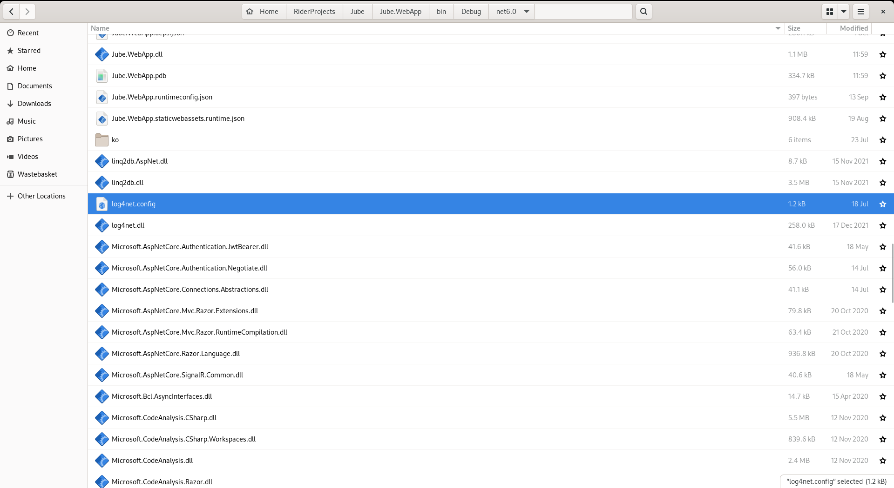
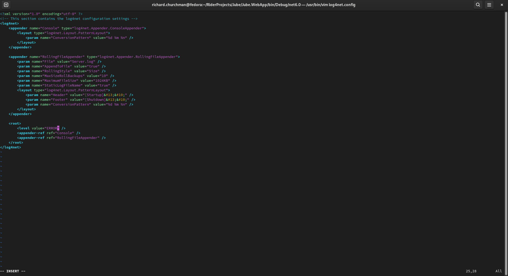
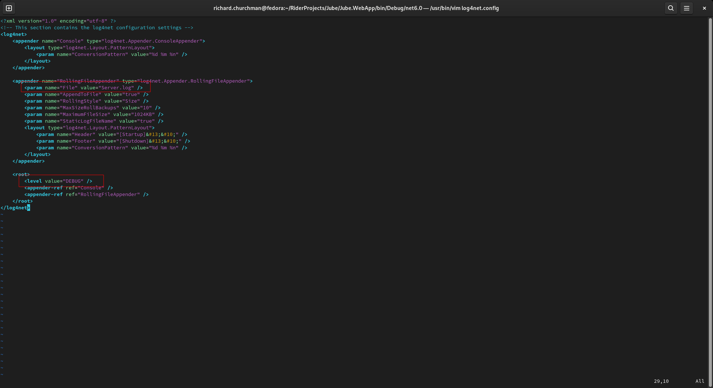
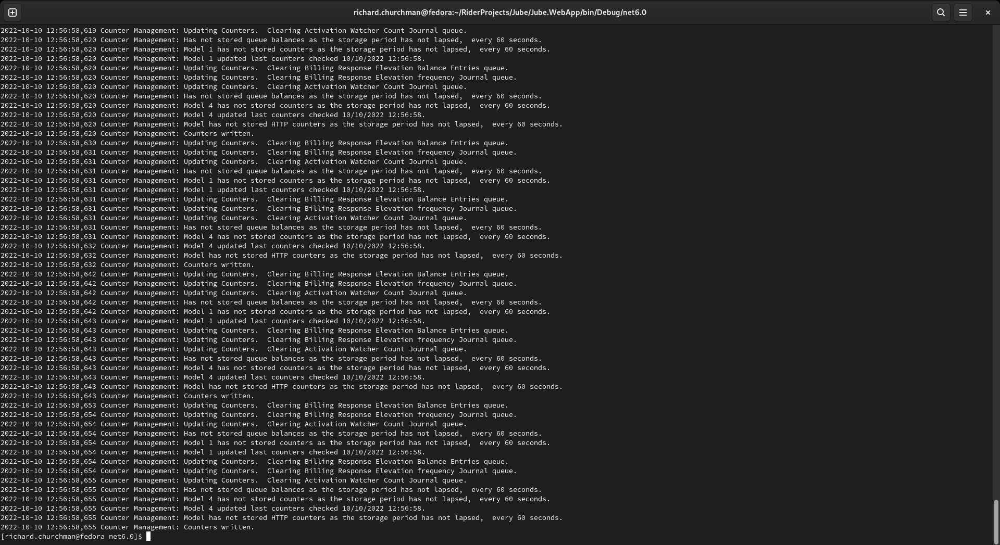

# Logging
Logging is provided by Log4Net which is a .Net port of the populate Log4J package.

The functionality of Log4Net is outside the scope of this document, yet it is sufficient to state that the overwhelming majority of steps taken by the engine will write to a log buffer, which in turn will be streamed to persistence media such as:

* Rotating Log Files in the local file system.
* Dispatch to Syslog Server (this works great and does not reduce response times too much).
* Storage in a Database (slowest and highest risk option).
* No storage (Errors should at least be logged, so this is inadvisable).

It seems atypical to configure a production system to not persist logging at INFO level,  however in ultra high volume and load balanced environments this can be advisable, instead logging by sampling from just a single node in load balancer rotation or by setting the trace querystring value in a transaction post (reserved for future use).  In all cases it is advisable to log at ERROR level.

The logging is controlled via updating the contents of a file called Log4Net.config in the same directory as the Jube binary executable:

The file may be updated in a text editor (such as VI if in terminal):

There are a variety of options available to Log4Net and it is advisable to read the documentation associated with that project,  but in this instance,  only the logging levels will be explored.  The logging levels can be set by updating the value attribute of the level node of the logging configuration file.  The logging levels have the following meaning in Jube:

| Level | Description                                                                                                                                                                                                                                                                                                                                                                                                                                                                                                                                                                                                                                                                                                                                                                                                                                                                                                                                                        |
|-------|--------------------------------------------------------------------------------------------------------------------------------------------------------------------------------------------------------------------------------------------------------------------------------------------------------------------------------------------------------------------------------------------------------------------------------------------------------------------------------------------------------------------------------------------------------------------------------------------------------------------------------------------------------------------------------------------------------------------------------------------------------------------------------------------------------------------------------------------------------------------------------------------------------------------------------------------------------------------|
| DEBUG | This logging level will produce an overwhelming amount of information.  The Debug logging level is intended for development and diagnosis of extremely complex issues and most typically in a local environment.  This logging level is so comprehensive that most lines of code executed will create a line of logging detailing what is happening, the value both before, after and a verbose description.  This level of logging should not be used unless directed by Jube Support. This logging level will cause an enormous amount of disk IO.                                                                                                                                                                                                                                                                                                                                                                                                               |
| INFO  | This logging level is intended to give a window into the real-time functioning of the platform and will included logging entries that are akin to transaction or event records.  There is a large amount of information available to this logging level and will allow for transactions to be inspected via the logs. In a very high throughput environment INFO logging can be overwhelming and it might be advisable to tap a single node of a load balancer for the purposes of sampling or use the trace querystring switch (reserved for future use). If building out a cluster of Jube instances which are load balanced,  it is often helpful to have one small node (with traffic in proportion) being directed to a node with INFO level enabled.  In this manner it is possible for an administrator to maintain the vast majority of transactions being processed without trace,  yet still have a sample of transaction trace to identify bottlenecks. |
| WARN  | This logging level relies on performance counters in the platform and is intended to write logs when these performance counters exceed a threshold as defined in the Thresholds and Limits section of this document.  This is extremely useful for identifying performance issues for intervention.  This logging level includes soft errors which are not runtime errors,  but have led to the fatal termination of a transaction while not having any further consequence beyond the scope of that transaction. WARN error messages are written out based on the platforms monitoring thresholds in the database table Warning_Thresholds.                                                                                                                                                                                                                                                                                                                       |
| ERROR | This logging level is the trapping and logging of any .Net runtime environment error.  Runtime errors are especially severe and will require immediate intervention, yet typically they should not lead to the termination of the Engine. This is the typical logging threshold for a production implementation,  with one load balanced node perhaps being set to INFO, as detailed above.                                                                                                                                                                                                                                                                                                                                                                                                                                                                                                                                                                        |
| FATAL | This logging level is the identification of a condition that leads to the termination of the application.  In general the Jube Engine is robust and there are no circumstances in code that would lead to the termination of the engine.                                                                                                                                                                                                                                                                                                                                                                                                                                                                                                                                                                                                                                                                                                                           |

As aforementioned,  the logging levels can be overwhelming in extremely high throughput environments,  in which case it is advisable to sample by tapping just a single node available to the load balancer. In all instance it is strongly recommended to use a Syslog server rather than a store the logs locally so not to overwhelm the disk, while also providing for improved security and centralised monitoring.

In the example as follows, Log4Net is configured to write logs to a file named Server.log in the same directory as the executable, at Info level:

Upon restart of the Jube.WebApp binary,  Debug log level will be observed in the Server.log file:

In the above example,  the log is set to DEBUG with each line representing a log entry.