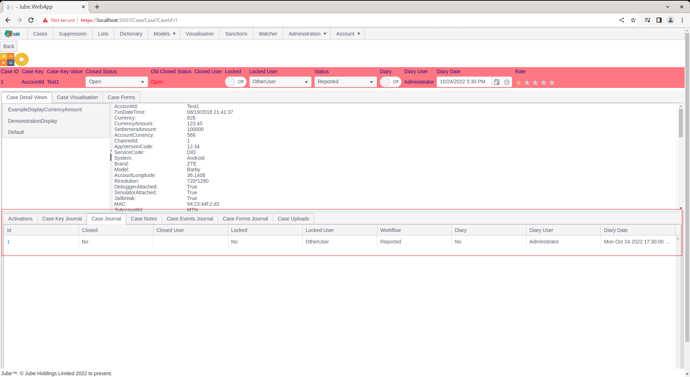

# Working Case Journal
Only a single case record may exist for a Case Key Value combination,  for a given case workflow.  Only upon a case being non existent or in Closed status, for that Case Key Value, for a cases workflow, may a new case be created.

Given creation it is quite possible that there can be many cases for a Case Key Value combination, for the case workflow, created over time as cases move from open to closed in response to different events / transactions.

The Case Journal shows the case records,  containing the same data as the status bar in the case page, in grid form. The Case Journal will contain all cases for a Case Key Value combination, for a case workflow,  ever created.

The presentation of data by Case Key Value combinations is of profound importance to ensure that a true history rolling up to a Case Key Value combination is maintained.

Navigate to a case record via either Fetch or Skim:

Note the tab by the name Case Journal:

Click on the Case Journal tab:

The Case Journal is the case status bar in grid row form:

Given the grid nature,  it follows that there can be many entries. Notice that the Case Id is a link:

The Case Id link,  upon click,  will load that case into the case page as if it were fetched or skimmed.

In the event that there are several cases for a Case Key Value combination history, the link allows for the navigation through the history of the Case Key Value combination.

As the tabs retrieve their information based on Case Key Value combination, only the case record contents will change over time, such as the event \ transaction payload.

The Case Journal serves to provide a reliable low level audit of the Case Key Value combination.