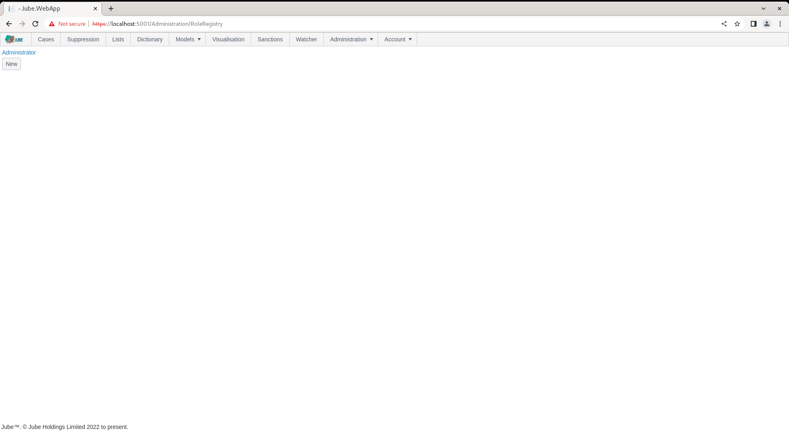
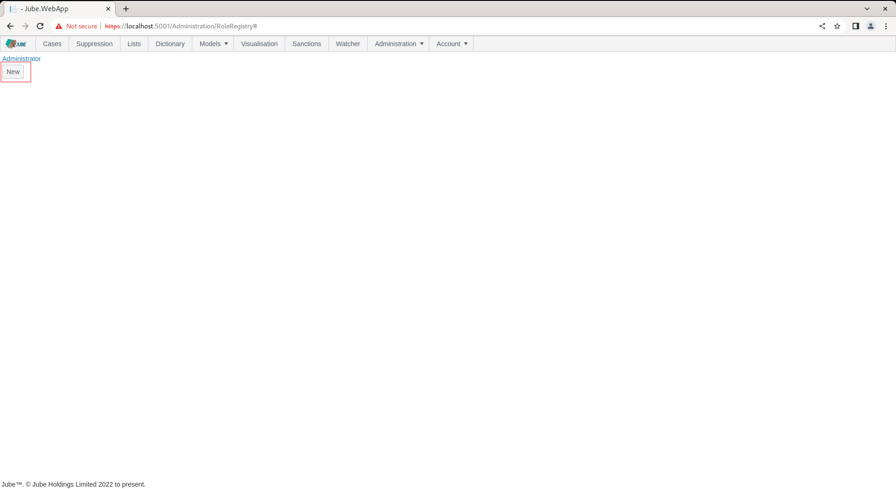
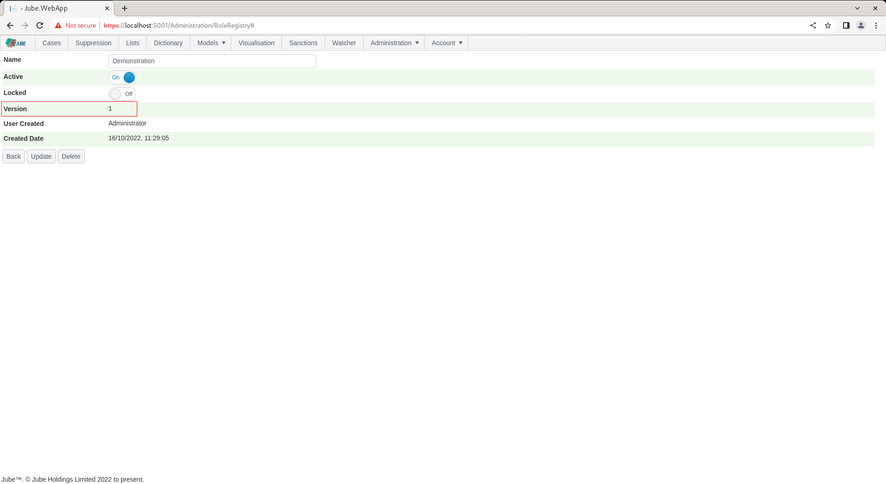

# Roles
Roles are a collection of both users and permissions,  for the purpose of authentication and authorisation in the user interface. It follows that permissions do not individually need to be allocated to a user, rather users allocated a role,  with the permissions being allocated to the role.

To create a role, navigate to Administration >> Security >> Roles:

The administrator Role is created by default by migrations.  To inspect the role,  navigate to the link:

Click on the link for the role to expand on the Role properties:

The Role can be updated and deleted,  otherwise use the Back button to return to the list of Roles:

To add a new Role,  locate the new button under the list of roles:

Clicking the new button exposes empty properties for the Role:

The Role takes no more than a name for the purpose of creating the entity.  Complete the Role as follows:

Click Add to create a version of the Role:

The Role is available to be allocated Permissions, and allocated to a User.