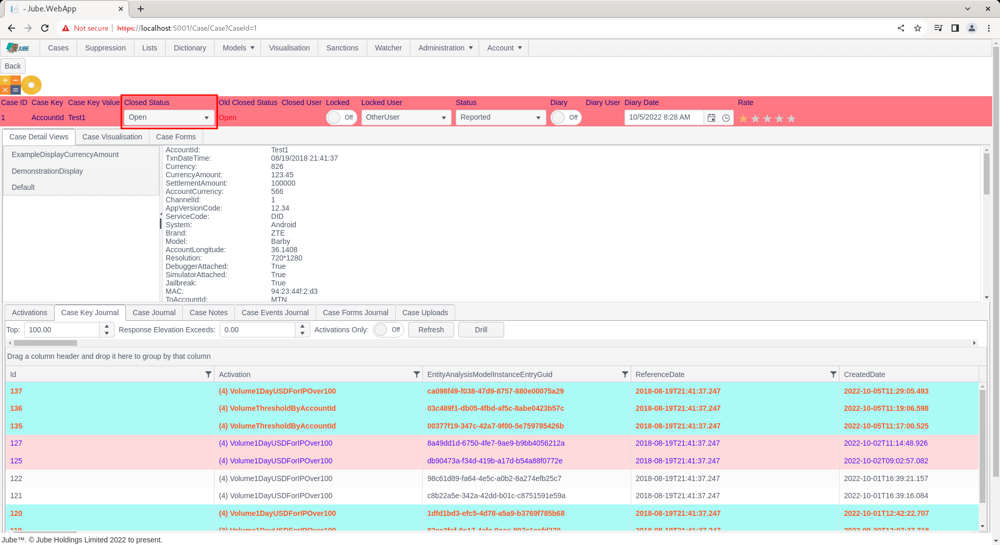
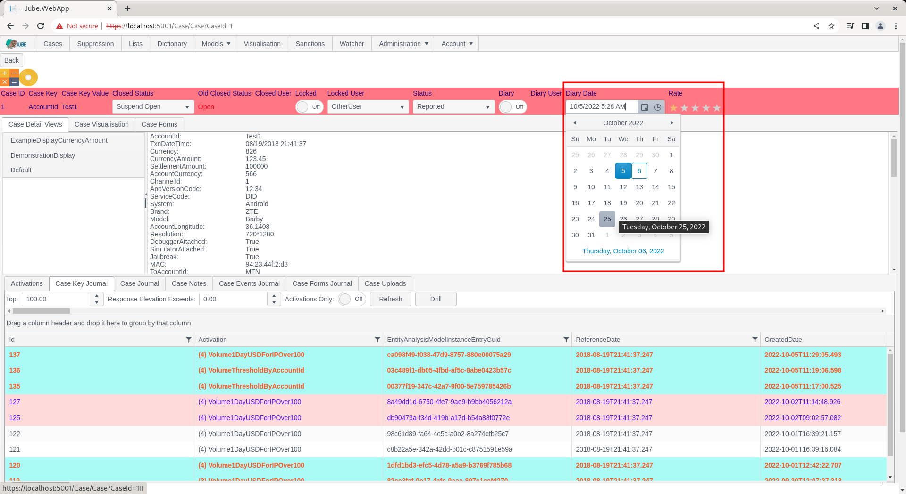
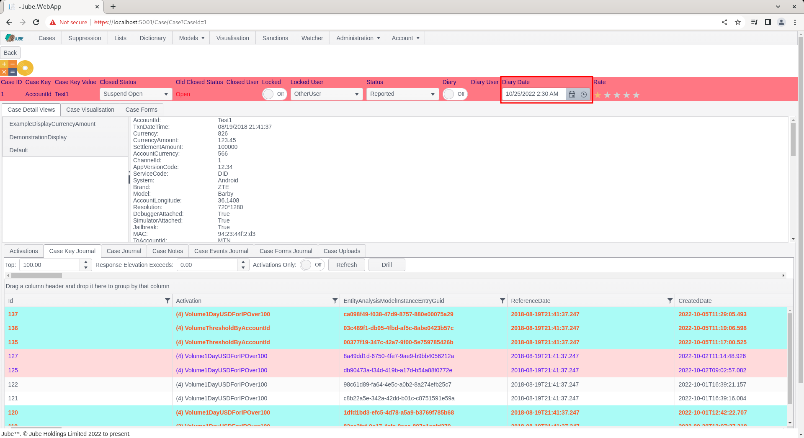

# Working Closed, Diary Date and Suspend
The Closed Status has the following dispositions:

| Name           | Description                                                                                                                                                                                                                                                            |
|----------------|------------------------------------------------------------------------------------------------------------------------------------------------------------------------------------------------------------------------------------------------------------------------|
| Open           | The case is open and ready to be worked. No other case can be created for the Case Key and Case Key Value for this case workflow.                                                                                                                                      |
| Suspend Open   | The case has been set to a pending status and on Diary Date expiration,  the case status will change to Open. No other case can be created for the Case Key and Case Key Value for this case workflow.                                                                 |
| Suspend Closed | The case has been set to a pending status and on Diary Date expiration,  the case status will change to Closed. No other case can be created for the Case Key and Case Key Value for this case workflow.                                                               |
| Closed         | The case has been closed and a new case can be created for the Case Key and Case Key Value for this case workflow.                                                                                                                                                     |
| Suspend Bypass | The case has been set to a pending status and on Diary Date expiration, the case status will be changed to closed.  The Suspend Bypass status is akin to an invisibility status and is used to sample out case records that would have otherwise caused case creation. |

Navigate to a case record via either fetch or skim:

To place a case into a Suspend Open status,  which will (subject to the EnableCasesAutomation being True as an Environment Variable) return to an open status upon Diary Date expiry,  start by navigating to the drop down containing Closed Status:

Click the Suspend Open Status which will update the case status to that Closed Status:

It is important that the cases workflow filters are used to remove the Suspend Open (and Closed) statuses from view,  the intention is that such status be judged as being hidden from view for a period of time (i.e. suspended).

Subject to the EnableCasesAutomation being True as an Environment Variable, the engine will ensure that on the expiration of the diary date, it will be moved back to an open status such that it is eligible for view.  To set a Diary Date,  note the Date Time Picker under the label Diary Date:

Note the Date and Time selection buttons adjacent to the free hand date selection:

Pick a date by selecting the calendar icon alongside the date and time picker (or typing freehand):

Then optionally a time by selecting the clock icon alongside the date time picker (or by typing freehand):

Upon changing the date time picker, the case record will be updated:

Note that unless the Diary button has been toggled, no background administration will be performed:

Only when the Diary toggle button is set to true,  is the inference that the case is in a diary and pending state:  

The background engine upon lapse of the Diary Date will set the Diary toggle button to False.  It follows that it is not the Diary Date itself that dictates the case being in a Diary state, rather the flag (which is important for the creation of cases workflow filters).

Upon lapse of the Diary Date - again, only if the Diary flag is set to True - the Diary flag will be toggled to No.   At the point the Diary flag is set to No,  the Suspend status is evaluated.  If the Closed Status is of Suspend Open,  then the Closed Status becomes Open. If the Closed Status is of Suspend Bypass or Suspend Closed,  then the Closed Status becomes Closed.