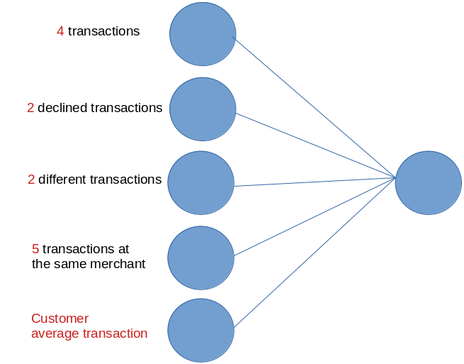
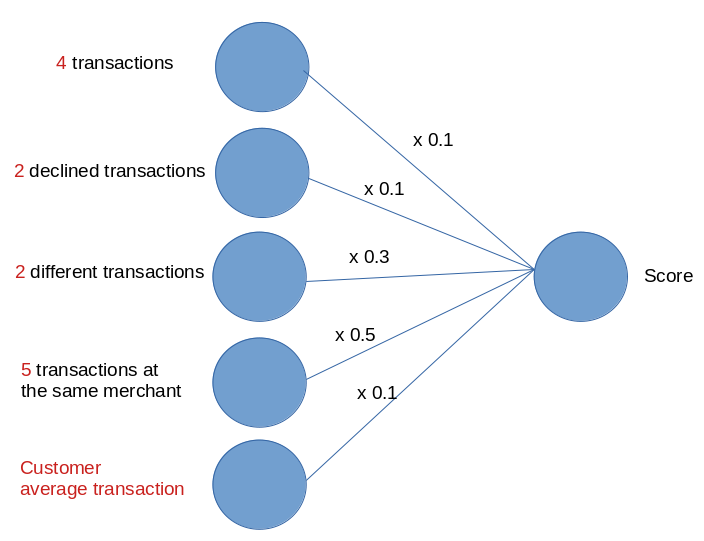

# Exhaustive Adaptation Concepts
Traditional risk management or anomaly detection is typically rule based.  Examples of rules might be:

* More than 4 transactions in a one day period.
* More than 2 declined transactions in a one day period.
* More than 2 different transactions in a one day period.
* More than 5 transactions at the same merchant in a one day period.
* Transaction more than twice (x2) customer average transaction.

Jube of course has a highly capable rules engine and crafting such rules without programming is trivial.

While rules are effective,  the manner in which the are derived is often quite anecdotal.  In the above examples,  deciding where to set the threshold is generally haphazard.  Furthermore,  overtime, the number of rules tends to burgeon, and the thresholds are rarely adapted.  It could be said that with rules the systems adaptation is neglected, and the rules efficacy almost certainly wanes (putting aside the haphazard manner in which they were implemented in the first place). 

Doubtless over time rules becomes impossible to manage and fail to adapt to new risk typology.

For the above example,  consider the continuous values, or components, of the rules:

* 4 transactions.
* 2 declined transactions.
* 2 different transactions.
* 5 transactions at the same merchant.
* Customer average transaction.

Disregarding the threshold,  it could be expressed as:

In the above representation, all of the continuous values converge.  The convergence would be expressed as a score.  The score might be derived by a series of weights:

The establishment of weights in the above example would not be a significant step forward from rules if it were not for the manner in which these weights were established,  and weights are established by machine learning algorithms (in Exhaustive the Levenberg Marquardt back propagation algorithm), on a wholly quantitative basis.

The final rule set out within Jube, might resemble:

* Transaction Score greater 0.8.

It follows that risk appetite can be set in the varying of just a single threshold value.

The internal weights are updated overtime as new data emerges, representing the systems ability to adapt.  The retraining of models, or the tweaking of weights is invoked on a batch basis and is most commonly approached in a regular regime of perpetual champion and challenger model creation and evaluation.  The online adaptation of the weights is not all that achievable without some batch intervention,  and even then, online learning tends to be an illusion crafted by the perpetual execution of the end to end training process.

One of the challenges in the selection of Machine Leaning algorithms is the extent to which the weights are created based upon feedback to the system (this is to say supervised) as opposed to identifying anomaly or clusters without feedback (this is to say unsupervised).  A significant challenge in risk management systems is establishing and obtaining enough feedback data to be able to create a supervised model (which is to say fraud does not happen often, and when it does the typology moves on rapidly).

Jube takes a novel approach to machine learning,  which is ultimately Supervised Learning, yet relying on Unsupervised Learning to create datasets with sufficient amounts of class data.  The approach to Machine Learning taken by Jube is automated, and as introduced follows:

* Data will be extracted from Jube for the Abstraction Rules, which would be the continuous values set out above example.
* This data will be trained on the basis of anomaly,  where highly anomalous events would be classified as being fraudulent.
* This data will be blended with any specific feedback data tagged, tending to be lower in volume,  but salient.
* Many Neural Network topologies (this is the number of hidden layers,  the width of the hidden layers and the activation function type) are trialled, evolved and trained based upon the data.

The outcome will be a complex neural network model created on a wholly quantitative basis:

The more hidden layers and the width of those hidden layers allows for more and more complex and comprehensive scenarios to be identified.  Jube has its own training algorithm that is especially adept at identifying optimal model topology,  although the actual weights are established by the Levenberg Marquardt Back Propagation algorithm.  Identification of optimal topology for the anomalous class is more limited, and relies on a Single Class Support Vector Machine evaluation on all available variables.

The exhaustive training algorithm takes the following steps in training a model:

* For the model,  a list of variables that are eligible for Exhaustive Machine Learning are collated.  Eligible variables are values taken data created by the from Abstraction Calculation, TTL Counter and Abstraction Rules.  The raw payload is not processed as the assumption is that at least some abstraction of that raw payload data be required (abstraction is seen as a way to introduce domain experience into the model).
* For the eligible variables, a sample of data is extracted from the archive for the given filter specification.  If a class variable is specified by filter,  this wil be excluded,  as the class variable will be merged in a separate processing step.  The sampling is subject to limits specified in the Environment variables.
* Statistics are performed on the sample, noting again that the class data is not included. These statistics provide valuable insight, however are principally available for Z score variable normalisation which is an important training step.
* Using the statistics, data will be normalised if continuous variables, but not binary variables.
* If Anomaly has been selected then a One Class Support Vector Machine will be trained for all variables.  Given that the data is sampled randomly across the whole population of data,  this will create a reliable anomaly detection model that will return the probability that an example fits the general pattern expected of the sample.  The One Class Support Vector Machine could on its own provide for adequate detection of anomaly,  however, the Exhaustive model seeks to blend any such classifications with data fed back by the end users,  henceforth the recall of a One Class Support Vector machine serves as the class variable for a Neural Network model training.
* Given a filter being provided, records matching the filter are sampled for blending to the dataset that had otherwise been used on a one class basis.  Data matching the filter is merged into the dataset.  The dataset with merged class data is shuffled,  however at this stage it is unlikely that that the dataset will be symmetric around the class (in that there will be more variables in one class than another).
* The dataset will be made symmetric randomly to ensure there is an even number of class records.
* Correlations will be calculated using Spearman Rank Correlation for each variable versus the class variable to identify variables with the strongest linear association.  The process of correlation is repeated for each variable, for each variable, to allow for detection of multi-colinearity.  Given that Neural Networks are considered a non linear and that the Exhaustive algorithm will select variables randomly to evolve topology on an exhaustive basis,  the correlation analysis is largely for manual analytical insight.
* The Exhaustive algorithm will train a neural network on an exhaustive basis seeking the most powerful model (based mean of correlation and classification accuracy between predicted vs actual) with the simplest topology, via the following steps:
  * The number of variables and the variables themselves will be selected randomly as per settings in the Environment Variables.
  * A search for the most performant Activation Function will be performed to be carried forward as follows.
  * A search for variables for which the model appears insensitive is performed,  with those variables being removed given no reduction in performance.
  * Data is split between Training, Cross Validation and Testing as per settings in the Environment Variables.
  * Training data will be used to train a model on an evolving basis whereby processing elements then hidden layers will continue to be added until such time as there is no further improvement in performance.
  * Upon topology being selected, the model will be finalised and trained more intensively. Testing data will be used to validate the model and the performance of the model compared with current best, promoting if the model is more performant (although in absolute deadlock the least complex topology would win).
  * Final sensitivity analysis is performed and;
  * Using variable statistics and a normalised variable (i.e. Min, Max and Mode) Triangle Distribution, Monte Carlo simulation is performed through the model for the amount of times specified in the Environment Variables,  with the descriptive statistics of the positive class values being stored.

Every step of the training is inserted into tables in the database, and these can grow very large.  Keeping in mind, putting aside Deep Learning, topology design is one of the hardest parts of the machine learning discipline; The intention of storing such large amounts of data about the exploration of the model is to be able to use this data in the future to make estimations about the most appropriate model topology based on the statistics calculated at the start of the process, thus improving generalisation while dramatically reducing training time.

Keeping in mind that the model is set to identify anomaly,  it should allow for anomalous – the unknown unknown - events to be reliably identified, which is something that cannot reliably be done with rules. As the score can be recalled in real-time,  it naturally follows that the transaction can be declined on the basis of overly anomalous nature.