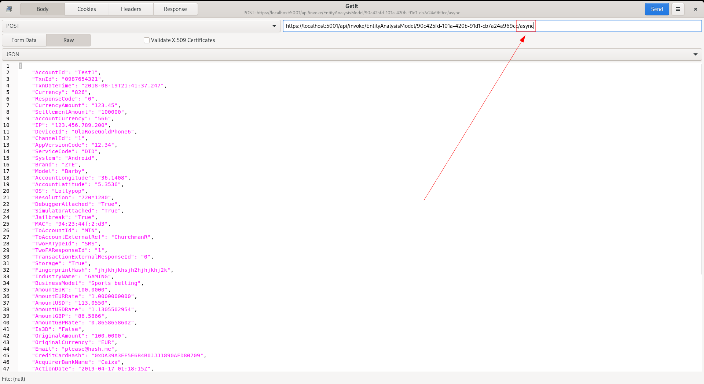
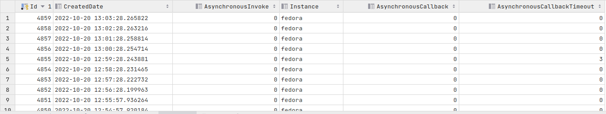
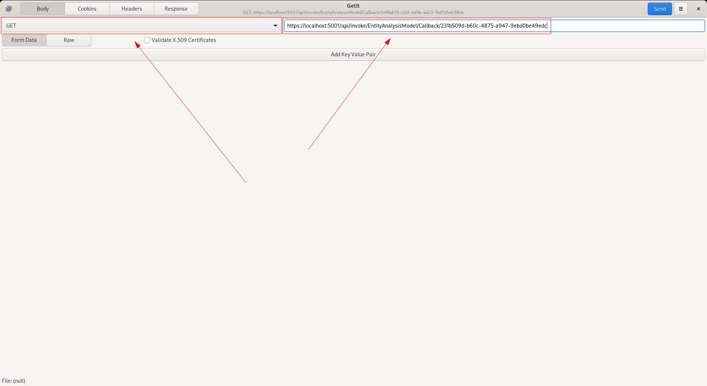
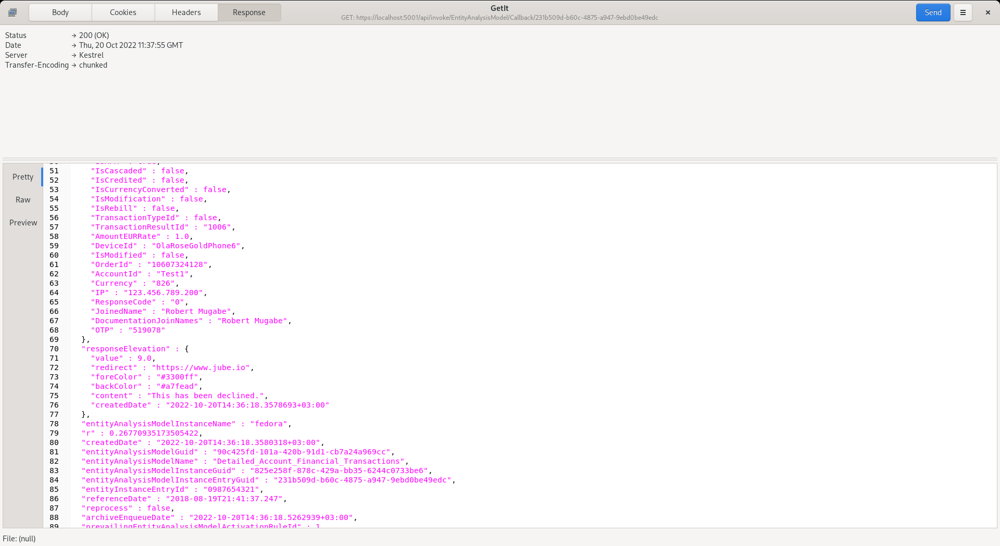

🚀 Get to pre-production in weeks, not months, with private [training](https://www.jube.io/jube-training) direct from
Jube's developer — real sovereignty, zero vendor lock-in.

# HTTP API Asynchronous Model Invocation

Most of the procedures in this documentation makes use of synchronous HTTP requests in which the request is blocked for
the client unitil absolute conclusion of the processing, notwithstanding a significant amount of asynchronous processing
taking place in the processing to ensure reasonable response time by eliminating blocking waits on IO.

As the HTTP requests are handled by the Kestrel web server embedded into Jube, this translates to a request being made
of a Thread from the .Net managed Thread Pool.

The .Net Thread Pool is perfect at sizing itself, however in periods of burst, thread load or saturation can occur,
which may lead to inconsistent - yet not necessarily unreasonable - response times. The manageability and
maintainability of the application becomes difficult should unmarshalled requests be made of the thread pool, especially
in burst. Henceforth, as a philosophy, it is a preferred approach to queue work on in the instances internal concurrent
queues and manually size thread counts, having detailed knowledge of the underlying hardware infrastructure. A further
benefit of the manual thread sizing approach is to allow for asynchronicity in the client integration, without having to
relying on asynchronous methods and thread pools client side, which may bring about many of the same challenges that
this architecture sets out to solve.

There exists a switch in the model invocation endpoint which will instruct the asynchronous processing of a transaction
or event:

[https://localhost:5001/api/invoke/EntityAnalysisModel/90c425fd-101a-420b-91d1-cb7a24a969cc](https://localhost:5001/api/invoke/EntityAnalysisModel/90c425fd-101a-420b-91d1-cb7a24a969cc/async)




By adding the Async switch to the endpoint url the request payload is only processed up to the conclusion of Request
XPath, after which the remainder of the processing is instructed via internal asynchronous queue, with a partial
response payload being returned by HTTP. There are a predefined number of threads available for the remaining model
invocation, specified as an Environment Variable called ModelInvokeAsynchronousThreads:

``` text
ModelInvokeAsynchronousThreads=1
```

In the event of burst, or incorrectly sized thread instantiations given available compute and load, then the queue will
backup. The queue balance can be monitored via select:

``` sql
select * from "EntityAnalysisModelAsynchronousQueueBalance"
```

Returning the following data:



Queue balances are captured roughly evey minute. In burst, queues backing up are to be expected, and will clear assuming
that the threads are sized slightly ahead of demand.

The response payload can be called back via the invocation of the GET HTTP method Callback HTTP endpoint using the
entityAnalysisModelInstanceEntryGuid element value taken from the initial HTTP response as key:

[https://localhost:5001/api/invoke/EntityAnalysisModel/Callback/de1119dc-dda0-4916-a716-bbd39c69a17e](https://localhost:5001/api/invoke/EntityAnalysisModel/Callback/de1119dc-dda0-4916-a716-bbd39c69a17e)



The response payload will be identical to that returned synchronously having been stored in an instance buffer once it
is complete, and communicated via notification to other running instances. The default timeout is three seconds which
implies that should background processing not have concluded, and made available within thirty seconds, a HTTP status
408 will be returned. The presence of timeouts would imply that that the threads are not handling burst adequately and
not able to reach requests within tolerance.



A callback may only be made once, as the callback is deleted upon matching EntityAnalysisModelInstanceEntryGuid value.

To enable HTTP callbacks, it is necessary to set the EnableCallback and CallbackTimeout Jube Environment Variables:

``` text
EnableCallback=True
CallbackTimeout=3000
```

There exists cluster wide publishing of callback Create and Delete events to facilitate effective continued load
balancing. The full response payload is stored in the instance memory, duplicated by however many instances are
configured for callback, which is the main rational for both Create and Delete events, allowing for the releasing of the
memory across all instances just as soon as the Callback has been collected.

Given the potential for memory saturation on orphaned callbacks, in the event that a callback has not been collected, it
will be removed upon the timout interval having been realised, configured in milliseconds in the CallbackTimeout
Environment Variable. Monitoring for timeouts is achieved by polling the "EntityAnalysisModelAsynchronousQueueBalance"
table as above, as a timout counter is maintained for each Callback.

## Implicit Async

The Async switch above requires the client to explicitly opt in per request, and hands the request off to the internal
concurrent queue described above -- decoupling entirely from the calling request's own thread. Implicit Async is a
different, complementary mechanism: it is a per Model switch, configured on the Model itself rather than the URL, for
models whose processing time is usually short enough to tolerate a normal synchronous request, but which occasionally
runs long.

When Implicit Async is enabled for a Model, along with a timeout in milliseconds, a plain synchronous invocation (the
same URL as a normal call, with no Async switch) still runs inline on the calling request's own asynchronous flow -- it
is not hoisted onto the internal concurrent queue or its dedicated thread pool, since the pipeline is already
non-blocking and does not need to be defended from the thread pool in the way the Async switch above is concerned with.
The request waits on that inline processing only up to the configured timeout:

- If processing concludes within the timeout, the caller receives the full response exactly as an ordinary synchronous
  call would, with `ImplicitAsyncTimedOut` present and `false`.
- If the timeout is reached first, the caller still receives an immediate HTTP response, using the same response schema,
  populated with only the request's identity and timing fields (`EntityAnalysisModelInstanceEntryGuid`,
  `EntityInstanceEntryId`, `ReferenceDate`, and similar) -- the fields that depend on rule evaluation are simply absent,
  since evaluation has not concluded. `ImplicitAsyncTimedOut` is present and `true` on this response, the one
  authoritative signal that this particular call raced its own timeout and lost -- everything else about the response
  schema stays identical whether or not a timeout occurred, so this field is what a caller should actually branch on,
  rather than inferring a timeout from which other fields happen to be absent. Processing continues in the background
  exactly as it would for the Async switch, and the caller can retrieve the completed response via the same Callback
  HTTP endpoint described above, using the `EntityAnalysisModelInstanceEntryGuid` from the timed-out response.

This is a deliberate content trade off, not an oversight: the fields populated during rule evaluation are held in
structures optimised for a single writer on the invocation's own thread, so a client-facing snapshot of those fields
cannot safely be taken from a second thread while evaluation is still running on the first, and Implicit Async does not
attempt to.

`ImplicitAsyncTimedOut` is not reset once the background invocation eventually completes: the Archive row and the
response the Callback endpoint eventually returns both carry `ImplicitAsyncTimedOut: true` for an invocation that timed
out, even though it went on to finish successfully in the background -- it is a record of what the caller
experienced at the time, not of the invocation's final outcome. Combined with the invocation counters below, this is
what lets a consumer of the Archive distinguish "this row is from a call that completed within its Implicit Async
timeout" from "this row is from a call the timeout gave up on, whatever happened next."

Implicit Async is configured per Model:

``` text
EnableImplicitAsync=True
ImplicitAsyncTimeoutMilliseconds=5000
```

Invocation counters distinguish an Implicit Async request that completed inline from one that timed out, and further
distinguish a timed-out invocation that later completed successfully in the background from one that later faulted --
available per Model via:

``` sql
select "ImplicitAsyncInvoke", "ImplicitAsyncTimeout", "ImplicitAsyncCompletedAfterTimeout", "ImplicitAsyncFaultedAfterTimeout" from "EntityAnalysisModelProcessingCounter"
```

The number of Implicit Async invocations currently running past their timeout is available as a live gauge, both per
Model (`EntityAnalysisModelAsynchronousQueueBalance`.`ImplicitAsyncOverdue`) and cluster wide
(`EntityAnalysisAsynchronousQueueBalance`.`AsynchronousImplicitAsyncOverdue`), alongside the other queue balances
described above.