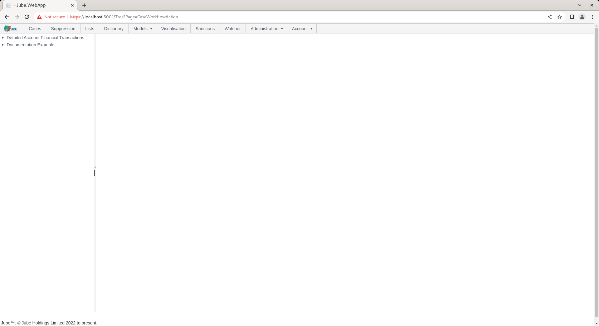
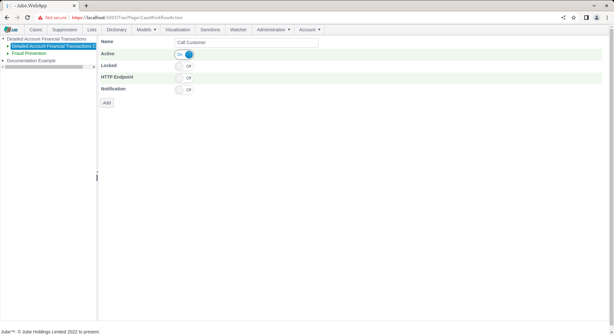
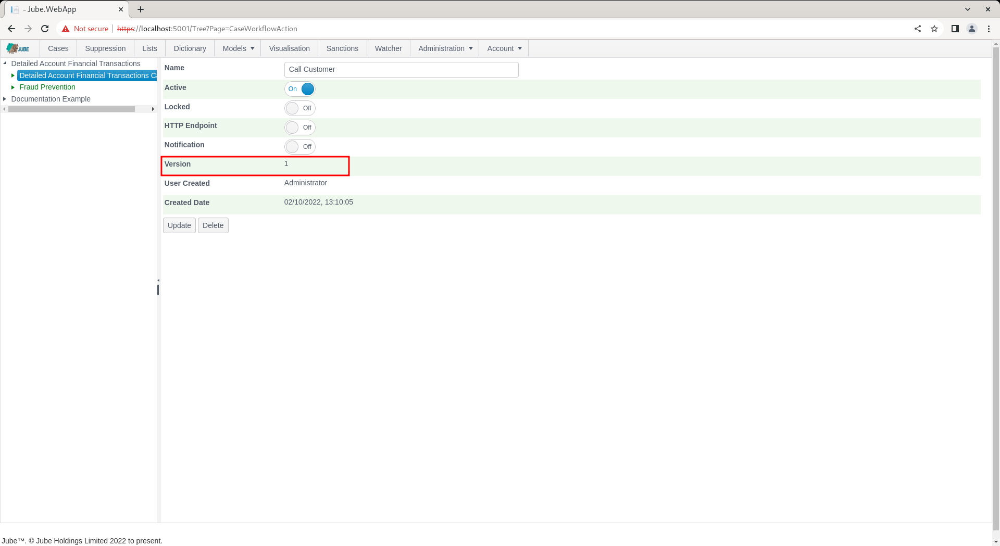
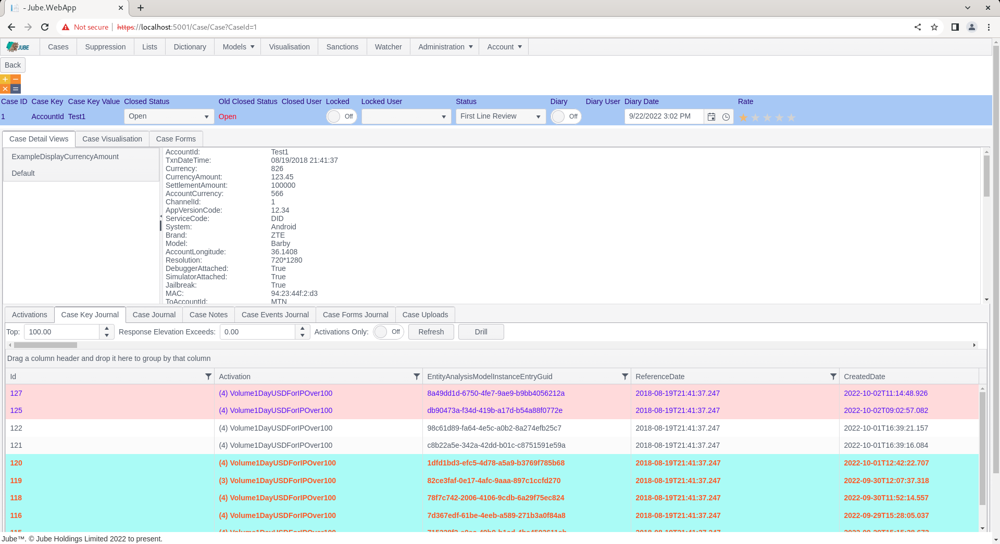
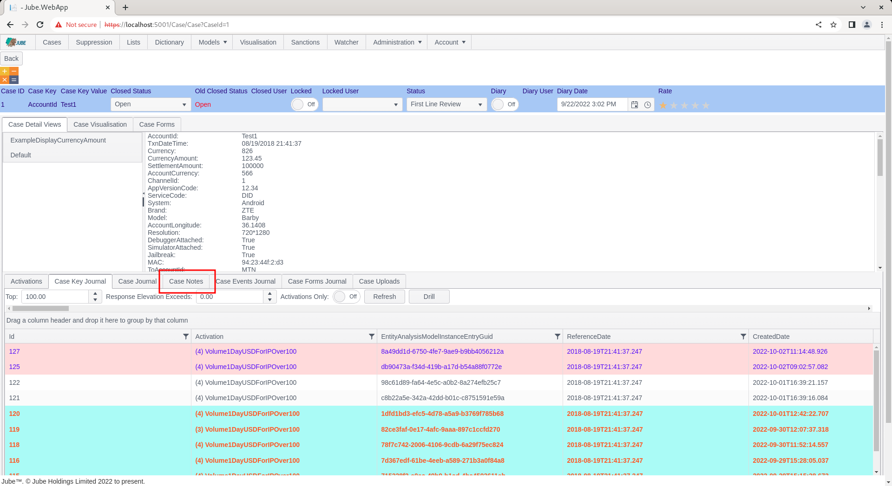
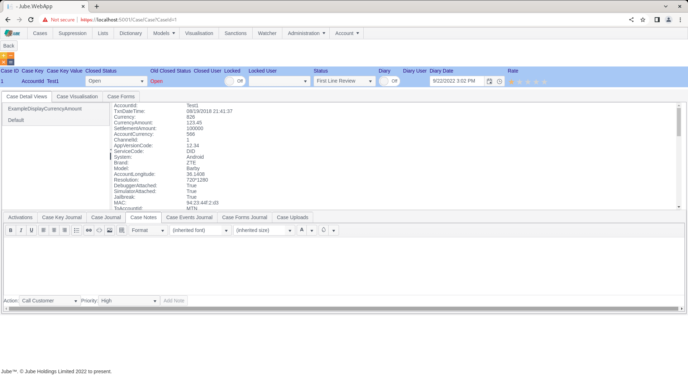
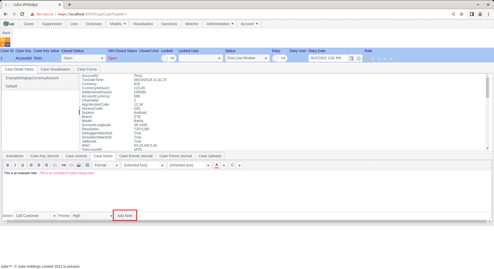
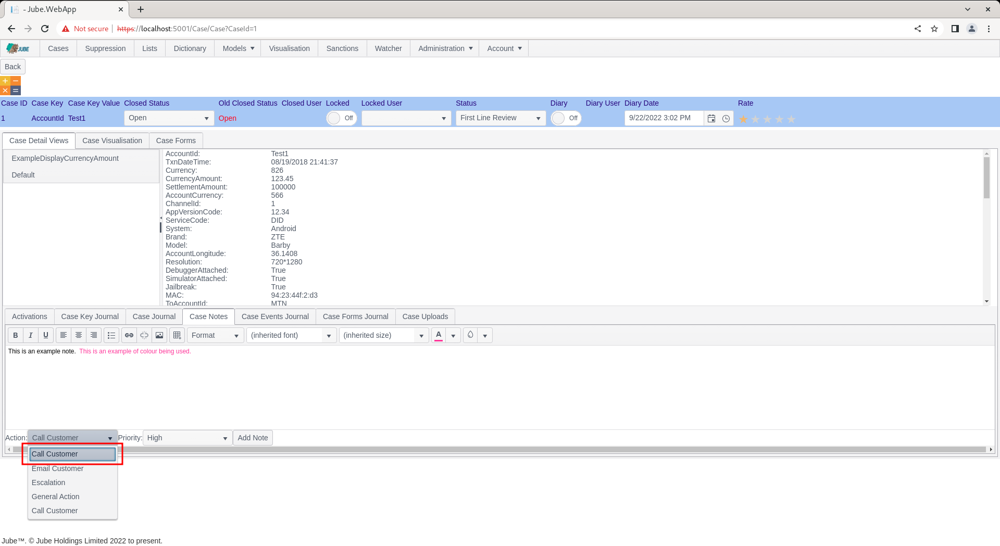
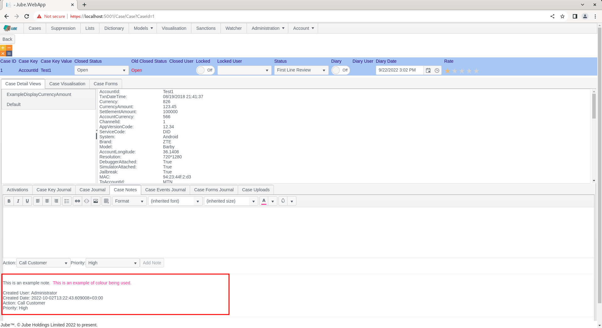

🚀Speed up implementation with hands-on, face-to-face [training](https://www.jube.io/training) from the developer.

# Case Workflow Action
Case Notes provide a means to annotate cases and provide a history of the unstructured actions taken.  Case notes by their nature are unstructured and cannot be reported upon. There are two structured data items that can be attached to a case note:

* Priority (High,  Medium and Low) and;
* Action Codes which are configured rolling up to the Cases Workflow.

In addition to providing typing and structure to unstructured notes,  Action Codes can also drive Notifications and integrations \ automation.

To create an Action Code,  begin by navigating to Models >> Cases Workflows >> Cases Workflow Action:

Expand the first level of the tree and click on the model to start a new entry:

Actions are extremely basic in comparison to other child elements available to the case workflow,  really only taking a generic parameter of Name and the common parameters to drive HTTP Endpoints of Notifications.

Complete the form as follows:

Scroll down and click the Add button to create a version of the Cases Workflow Action:

Navigate to a case:

To allocate the newly created Action, locate the Case Notes tab:

Click on the Case Notes tab to expose recent notes, and the ability to create a new entry:

Locate the text editor section to create a new Note:

Type into the text editor as required:

On typing, the Add Note button will be enabled:  

Alongside the add button there is a drop down containing the newly created Cases Workflows Action:

Having set the values,  click on the Add Note button to create the note:

Notice how the note had been added and the Action and Priority recorded alongside.