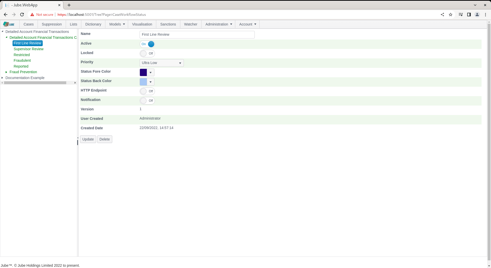
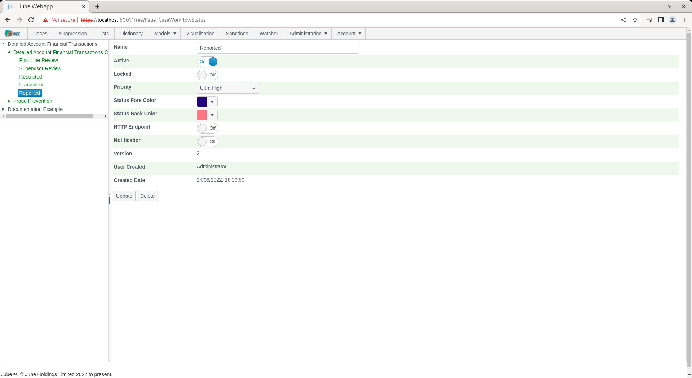
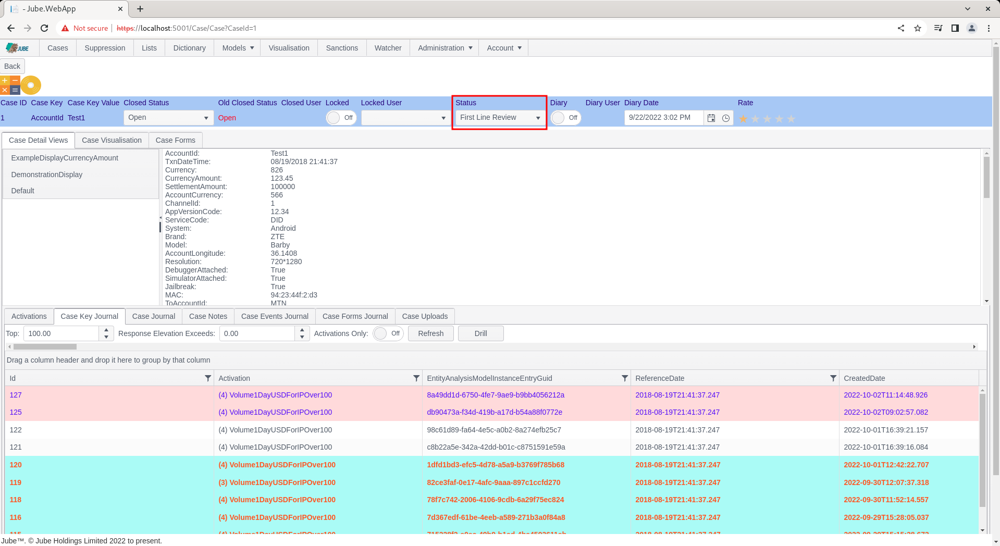
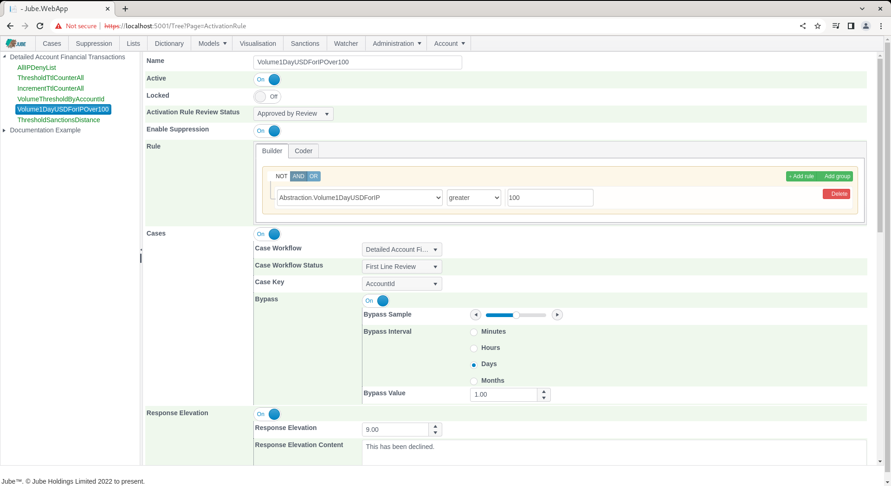
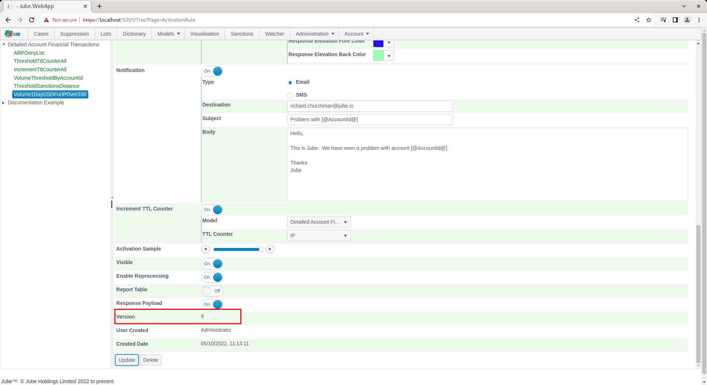
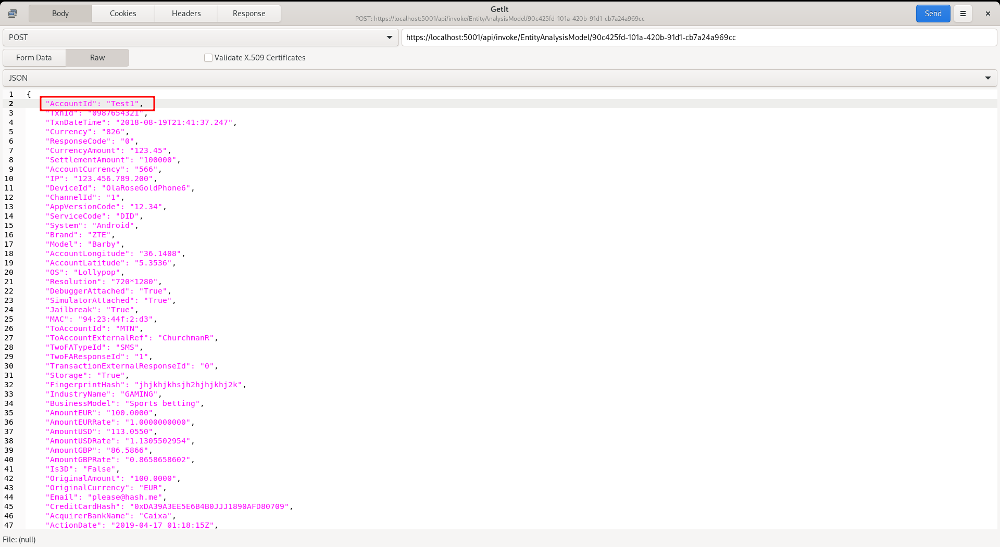
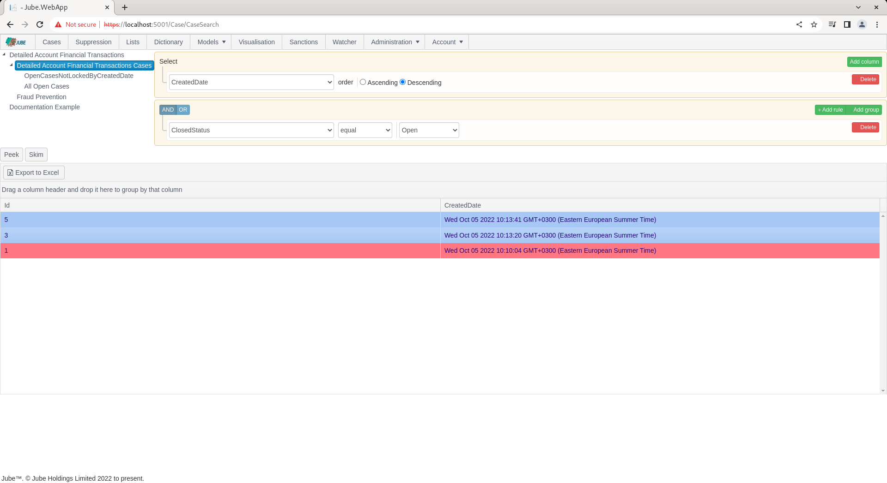
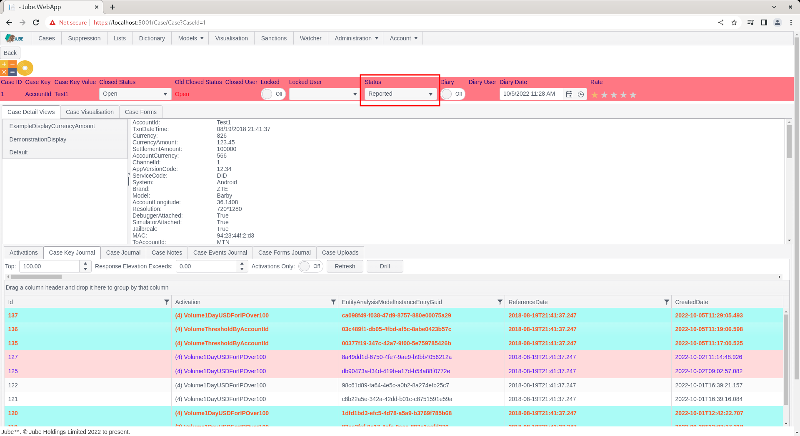

# Creating Status Elevation
Consider the scenario where a rule creates a case having allocated a status of FLD (First Line Defence) as a consequence of an velocity rule having matched.  Thereafter,  suppose a transaction occurs in a sanctioned country, which is of course a much higher risk event than a velocity having been breached.  Status elevation is able to change the status in an upward,  more severe direction, on rule match, yet not allow for the status to be changed to a less severe,  downward direction.

Navigate to Models >> Cases Workflows >> Cases Workflow Status, navigating to the status First Line Review:

Note the Priority as being Ultra Low.

Navigate after to the status Reported Cases Workflows Status:

Note the Priority as being Ultra High.

To demonstrate the status elevation, identity a case key and case key value that is currently open in the status FLD by navigating to the cases page, navigating to the case workflow and selecting the case workflow filter All Open:

Navigate to Case Id 1:

Make a note of the Case Key Value from the status bar,  in this case AccountId = Test1.

If the case exists in all but a closed status, another case may never be created for a Case Key Value combination.  However,  it is possible to raise the status code priority based on subsequent rule matches.

Navigate to Models >> Activation >> Activation Rules and navigate to the existing rule Case Creation:

Scroll down to the case creation parameters:

Change the Case Workflow Status Priority to Reported:

Scroll down and update a new version of the Activation Rule:

Synchronise the model via Entity >> Synchronisation and repeat the HTTP POST to endpoint [https://localhost:5001/api/invoke/EntityAnalysisModel/90c425fd-101a-420b-91d1-cb7a24a969cc](https://localhost:5001/api/invoke/EntityAnalysisModel/90c425fd-101a-420b-91d1-cb7a24a969cc) for response as follows, noting AccountId to Test1:

To test the status elevation, identity a Case Key Value combination that is currently open, in the status FLD, by navigating to the Cases page, then navigating to the case workflow, and finally selecting the case workflow filter All Open:

Notice for the cases grid that the case has been elevated to a High status from its original default status (as identified by a change in colour and upward classification of the Priority) or in expanding the case:

