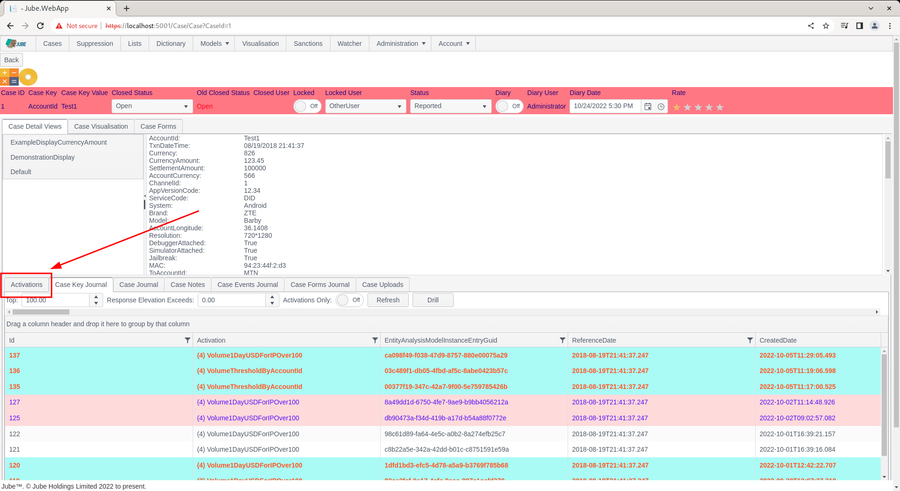
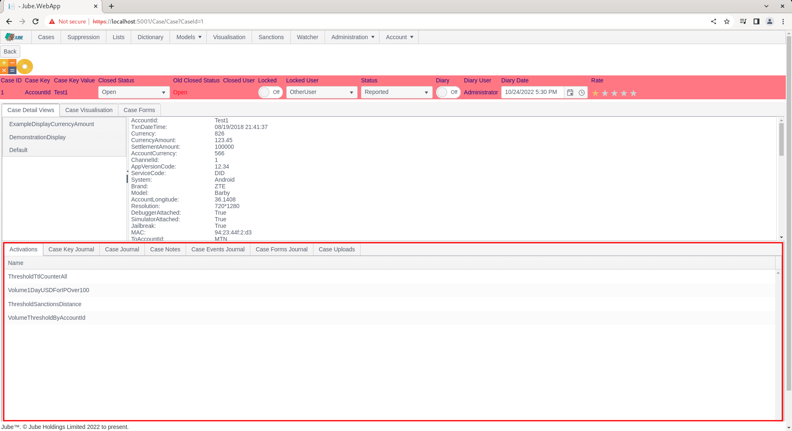

🚀Speed up implementation with hands-on, face-to-face [training](https://www.jube.io/training) from the developer.

# Working Activations
At the point a case is created a copy of the event is stored alongside the case record.  In this event payload there is a list of the Activation Rules that were matched upon,  stored in their order of priority and match.  The Activations tab exists to write out these activations in a convenient form representing the one to many relationship that exist between transaction or event (one) and Activation (many), insofar as one transaction or event may have many matches:

Navigate to a case record via either fetch or skim:

Notice that in the case detail pane, there exists a series of tabs, noting specifically the tab titled Activations:

Click on the tab titled Activations:

The Activations tab presents the Activation Rules that have matched, in the order of Response Elevation descending, upon match, with the first match at the top,  the last match at the bottom. Activation Rule processing, and thus priority of Activation, is on the basis of:

* Enabled For Response Elevation and;
* Highest Response Elevation First.
* Enabled for Case Management and;
* Highest Priority Status First.
* Enabled for Notifications.
* Enabled for TTL Counter Increment.
* Alphabetically on Activation Rule Name.

It follows, that on an Activation Rule matching, the order of rules matching will respect the above.

Activations will only be visible if the Visible flag has been set in the Activation Rule:

