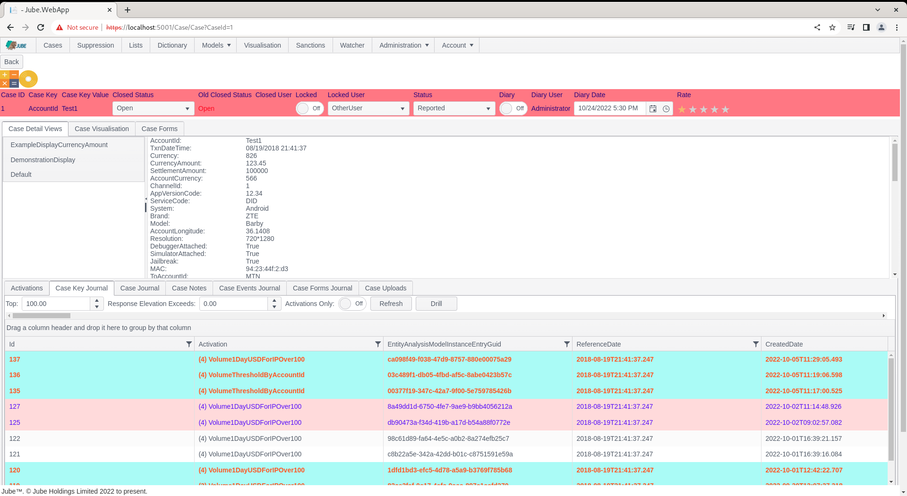
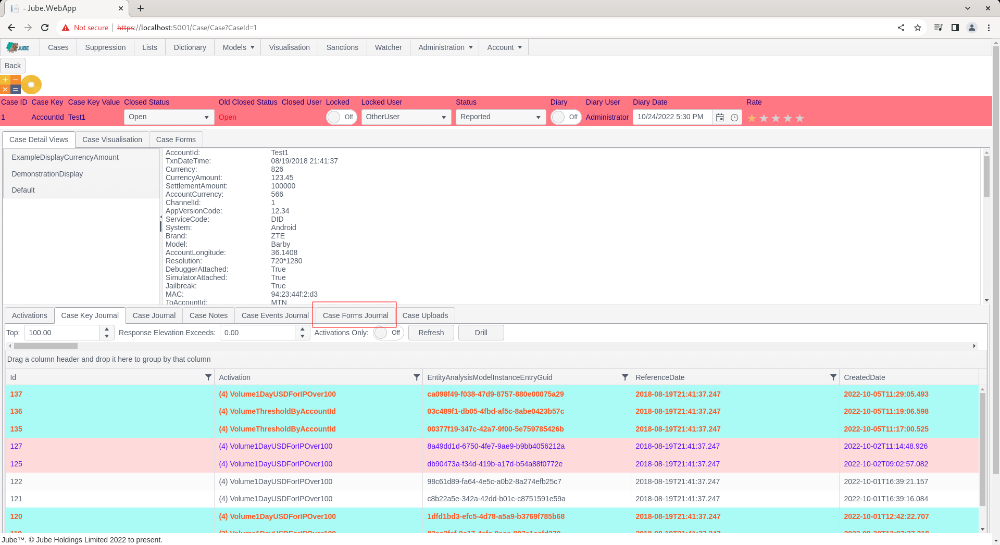
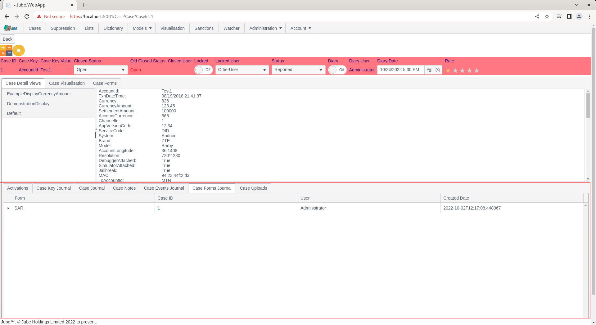
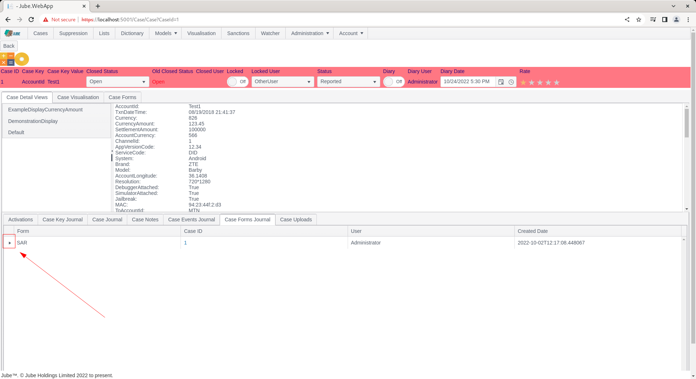

🚀Speed up implementation with hands-on, face-to-face [training](https://www.jube.io/jube-training) from the developer.

# Working Case Form Journal
Forms are used to capture structured data and invoke certain automations using the HTTP Endpoint and Notification Functionality.  The data captured during form invocation, which is documented in a separate configuration section of this documentation,  is available for end user review in its entirety.

Navigate to a case record via either Fetch or Skim:

Notice the Case Forms Journal tab:

Click on the Case Forms Journal Tab:

The documentation elsewhere shows the creation of a Cases Workflows Form and the invocation of that, henceforth there exists an entry for that execution.

The grid is hierarchical in nature, thus clicking on the expansion icon on the left hand side, at the row level, will proceed to expand to reveal the form element entries and values:

Clicking on the expand icon will expose all of the values available after the form was submitted:

Notice how the elements of the form have been merged into the case creation payload, which happened during the submission of the form and before any Notification or HTTP Endpoint invocation,  such that all these elements are available for tokenization for those processes.  Given the structured nature of the data capture,  it is simple to produce rich reporting based on the data submissions,  although the most powerful use case for Cases Workflows Forms is for the purposes of integration and automation via HTTP Endpoint.