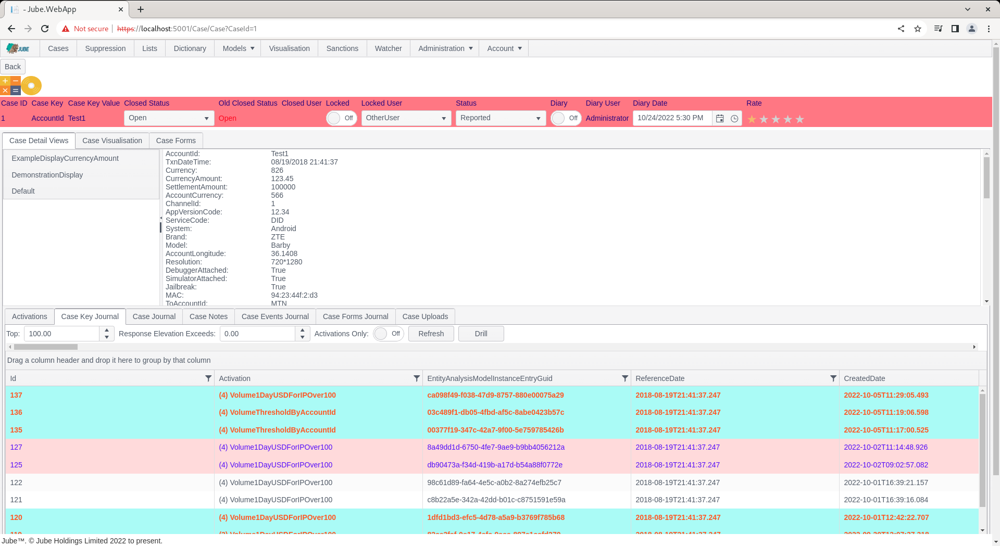
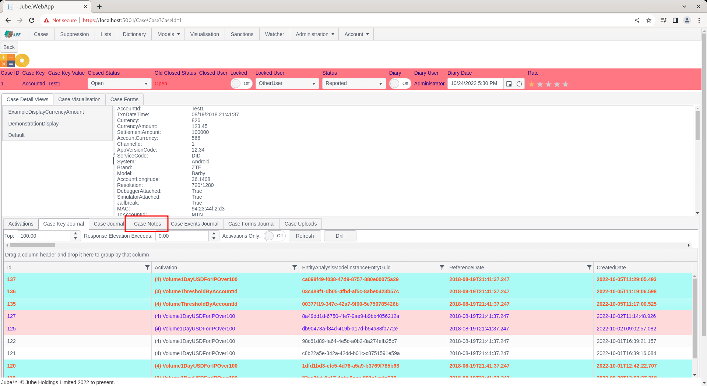
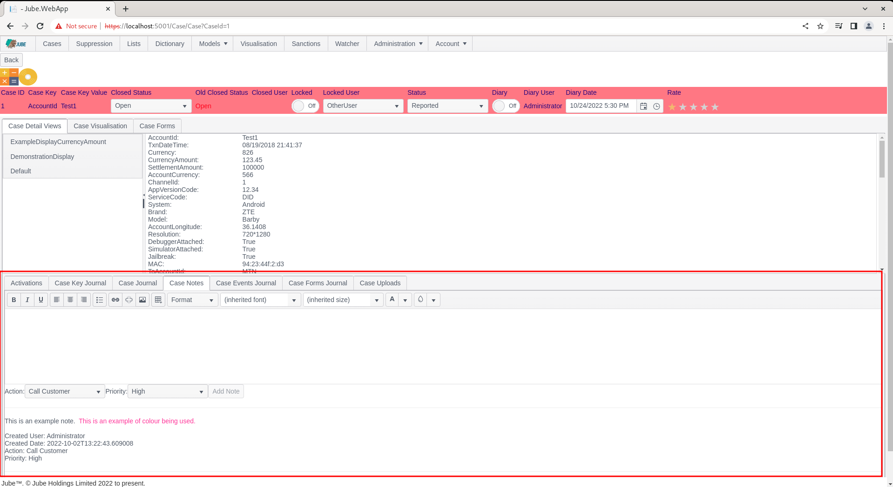
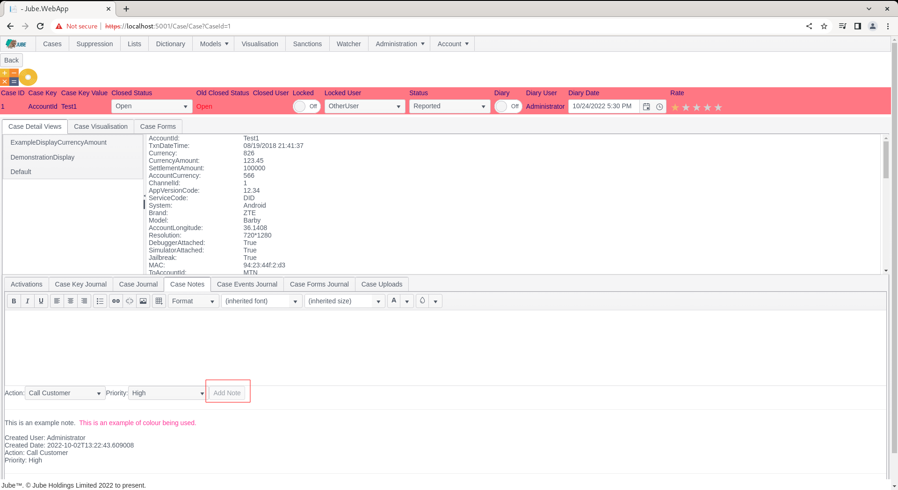
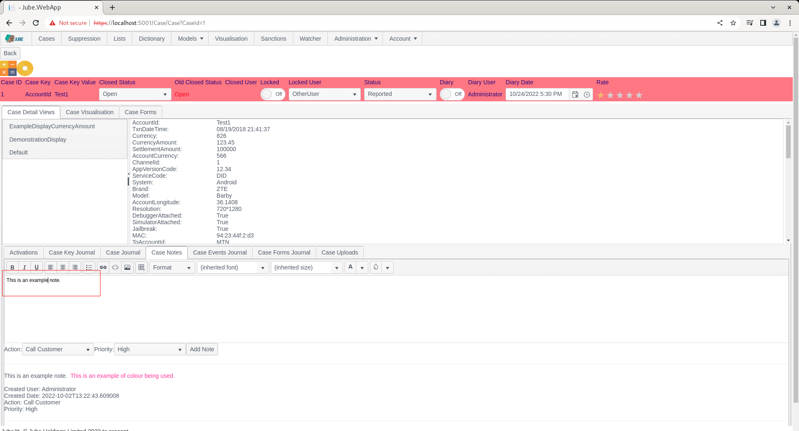
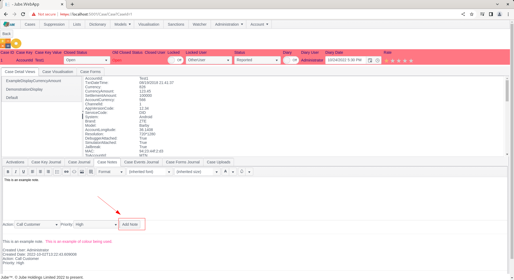
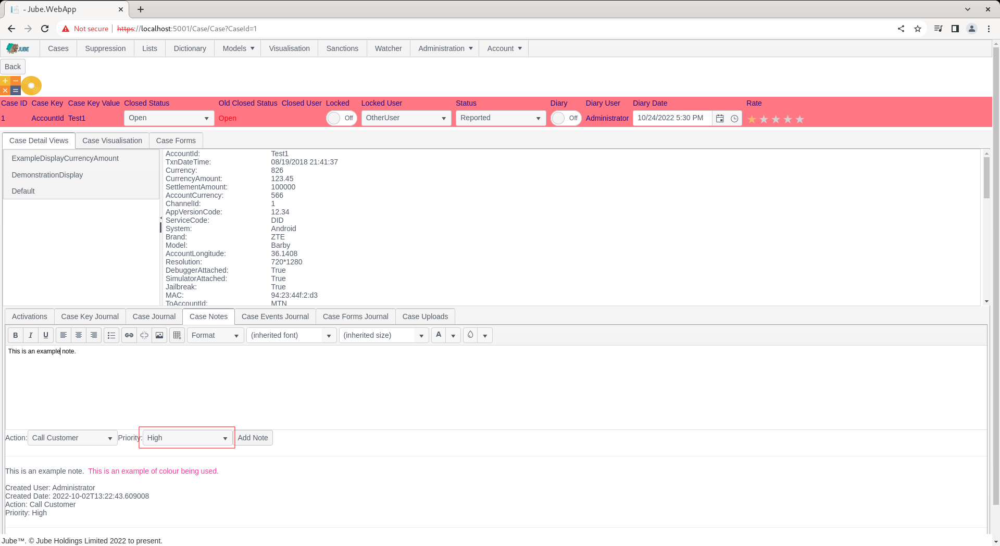
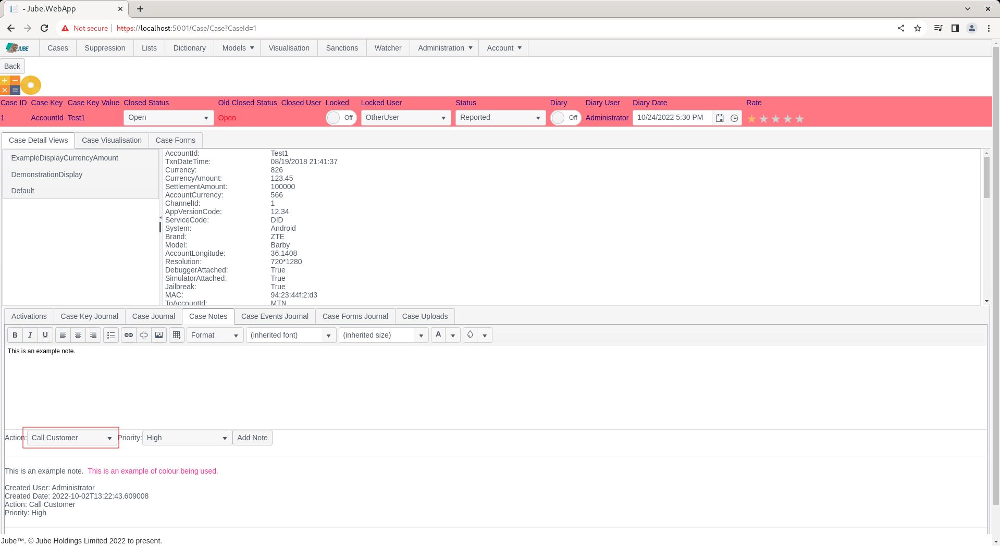
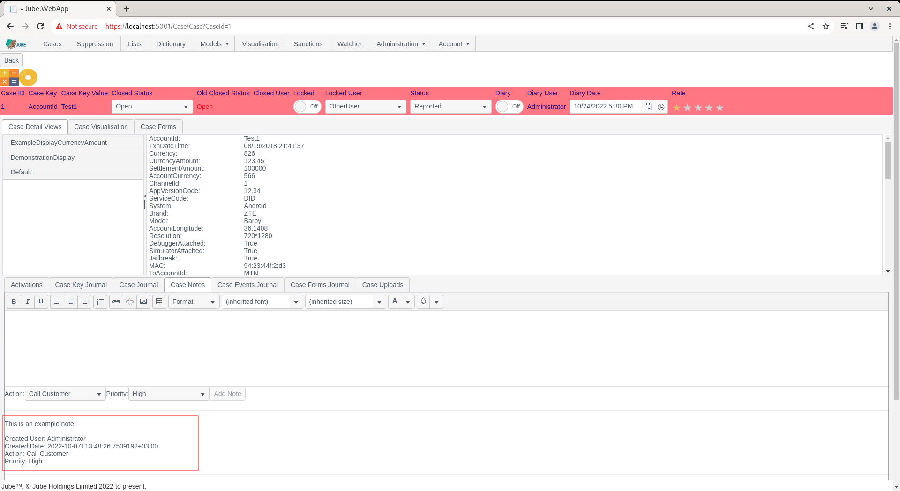

🚀 Get to pre-production in weeks, not months, with private [training](https://www.jube.io/jube-training) direct from
Jube's developer — real sovereignty, zero vendor lock-in.

# Working Case Note

The ability to add notes to a case is intrinsic to the functioning of most case management tools, and crucial for audit.

Notes roll up to the Case Key Value combination and are therefore available across all historic case records.

The presentation of data by Case Key and Case Key Value is of profound importance to ensure that a true history is
maintained and evidential, rather than on a Case Id (as a case may cycle a number of times over the life of a Case Key
and Case Key Value, thus having several Case Id).

Navigate to a case record via either Fetch or Skim:

Note the Case Notes tab:

Click on the Case Notes tab:

Case Notes are displayed in a grid from newest to oldest, by their creation date. Case Notes are comprised of the
following:

| Name     | Description                                                                                                                                                                                                                                   | Example      |
|----------|-----------------------------------------------------------------------------------------------------------------------------------------------------------------------------------------------------------------------------------------------|--------------|
| Note     | A free text note or memo.                                                                                                                                                                                                                     | Ask for kyc. |
| Priority | The allocated priority for the memo. Priority provides for an element of structure in otherwise unstructured, free text, data for the purpose of reporting.                                                                                   | High         |
| Action   | As created in Administration >> Cases >> Cases Workflows Actions. Actions provides for an element of structure in otherwise unstructured data while also providing automation capability via the Notification and HTP endpoint functionality. | High         |

To add a new Case Note, observe the button Add new record, noting that it is disabled without input:

Start by typing into the note:

Note that the the Add button is now available to commit the new memo:

In this example, set the priority to High:

Set the Action to the only available value in the drop down, being the Cases Workflow Action set up in previously:

Click the Add Note button to commit the memo (cancel would abandon the template):

To assure a reliable audit, it is not possible to update or delete a Case Note. Upon an error being made, a new Case
Note must be created annotating a correction to a previous entry. It is of course possible for a memo to be deleted at
the database level, but this is STRONGLY discouraged as it compromises audit integrity of the case management system.

## Note Formatting and Sanitising

The note is written in a rich text editor, so it is stored as HTML. Before a note is stored, and again when it is read
back, the HTML is rebuilt from an allow-list; a note is never returned to a browser as it was typed. The rules are:

| Part of the note   | What is kept                                                                                                                                                                                      | What happens to the rest                                                                                         |
|--------------------|---------------------------------------------------------------------------------------------------------------------------------------------------------------------------------------------------|------------------------------------------------------------------------------------------------------------------|
| Tags               | Paragraphs, line breaks, headings (h1 to h6), bold, italic, underline, strike, sub and superscript, lists, tables, block quotes, preformatted text and code, rules, spans, divs, links and images | Any other tag (script, iframe, style, form and so on) is dropped, its text stays as plain text                   |
| Attributes         | Only the attributes each allowed tag needs: link target, image source, size, span counts, and a limited style                                                                                     | Event handlers such as onclick, and every other attribute, are removed                                           |
| Style              | Colour, background colour, font, size, weight, alignment, width, height, border, padding and margin                                                                                               | A style value that could carry a URL, an expression or a CSS escape is removed                                   |
| Links              | http, https, mailto, or a path within the application                                                                                                                                             | Anything else, including script URLs, is removed                                                                 |
| Images             | An inline image (png, jpeg, gif or webp), an https URL, or a file in the application's own image folders                                                                                          | A path to any other page of the application is refused, so a stored note cannot make a reader's browser call one |
| Stray brackets     | Shown as text (a lone less-than or greater-than sign is encoded)                                                                                                                                  | -                                                                                                                |
| Control characters | Tab and line breaks                                                                                                                                                                               | Removed, including the NUL character                                                                             |

Text that only looks like markup, such as `` typed as a note, is therefore stored and shown as
inert text, not executed. Note the earlier point that a Case Note cannot be updated or deleted: the sanitising applies
when the note is added and again on every read.
