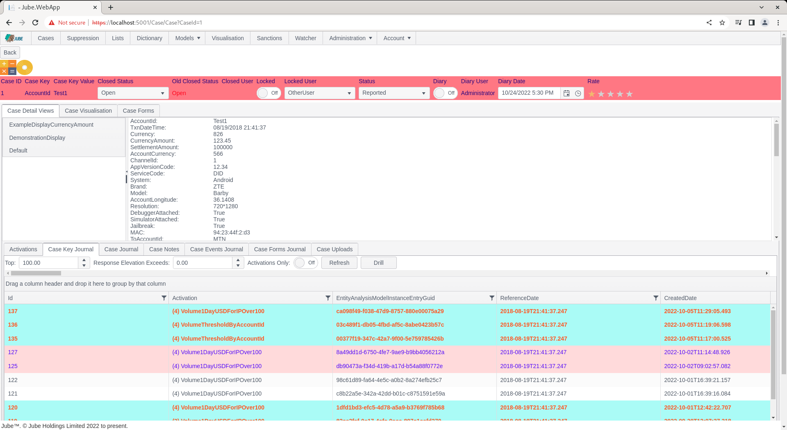
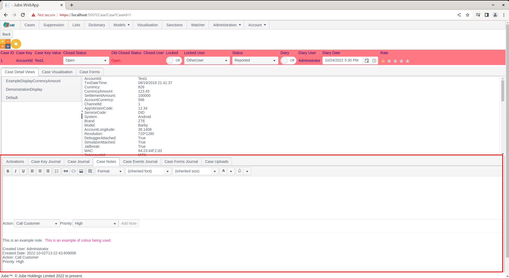
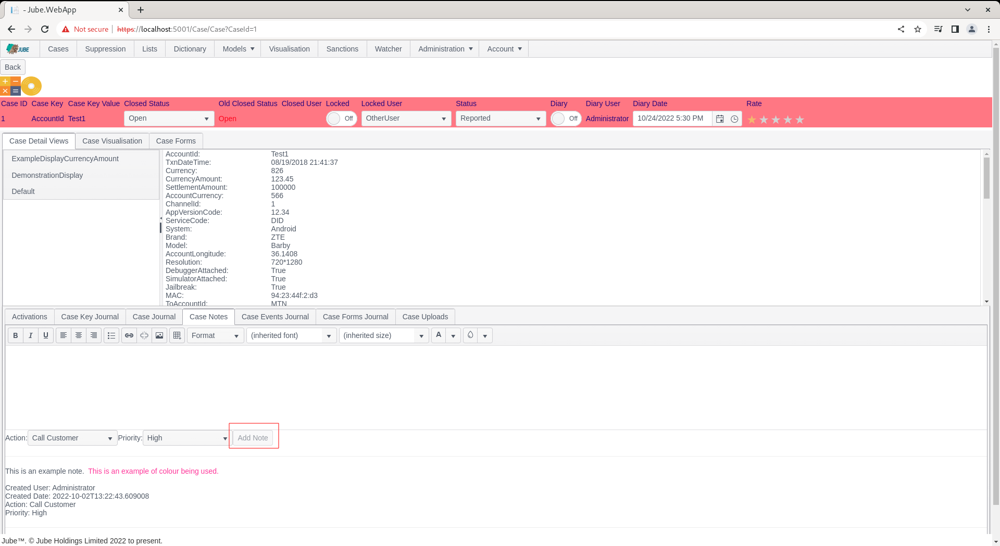
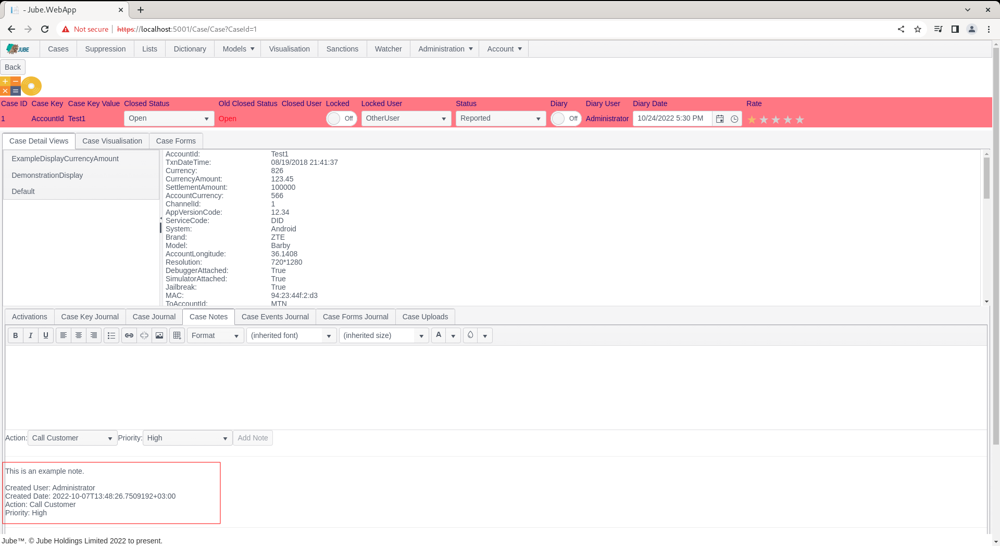

🚀Speed up implementation with hands-on, face-to-face [training](https://www.jube.io/jube-training) from the developer.

# Working Case Note
The ability to add notes to a case is intrinsic to the functioning of most case management tools, and crucial for audit.

Notes roll up to the Case Key Value combination and are therefore available across all historic case records.

The presentation of data by Case Key and Case Key Value is of profound importance to ensure that a true history is maintained and evidential,  rather than on a Case Id (as a case may cycle a number of times over the life of a Case Key and Case Key Value, thus having several Case Id).

Navigate to a case record via either Fetch or Skim:

Note the Case Notes tab:

Click on the Case Notes tab:

Case Notes are displayed in a grid from newest to oldest, by their creation date. Case Notes are comprised of the following:

| Name     | Description                                                                                                                                                                                                                                     | Example      |
|----------|-------------------------------------------------------------------------------------------------------------------------------------------------------------------------------------------------------------------------------------------------|--------------|
| Note     | A free text note or memo.                                                                                                                                                                                                                       | Ask for kyc. |
| Priority | The allocated priority for the memo. Priority provides for an element of structure in otherwise unstructured, free text, data for the purpose of reporting.                                                                                     | High         |
| Action   | As created in Administration >> Cases >> Cases Workflows Actions. Actions provides for an element of structure in otherwise unstructured data while also providing automation capability via the Notification and HTP endpoint functionality. | High         |

To add a new Case Note,  observe the button Add new record, noting that it is disabled without input:

Start by typing into the note:

Note that the the Add button is now available to commit the new memo:

In this example,  set the priority to High:

Set the Action to the only available value in the drop down,  being the Cases Workflow Action set up in previously:

Click the Add Note button to commit the memo (cancel would abandon the template):

To assure a reliable audit,  it is not possible to update or delete a Case Note.  Upon an error being made,  a new Case Note must be created annotating a correction to a previous entry.  It is of course possible for a memo to be deleted at the database level,  but this is STRONGLY discouraged as it compromises audit integrity of the case management system.