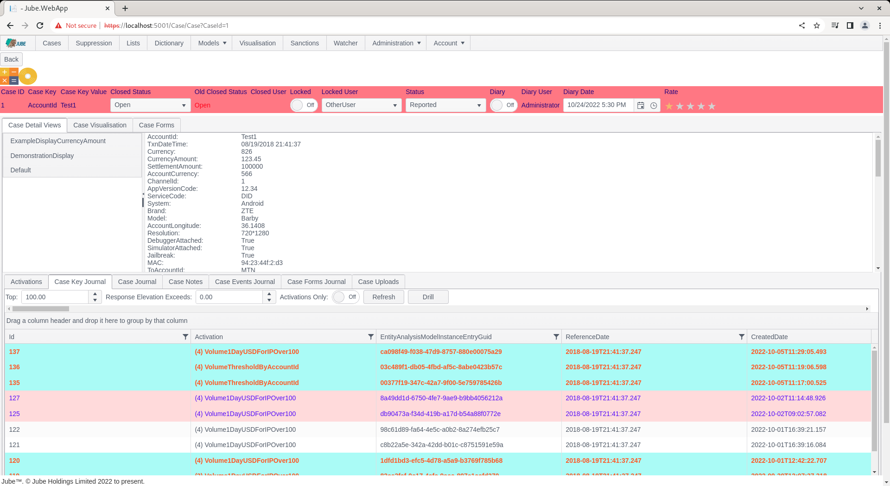
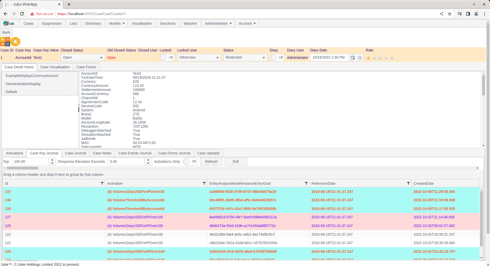

🚀Speed up implementation with hands-on, face-to-face [training](https://www.jube.io/training) from the developer.

# Working Case Status
Several cases workflow statuses may be created and allocated at case creation or via upward reclassification.  It is more common to set a case status manually,  in performing an escalation.

Navigate to a case record via either Fetch or Skim:

Notice a drop down in the case status bar titled Status:

Click on the status drop down:

Select a status other than, in this case, Reported, changing to Restricted:

The case will be reloaded and the status bar will be coloured to reflect the new status having been allocated.

The change of a case status by itself will not cause any specific action, except given Notification and HTTP Endpoint having been configured.

The allocation of a given cases workflow status is often for the purpose of facilitating allocation via cases workflows filters.