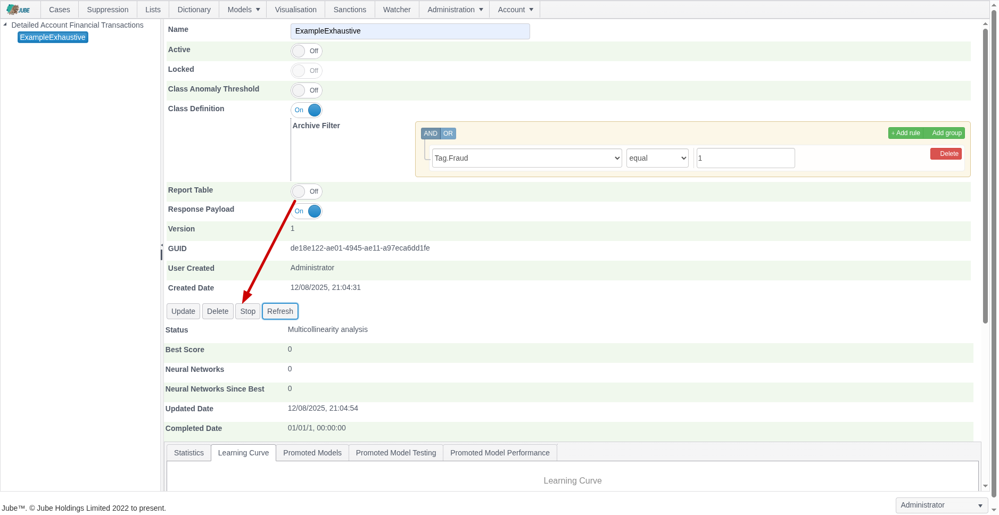
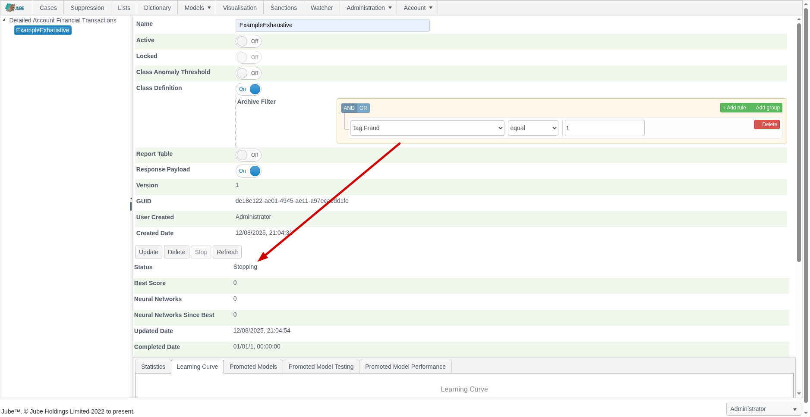

🚀Speed up implementation with hands-on, face-to-face [training](https://www.jube.io/jube-training) from the developer.

Exhaustive model training can take a very long time, and it is computationally expensive. To stop an Exhaustive training
instance identify the Stop button:

On clicking the Stop button the training status is set to Stopping:

The Exhaustive training thread updates the status to signal progress. Before each update of a status by the Exhaustive
training thread,
the same status is checked to see if it is in a Stopping state. In the event that the status is in a Stopping state, the
state is finalised to Stop instead, and the Exhaustive training thread gracefully returned uncompleted. It is worth
noting
that the task in hand will be completed and the thread is not interrupted or aborted, hence it can still be a moderately
time-consuming process to reach a consistent stopping point.  On the Exhaustive model training being stoped:

The thread is immediately available for the next Exhaustive training instance.

