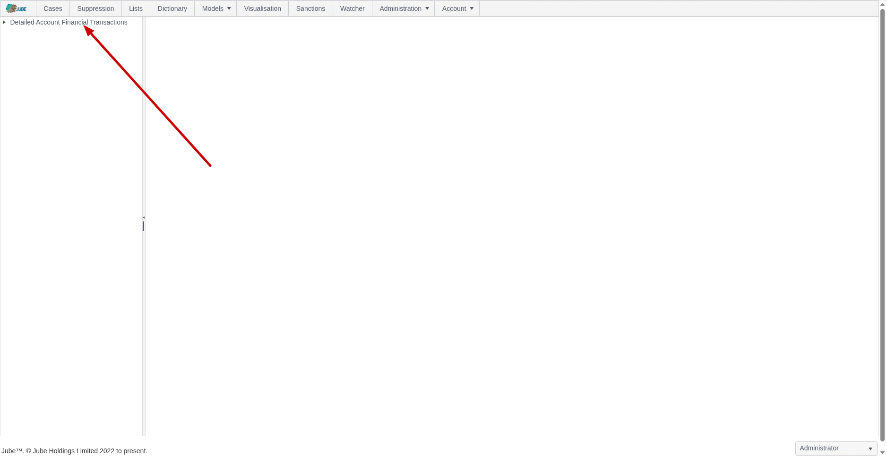
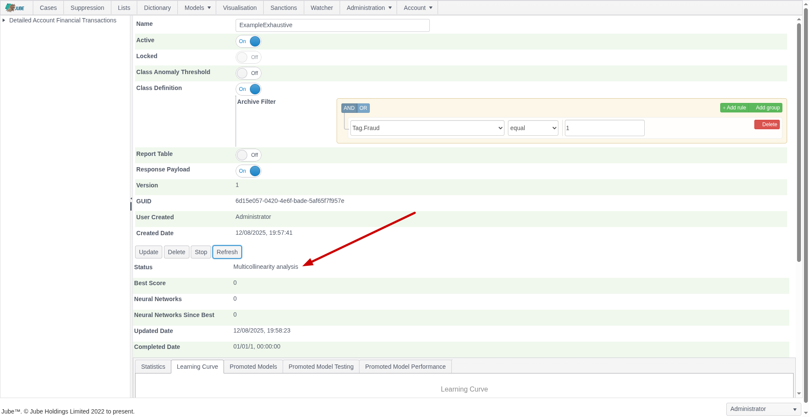
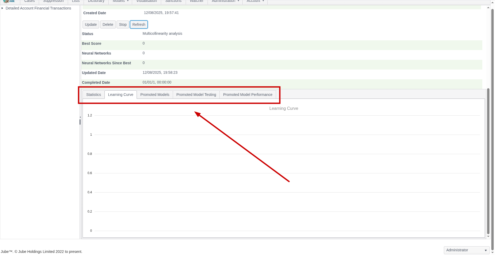
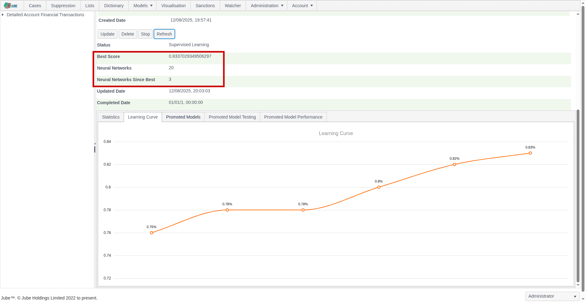

🚀Speed up implementation with hands-on, face-to-face [training](https://www.jube.io/jube-training) from the developer.

# Exhaustive Adaptation Training Configuration

Exhaustive training is controlled by several Environment Variables, however the defaults are adequate in most use cases.
Exhaustive models are otherwise given some basic training parameters which specify if Anomaly detection is to be used
and the extent to which other class data is to be enriched into the anomlous classifications.

The output of Exhaustive training will always be a Neural Network having been trained by the Supervised Learning
Levenberg Marquardt back propagation algorithm. As introduced beforehand, while there does exist a One Class Support
Vector Machine for the purpose of anomaly detection, this is not directly recalled, rather it is used to derive class
for supervised learning.

Keep in mind that processing of data in Jube will have created large amounts of data in the Archive database table and
this data will be targeted for machine learning training.

For the purpose of testing and demonstration, a mock dataset can be used instead of extracting the data from the
Archive. To enable the mock dataset for the purpose of testing, update the UseMockDataExhaustive Environment Variable to
True:

```text
UseMockDataExhaustive=True
```

Mock data will instead take a file called Mock.csv from directory location Jube.Engine/Exhaustive/Mock.csv. The file
will be loaded into MockArchive database table using the same JSON structure as otherwise expected in normal processing
into the Archive database table, storing the first column as a Tag by the same name, and rest of the columns as if they
were Abstraction Rules. At this stage the functionality exists solely for the purpose of testing, however, it is
envisaged that this functionality will be expanded upon in the future to allow for the training of third party files.
The documentation as follows assumes that the Mock data is being used.

By default the UseMockDataExhaustive is enabled as the assumption is that a default installation of the software will
largely be about proof of concept, with production implementations having the binary executables more distributed and
allocated.

Before a model can be recalled it must be trained. To configure an Exhaustive model for training navigate Models >>
Machine Learning >> Exhaustive Adaptation:



Click on the model to create an Exhaustive Adaptation which will expose an empty page for the model configuration
parameters:


The page accepts the following parameters:

| Value                                       | Description                                                                                                                                                                                                                                                                       | Example       |
|---------------------------------------------|-----------------------------------------------------------------------------------------------------------------------------------------------------------------------------------------------------------------------------------------------------------------------------------|---------------|
| Class Anomaly Threshold                     | A switch to indicate that a One Class Support Vector Machine Anomaly Detection Model should be trained for the purpose of deriving a class for supervised Learning.                                                                                                               | True          |
| Class Anomaly Threshold:Anomaly Probability | The One Class Support Vector Machine will be recalled to return a probability that the example fits the overall pattern of the data sample.  The threshold is the amount whereby examples are classified as positive in the event that their are less than a certain probability. | 2%            |
| Class Definition                            | A switch to indicate that the class should be defined by a filter of records in the archive table whereby a match on the filter will return positive class.                                                                                                                       | True          |
| Class Definition: Archive Filter            | The filter to apply to the Archive table to define positive class. The filter will also be used to negate the sample of negative class.                                                                                                                                           | Tag Fraud = 1 |

Complete the parameters to training a model based confirmed fraud via Tag, as follows:


Scroll down and click Add to not only create a version of the Exhaustive model but instruct the training of the model by
the background thread. The default status will by "Awaiting Server" with the background thread updating the following status as progress:

* Awaiting Server.
* Fetching Data.
* Calculating Statistics.
* Normalising Data.
* Training Anomaly Model.
* Recalling Anomaly Model for Class Data.
* Getting Filter Class Data from Archive.
* Data Class Symmetry Sampling.
* Performing Class Correlation Analysis.
* Performing All Variable Multi-collinearity Analysis.
* Training Neural Networks and Performing Evolution.
* Stopped as expected after training.

The Refresh button exists to update the page. Click the Refresh button to observe the most recent training status:




After the model has been picked up for training it can no longer be updated.

Upon status Training Neural Networks and Performing Evolution having been reached, the model tabs will be exposed:



The page will not automatically refresh as the training process takes some time and the page requests are extensive.
Clicking the Refresh button will allow for monitoring of exploration:


During evolution, the number of attempted Neural Network topologies is recorded, alongside the best score and the number
of topologies since best (being the last topology having been promoted):



Training can take several hours or days depending on dataset size. The training will terminate at the point there have
been more than a certain number of topologies tried since best (which is a setting available in the Environment
Variables) else will continue to evolve better scores for simpler topology, being plotted as a learning curve:


Each promoted model is available for detailed inspection.

Notice the availability of a Guid which can be used for direct recall of the model via HTTP:

