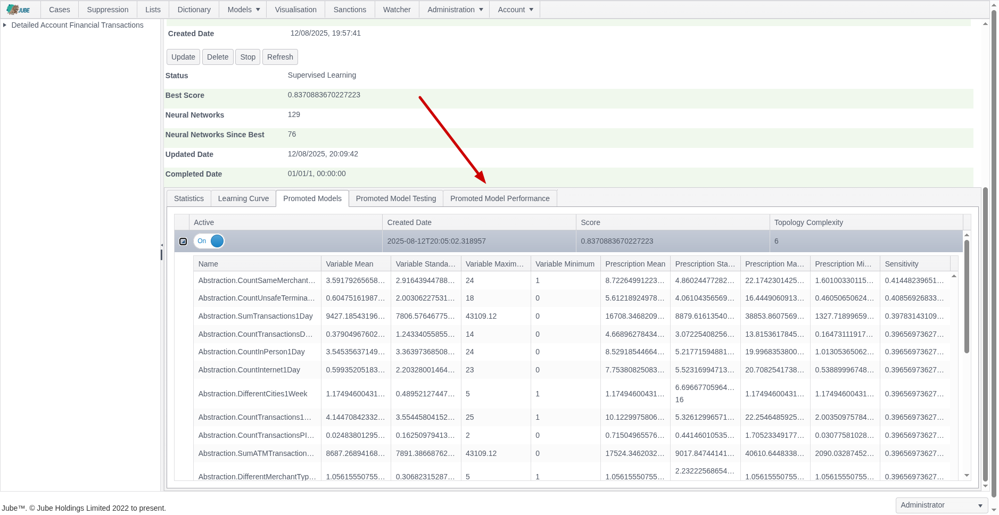
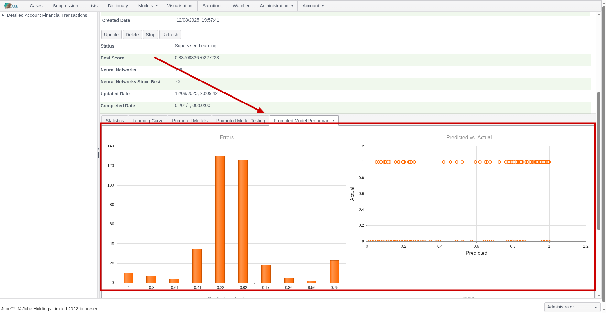
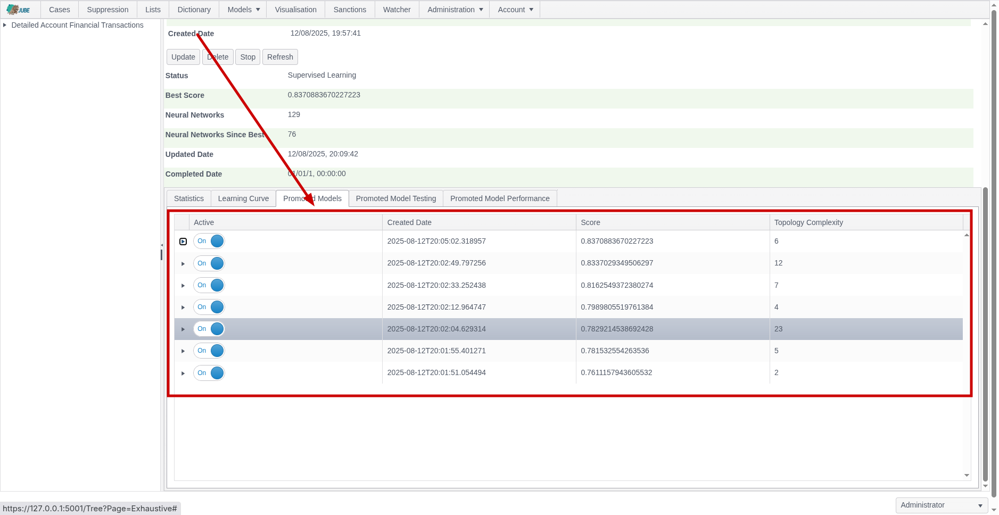
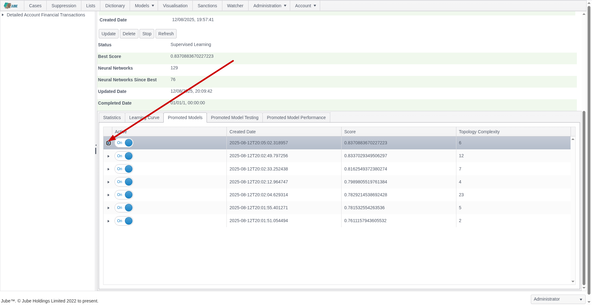
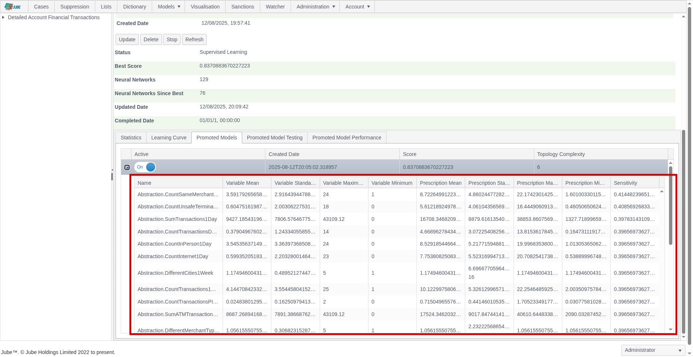
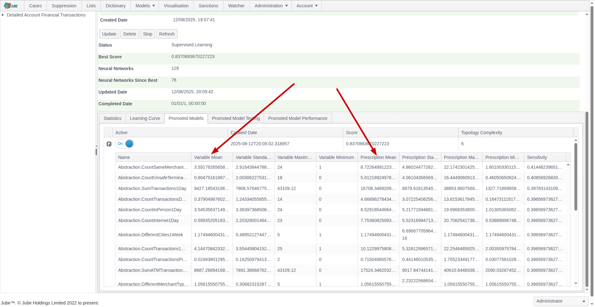
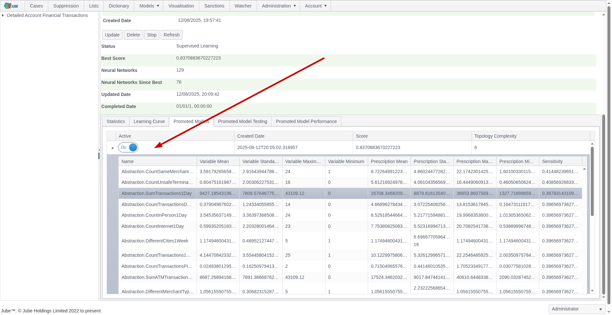
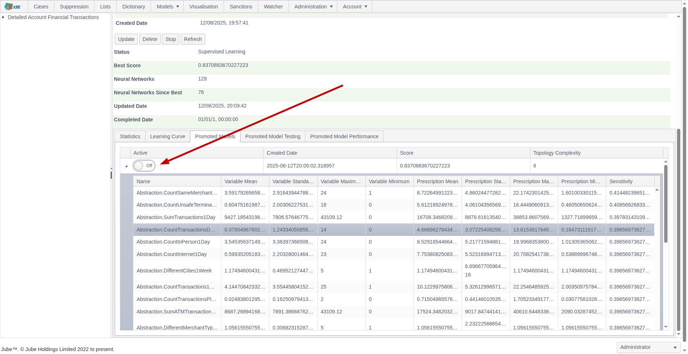
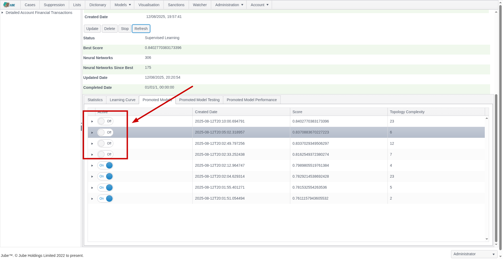
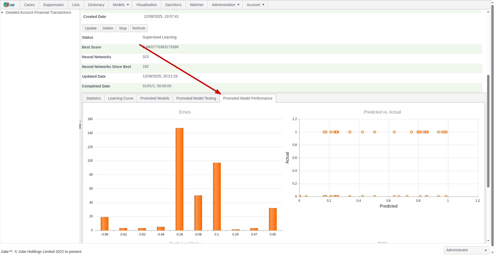

🚀Speed up implementation with hands-on, face-to-face [training](https://www.jube.io/jube-training) from the developer.

# Exhaustive Adaptation Training Promoted Model Performance
Model performance is expressed as a score.  The score is the mean of percentage classification accuracy and the Spearman Rank Correlation.  There are other means to assess overall model performance however.  Model promotion statistics are computed to make available more comprehensive performance statistics via the Promoted Model Performance tab:

Clicking on the Promoted Performance Model tab will expose several performance measures:

The performance measures are as follows:

| Performance Measure         | Description                                                                                                                                                                                                                                 |
|-----------------------------|---------------------------------------------------------------------------------------------------------------------------------------------------------------------------------------------------------------------------------------------|
| Errors Histogram            | During the testing phase of the training process,  the errors made between the predicated value and actual value plotted as a histogram.                                                                                                    |
| Errors Histogram            | During the testing phase of the training process,  the errors made between the predicated value and actual value plotted as a histogram.                                                                                                    |
| Errors Histogram            | During the testing phase of the training process,  the errors made between the predicated value and actual value plotted as a scatter plot.                                                                                                 |
| Confusion Matrix            | During the testing phase of the training process,  the classification predicted vs actual classification organised into a table with all possible states being reflected (true positive, true negative, false positive and false negative). |
| Receiver Optimisation Curve | A curve that compares false positive rates to true positive rates given different thresholds of classification being applied  incrementally,  stepped low to high thresholds increasing by a value specified in the Environment Variables.  |

The Promoted Models tab keeps a journal of all promoted models:

Clicking on the tab exposes more details about the models that have been promoted,  expressing the same as that in the Learning Curve:

The table is ordered from the best performing model to the weakest, then on topology complexity (the number of weights in the topology) on the very unlikely total deadlock in model performance.

It can be noted that the grid is hierarchical and can be expanded upon:

Expanding upon the grid exposes the selected input variables variables that have been included in the model:

The variables are presented in the order of most sensitive to least sensitive.  The nature of exhaustive exploration is such that all variables will provide for sensitivity, as poorly generalised models will have been discarded by the training algorithm.

The variable statistics are included and contrast to prescription statistics.  The prescription statistics are summary statistics having been performed as a consequence of Monte Carlo Model Simulation yielding a positive classification:

In the above example, it can be observed that the sampled data suggests 0.8 Abstraction.CountTransactionsDecline (this is of course 1 in practice), whereas positive classified by the model suggests a Abstraction.CountTransactionsDecline of closer to 6,  where the inference is that given positive, Abstraction.CountTransactionsDecline tends to be higher.  Prescriptions are to provide some explanatory value to models,  given that Neural Networks are often felt to be less explainable.

It is possible to reject or deactivate a model via the switch in each row of the grid:

Selecting the switch to false will mean that this model is no longer considered as promoted:

Upon deactivation, and upon clicking the refresh button,  the model performance will no longer be available in the Promoted Model Performance tab nor Promoted Model Testing tab,  instead, the next highest performing model will be presented:

