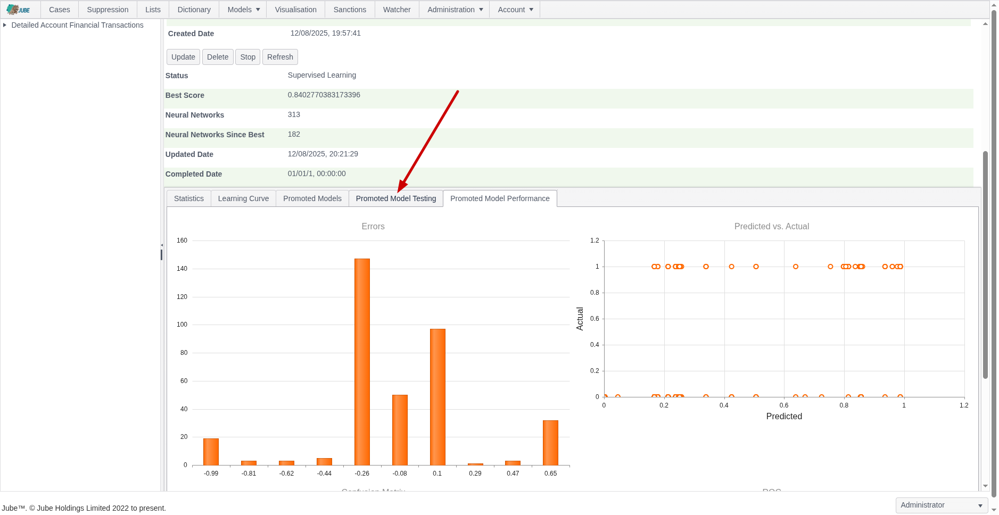
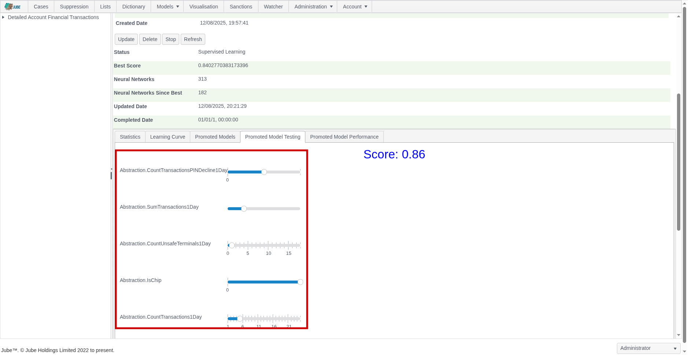
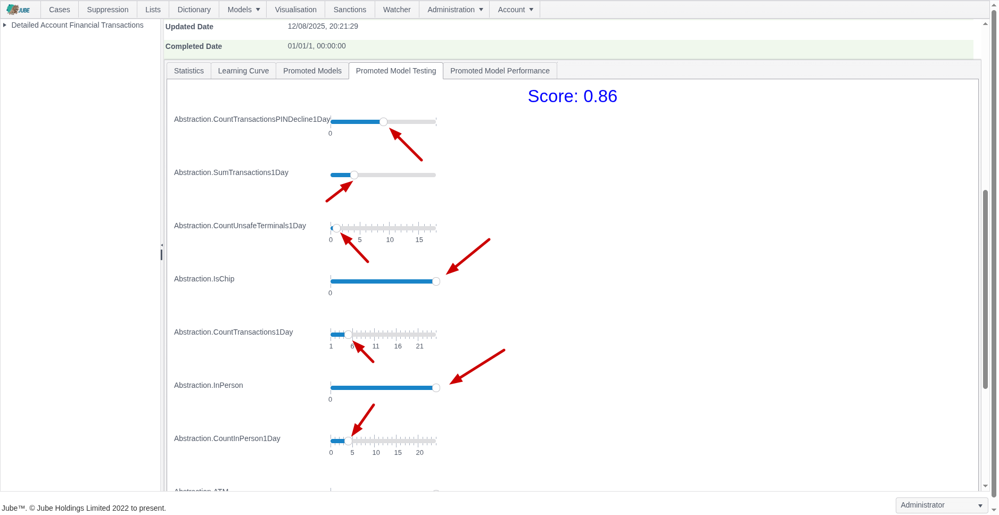
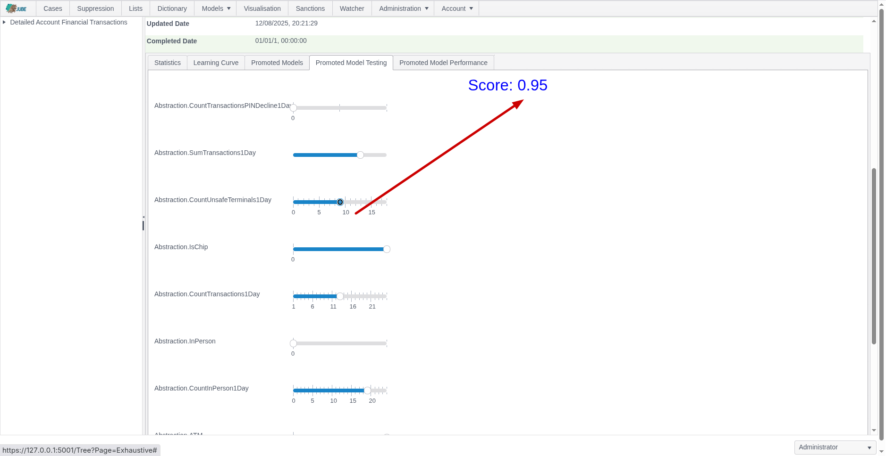

🚀Speed up implementation with hands-on, face-to-face [training](https://www.jube.io/training) from the developer.

# Exhaustive Adaptation Training Promoted Models Performance
Promoted models can be manually tested via the Promoted Models Testing tab:

Clicking on the tab will present the model variables as sliders:

The sliders are set to their optimal prescription values for the purpose of classifying positive:

Moving the sliders will present the collated values of all sliders to the model to return a score:

The higher the score,  the more likely the simulation is a positive case (e.g. fraud).

The intention of the manual simulation is to process several intuitive scenarios and observe the score to change equally intuitively, although keeping in mind that the model is largely bias to anomaly.

Given a score behaving counter intuitively or not flexibly enough,  it can of be deactivated, and the next highest priority score will be considered promoted.