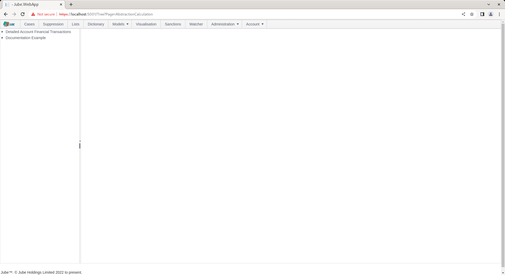
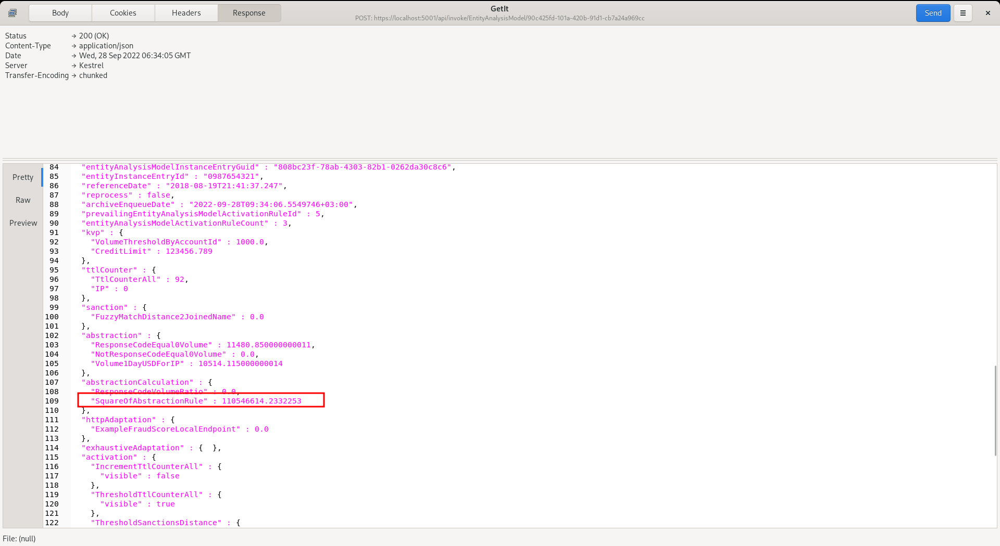

🚀 Get to pre-production in weeks, not months, with private [training](https://www.jube.io/jube-training) direct from
Jube's developer — real sovereignty, zero vendor lock-in.

# Abstraction Calculation

An Abstraction Calculation applies a VB .Net code fragment to the values available in an invocation, and produces one
named number. Its most common use is a ratio, for example the ratio of declined spend to total spend. The result is
stored under the calculation's name, so any later stage can read it as `AbstractionCalculation.Name`.

Every Abstraction Calculation is written as a function fragment. The earlier Add, Subtract, Divide and Multiply types,
which took a Left and a Right Abstraction Rule from drop downs, have been removed, because the fluent calculation
methods do the same in one line and reach every value in the invocation. Calculations saved as those types are
converted, and the old columns dropped, when the database is migrated
(see [Migrating Add, Subtract, Divide and Multiply Calculations](#migrating-add-subtract-divide-and-multiply-calculations)).

The name is required and limited to 256 characters, and must be unique within the Model. The function is required.

## Values Available to a Calculation

A calculation runs after everything it can read has been produced in the invocation, so it can use any of:

| Source                             | Token                          | Notes                                                                                                        |
|------------------------------------|--------------------------------|--------------------------------------------------------------------------------------------------------------|
| Payload field                      | `Payload.Amount`               | Numeric and Boolean fields. A Boolean is read as 1 or 0                                                      |
| Inline Script property             | `Payload.ScriptScore`          | Inline Script output is added to the payload before the calculation runs                                     |
| Inline Function                    | `Payload.FunctionScore`        | As above                                                                                                     |
| TTL Counter                        | `TTLCounter.Declined`          |                                                                                                              |
| Abstraction Rule                   | `Abstraction.Velocity`         |                                                                                                              |
| Sanction                           | `Sanction.PartyName`           | Throws when there is no match; an uncaught exception leaves the function's result at zero                    |
| Dictionary                         | `Dictionary.CountryRisk`       |                                                                                                              |
| An earlier Abstraction Calculation | `AbstractionCalculation.First` | Only if it has already run in this invocation. Calculations run oldest first, in the order they were created |

Http and Exhaustive Adaptations, and Activations, run after Abstraction Calculations, so a calculation cannot read them.

The fluent calculation methods apply, for example `Matched = TTLCounter.DeclinedSpend.RatioOf(Payload.Amount)`. See
[Calculations on continuous values](../../../RuleTaxonomy/RulePipelineReference.html#calculations-on-continuous-values)
for the full list and a table of recipes.

The page is available by navigating through the menu as Models > Abstraction >> Abstraction Calculation:



Clicking the required model in the tree towards the left hand side exposes the page for creating a new Abstraction
Calculation. The parameters available to the page are described in the following table:

| Value            | Description                                                                                                                                                                            | Example                                                   |
|------------------|----------------------------------------------------------------------------------------------------------------------------------------------------------------------------------------|-----------------------------------------------------------|
| Name             | The name the result is stored under, and read by as `AbstractionCalculation.Name`. Unique within the Model.                                                                            | DeclineRate24h                                            |
| Active           | Whether the calculation runs on invocation.                                                                                                                                            | Checked                                                   |
| Locked           | Prevents the calculation being edited or deleted.                                                                                                                                      | Unchecked                                                 |
| Function         | A VB .Net function fragment that assigns the result to `Matched`, and can read any of the values in [Values Available to a Calculation](#values-available-to-a-calculation). Required. | `Matched = TTLCounter.Declined.RatioOf(TTLCounter.Total)` |
| Report Table     | Archives the value for SQL reporting and threshold analysis.                                                                                                                           | Checked                                                   |
| Response Payload | Returns the value in the response payload under `AbstractionCalculations`.                                                                                                             | Checked                                                   |

For example, to provide the square of an Abstraction Rule named Sum, add a calculation with the function below:

```vb
Matched = Abstraction.Sum.Times(Abstraction.Sum)
```

Upon the function fragment showing Parsed and Compiled, click Add to create the first version of the Abstraction
Calculation. Synchronise the model via Entity >> Synchronisation and repeat the HTTP POST to endpoint
[https://localhost:5001/api/invoke/EntityAnalysisModel/90c425fd-101a-420b-91d1-cb7a24a969cc](https://localhost:5001/api/invoke/EntityAnalysisModel/90c425fd-101a-420b-91d1-cb7a24a969cc)
for a response as follows:



The result of the Abstraction Rule has been squared and presented in an AbstractionCalculations element. Far more
complex functions can be embedded, indeed anything supported by the fluent methods, and the Abstraction Calculation can
be used in later Activation Rules and models.

## Abstraction Calculations as the Preferred Way to Create a Ratio

A ratio can be written inline in an Activation Rule, for example
`TTLCounter.DeclinedSpend.RatioOf(TTLCounter.TotalSpend)`, and that remains fully supported, but as a standard an
Abstraction Calculation is the preferred construction, for these reasons:

| Reason to use an Abstraction Calculation | What it means in practice                                                                                                                                                                                                               |
|------------------------------------------|-----------------------------------------------------------------------------------------------------------------------------------------------------------------------------------------------------------------------------------------|
| Reuse                                    | The ratio is defined once and named. Ten Activation Rules read `AbstractionCalculation.DeclineRate`, and changing how the ratio is built changes it in one place.                                                                       |
| One meaning                              | Every rule that reads the ratio agrees what it is, so thresholds on it can be compared and tuned.                                                                                                                                       |
| It reaches models                        | Abstraction Calculations run before Exhaustive, HTTP and other model recall, so the ratio can be a model input as well as a rule input (see [Where a Calculation Runs in the Invocation](#where-a-calculation-runs-in-the-invocation)). |
| It is reportable                         | With Report Table enabled, the value is archived for SQL reporting and threshold analysis.                                                                                                                                              |
| Organised concerns                       | The calculation defines the number, and the Activation Rule makes the decision, so each can be read, tested and changed on its own.                                                                                                     |
| It is auditable                          | The value is recorded in the payload and response under its name, so a case shows what the ratio was when the rule fired.                                                                                                               |

As a standard, endeavour to put every ratio, and every other derived number, that an Activation Rule reads in an
Abstraction Calculation, whether or not a second rule or a model uses it today, because the cost is one function and the
value is then defined, visible and reportable. The Activation Rule then only compares it. Work it out in the rule where
a calculation is not available: in a Gateway Rule, which runs before calculations, or where the number involves a model
score, which is recalled after them. See
[Derived Values: Use an Abstraction Calculation](../../../RuleTaxonomy/RuleAuthoringMethodology.html#derived-values-use-an-abstraction-calculation).

### Creating a Ratio for Activation Rules

To create a ratio of declined spend to total spend over one day:

1. Create the two TTL Counters (`DeclinedSpend24h`, `TotalSpend24h`), or Abstraction Rules, that hold the parts. See
   [TTL Counters](../TTLCounters/index.html) and [Abstraction Rules](../AbstractionRules/index.html).
2. Create an Abstraction Calculation named `DeclineRate24h` with the function:

```vb
Matched = TTLCounter.DeclinedSpend24h.RatioOf(TTLCounter.TotalSpend24h).ZeroIfUndefined()
```

3. Synchronise the model, and read the result in any Activation Rule as `AbstractionCalculation.DeclineRate24h`:

```vb
Matched = AbstractionCalculation.DeclineRate24h.MatchGreater(0.3)
```

More complex ratios, such as a ratio of ratios, are built from the same values:

```vb
Matched = TTLCounter.DeclinedCount.RatioOfRatios(TTLCounter.TotalCount, TTLCounter.DeclinedSpend, TTLCounter.TotalSpend).ZeroIfUndefined()
```

A calculation can be built from an earlier calculation, provided it was created after it (calculations run oldest
first), for example a `DeclineRateVersusNorm` that divides `AbstractionCalculation.DeclineRate24h` by an average decline
rate Abstraction Rule.

## Where a Calculation Runs in the Invocation

Abstraction Calculations run after every value they can read has been produced, and before any model is recalled and
before Activation Rules are evaluated:

| Order | Stage                                           | Reads or produces                                         |
|-------|-------------------------------------------------|-----------------------------------------------------------|
| 1     | Inline Functions, Inline Scripts, Gateway Rules | Adds derived values to the payload                        |
| 2     | Sanctions, TTL Counters, Abstraction Rules      | Produces the counters, aggregates and sanction distances  |
| 3     | **Abstraction Calculations**                    | Produces the ratios and other derived numbers             |
| 4     | Exhaustive Adaptation                           | Recalls the in-process neural network models              |
| 5     | HTTP Adaptations                                | Recalls remote models, in ascending Priority              |
| 6     | Activation Rules                                | Evaluates rules, in Priority order, over everything above |

It follows that a calculation can read a payload field, a TTL Counter, an Abstraction Rule, a Sanction, a Dictionary and
an earlier calculation, but **cannot read a model score**, and that a model can read a calculation. A ratio is therefore
the natural way to give a model a well-formed input, and the same ratio can then be thresholded directly by a rule. See
[Generalisation, Adaptation and Model Thresholds](../../../RuleTaxonomy/GeneralisationAdaptationAndModelThresholds.html).

## An Undefined Result

A fluent calculation that cannot produce a number, such as a `RatioOf` with a zero denominator, returns `NaN`. **The
function's result is stored as it is returned**, so a `NaN` is stored as `NaN`. A `NaN` fails every comparison in an
Activation Rule, so a rule fails closed, but it is not a usable model input and it does not report cleanly.

Add `.ZeroIfUndefined()` to store zero for a result that is not a number or is infinite, as the removed arithmetic types
did:

```vb
Matched = TTLCounter.DeclinedSpend24h.RatioOf(TTLCounter.TotalSpend24h).ZeroIfUndefined()
```

An error in the fragment, such as reading a Sanction that has no match, leaves the result at zero.

The consequence of storing zero is that it means "low" and also "unknown", so a rule that fires on a **low** ratio fires
on an entity with no history:

```vb
Matched = AbstractionCalculation.DeclineRate24h.MatchLess(0.05)
```

Guard any rule that reads a ratio from below with a count that proves the ratio is real, using `Require` so that an
entity with too little history is rejected first:

```vb
Matched = TTLCounter.Payments24h.RequireGreaterOrEqual(10).Against(AbstractionCalculation.DeclineRate24h).MatchLess(0.05)
```

A rule that fires on a **high** ratio is safe from this, as an undefined ratio stored as zero does not exceed the
threshold. Where the difference between "zero" and "undefined" matters, leave off `ZeroIfUndefined()` and let it be
`NaN`, which fails every comparison.

## Migrating Add, Subtract, Divide and Multiply Calculations

Calculations saved with an Add, Subtract, Divide or Multiply type are converted to the equivalent function by a database
migration. The two Abstraction Rules that were selected as Left and Right become tokens, and the result keeps the old
behaviour of storing zero for anything undefined:

| Old type | Becomes                                                                   |
|----------|---------------------------------------------------------------------------|
| Add      | `Matched = Abstraction.Left.Plus(Abstraction.Right).ZeroIfUndefined()`    |
| Subtract | `Matched = Abstraction.Left.Minus(Abstraction.Right).ZeroIfUndefined()`   |
| Divide   | `Matched = Abstraction.Left.RatioOf(Abstraction.Right).ZeroIfUndefined()` |
| Multiply | `Matched = Abstraction.Left.Times(Abstraction.Right).ZeroIfUndefined()`   |

A space in an Abstraction Rule name is written as an underscore in the token, as the engine has always done. The results
are the same as before, including a missing Abstraction Rule reading as zero.

A calculation whose Left or Right name cannot be written as a token (it is blank, or contains a character such as a
hyphen or a full stop) cannot be converted safely. The migration **deactivates** it rather than guess, and records what
it was as a comment in the function, so nothing is lost when the old columns are dropped:

```vb
' Converted from Divide: Refunds-Sum / Total.Sales. Rewrite this as a function, then activate it.
```

A comment is not a valid function, so the calculation cannot be activated until the comment is replaced with a real
function, and a calculation that is not active is not compiled at model synchronisation. Find the ones to rewrite with:

```sql
select "Id", "Name", "FunctionScript"
from "EntityAnalysisModelAbstractionCalculation"
where "Active" = 0 and "FunctionScript" like '%Converted from %'
```

The same conversion is applied to the saved version history, so an earlier version of a converted calculation shows the
function that replaced it, or the comment. A name in a comment is cut to 100 characters and to a single line.

The migration then **drops** the three columns that held the old surface, `AbstractionCalculationTypeId`,
`EntityAnalysisModelAbstractionNameLeft` and `EntityAnalysisModelAbstractionNameRight`, from both the calculation and
the version tables. They are no longer read or written. The migration adds the columns back, empty, if it is reversed,
but it cannot restore what was in them, so **take a database backup first**.

## Abstraction Calculation Faults

Symptoms of a misbuilt Abstraction Calculation, with the likely cause.

| Symptom of an Abstraction Calculation        | Likely cause                                                                                                                                                                |
|----------------------------------------------|-----------------------------------------------------------------------------------------------------------------------------------------------------------------------------|
| The value is always zero                     | A source is missing (name misspelt, or the source did not run), a source is a string field, the denominator is zero and `ZeroIfUndefined()` is used, or the fragment threw. |
| The value is `NaN`                           | An undefined result (a zero denominator) with no `ZeroIfUndefined()`.                                                                                                       |
| A ratio built on another calculation is zero | The other calculation was created later, so it has not run yet. Recreate them in dependency order.                                                                          |
| A low-ratio rule fires on new customers      | An undefined ratio is stored as zero. Add a `Require` guard on a count, or drop `ZeroIfUndefined()`.                                                                        |
| A calculation cannot read a model score      | Models are recalled after calculations. Threshold the score in the Activation Rule instead.                                                                                 |
| A migrated calculation is inactive           | Its Left or Right name could not be written as a token, and its function is a comment describing what it was. Rewrite it as a function. See the query above.                |
