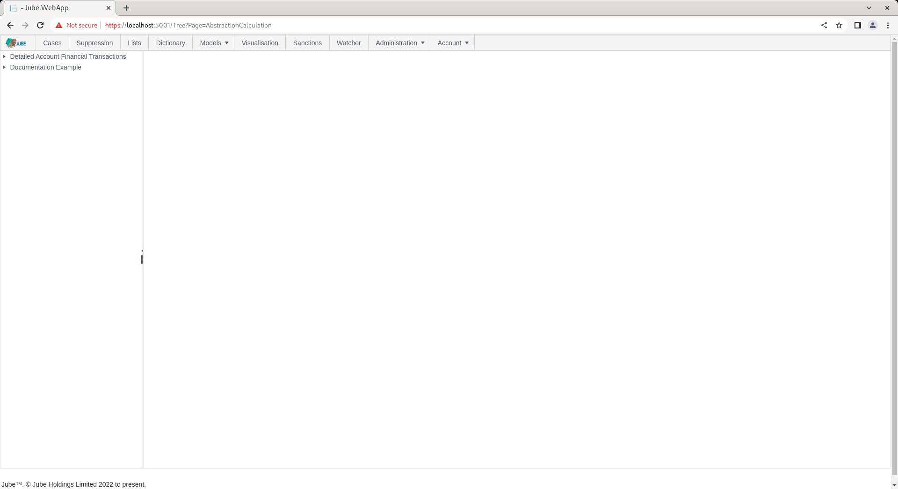
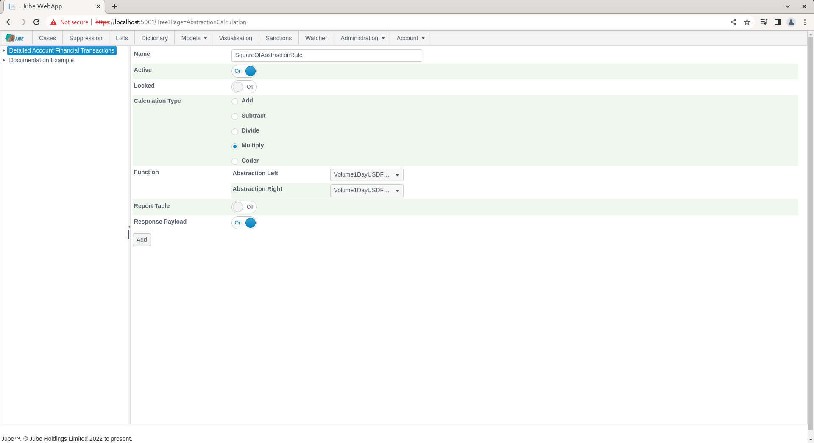
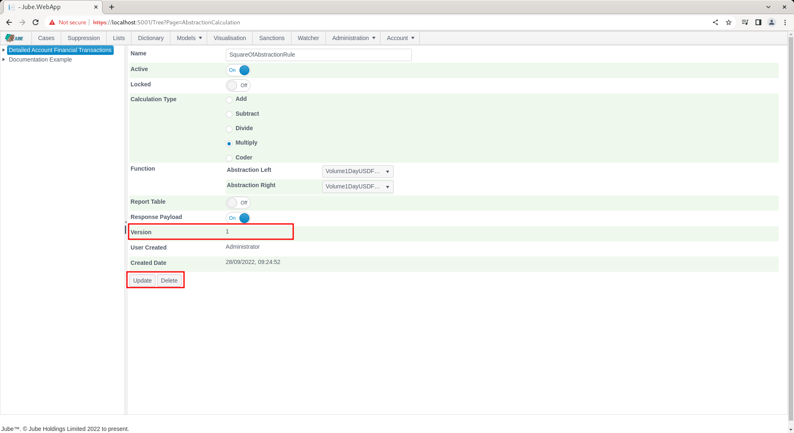
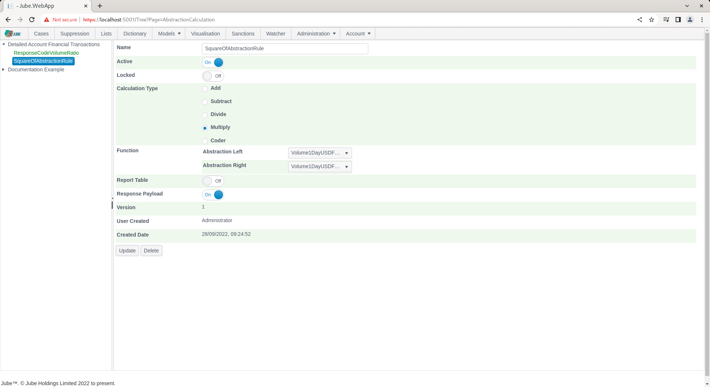
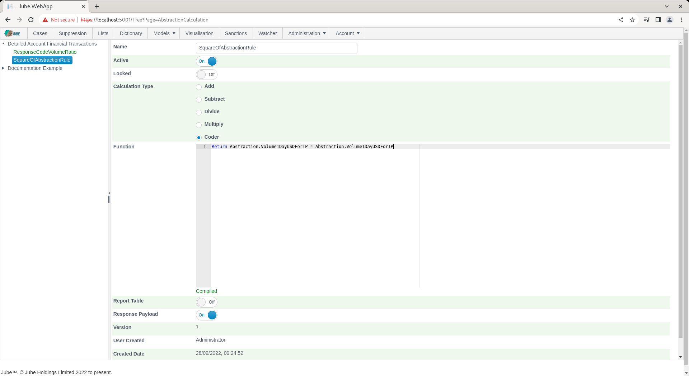
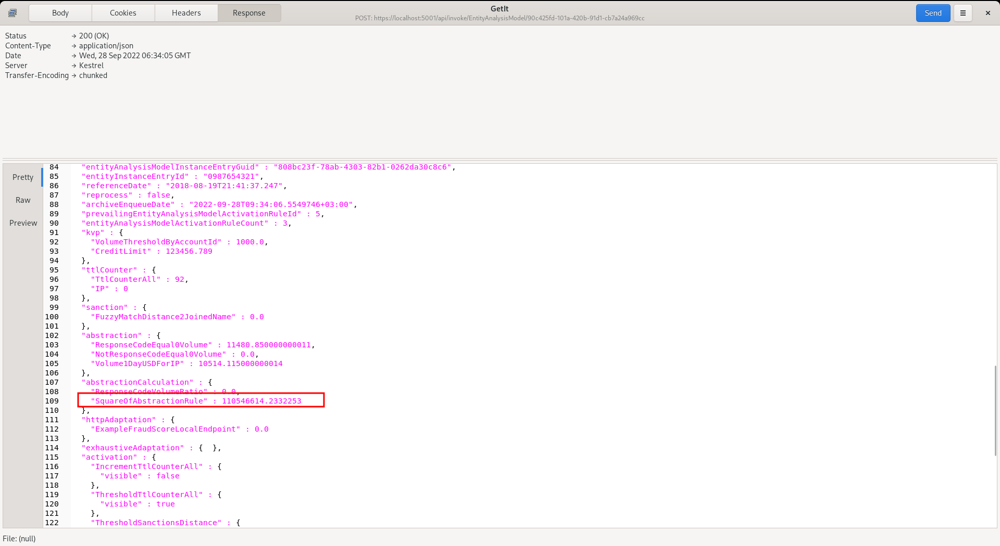

# Abstraction Calculation
An Abstraction Calculation compares one Abstraction Rule return value to another using reasonably simple arithmetic or functions based on VB .Net code fragments.  For example,  it is useful to take two values,  dividing one by another to create a ratio, which is oftentimes quite helpful in machine learning.

The page is available by navigating through the menu as Models > Abstraction >> Abstraction Calculation:

Clicking the required model in the tree towards the left hand side exposes the page for creating a new Abstraction Calculation:

The parameters available to the page are described in the following table:

| Value                        | Description                                                                                                                                                                                             | Example                                                                                                                                |
|------------------------------|---------------------------------------------------------------------------------------------------------------------------------------------------------------------------------------------------------|----------------------------------------------------------------------------------------------------------------------------------------|
| Abstraction Calculation Type | The type of basic arithmetic or user of coder to achieve something similar. For example Divide would cause a division of the Left hand Abstraction Rule Value by the Right hand Abstraction Rule Value. | Multiply                                                                                                                               |
| Abstraction Left             | The name of the Abstraction Rule to occupy the Left hand side of the arithmetic.                                                                                                                        | Refunds Sum                                                                                                                            |
| Abstraction Right            | The name of the Abstraction Rule to occupy the Right hand side of the arithmetic.                                                                                                                       | Total Sales Sum                                                                                                                        |
| Coder                        | On selection of the coder radio icon only, a .Net function fragment containing data compiled in payload, TTL Counter and Abstraction Rule processing.  The return type is float.                        | Return Abstraction.NotResponseCodeEqual0Volume /  (Abstraction.NotResponseCodeEqual0Volume + Abstraction.ResponseCodeEqual0Volume) |

Click on the model towards the left hand side to add an Abstraction Calculation:

Proceed to perform a more basic Abstraction Calculation.  Select the Multiply radio button with the intention of squaring the Abstraction Rule created beforehand:

The intention is to provide the square of the abstraction sum,  hence set the Abstraction Left side and the Abstraction Right side of the function to Sum. Complete the Abstraction Configuration as above table, excluding the coder value (which will be explored in the next example).

Click Add to create the first version of the Abstraction Calculation:

Synchronise the model via Entity >> Synchronisation and repeat the HTTP POST to endpoint [https://localhost:5001/api/invoke/EntityAnalysisModel/90c425fd-101a-420b-91d1-cb7a24a969cc](https://localhost:5001/api/invoke/EntityAnalysisModel/90c425fd-101a-420b-91d1-cb7a24a969cc) for response as follows:

It can be observed that the result of the Abstraction Rule has been squared by using the simple calculation and presented in an AbstractionCalculations element. The Abstraction Calculations can be used in Activation Rules as well as variables in machine learning.

In the next example,  the same calculation is going to be applied, yet this time a VB .net function fragment is going to be used to achieve the same.  Navigate to the rule having ben created:

Click on the Coder Radio button to expose the Coder:

Add the function as described in the above table and as below to replicate the squaring:

Upon the function fragment showing Parsed and Compiled,  update the Abstraction Calculation:

Synchronise the model via Entity >> Synchronisation and repeat the HTTP POST to endpoint [https://localhost:5001/api/invoke/EntityAnalysisModel/90c425fd-101a-420b-91d1-cb7a24a969cc](https://localhost:5001/api/invoke/EntityAnalysisModel/90c425fd-101a-420b-91d1-cb7a24a969cc) for response as follows:

It can be observed that the same response has been achieved albeit via the VB.net code fragment.  It follows that far more complex arithmetic functions can be embedded, indeed anything supported by the VB .Net syntax.

