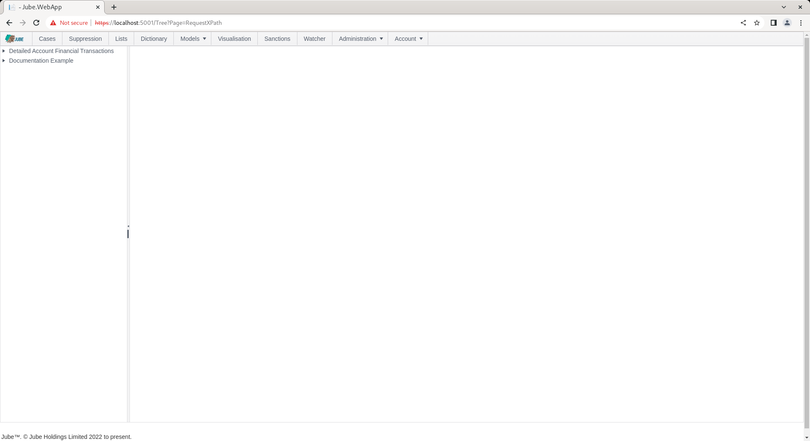
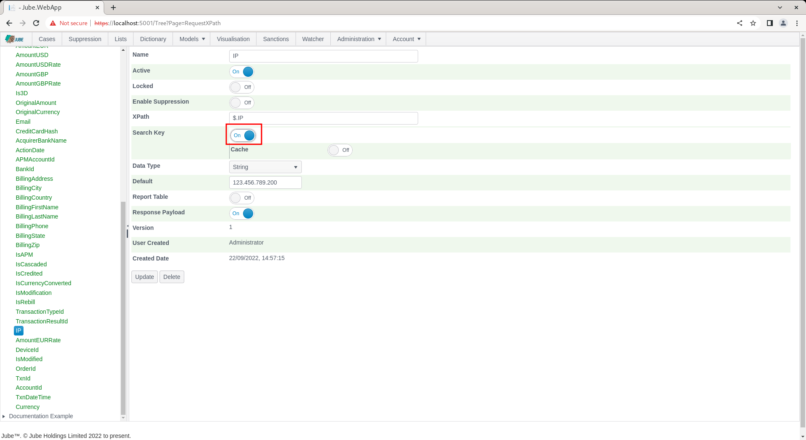
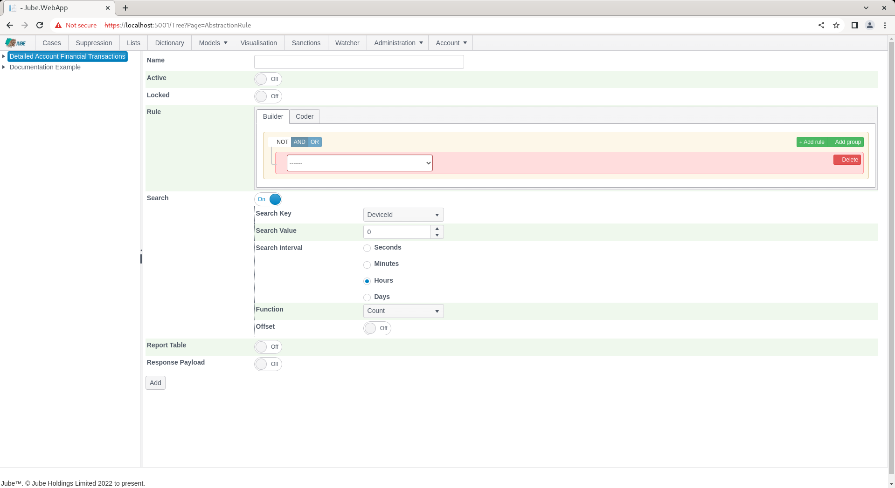
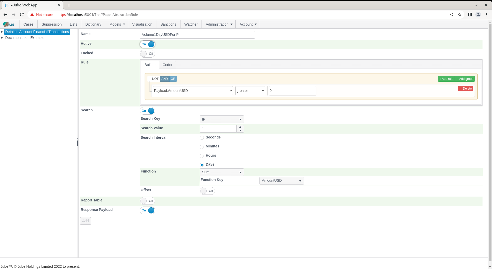
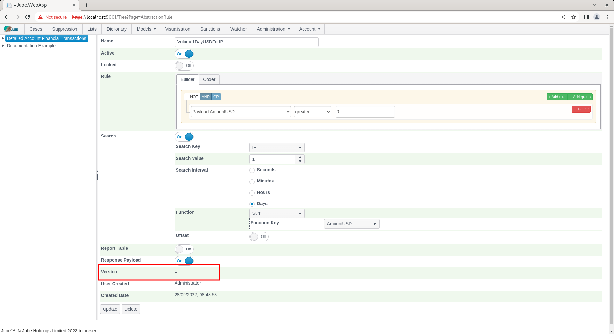
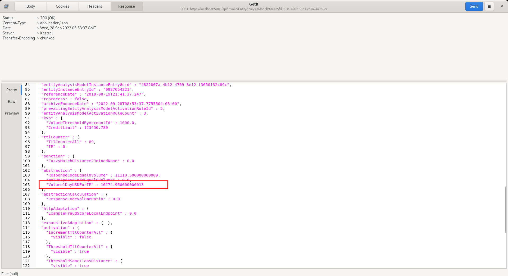
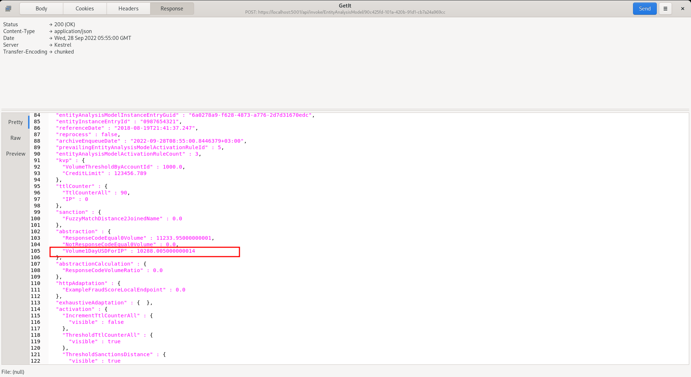

# Abstraction Rules
The Abstraction Rules page is where rules are created for the aggregation of data available in the cache database.  The Abstraction Rule functionality is one of the most intrinsic processes in the model invocation, being responsible for the creation of aggregate statistics based on the contents of the cache of transaction or event data retained. 

The abstraction rules are grouped together by their search keys, which has the effect of only a single key value pair type query being looked up against the cache,  with compiled assemblies being executed for match against the in memory dataset.

A search key will be used as a predicate in retrieval of data for the subsequent execution of Abstraction rules that use roll up to that search key.  For example,  if a transaction is being processed through a model,  if an account identifier is configured to be a search key,  a selection of all records in the cache will be returned where that account identifier matches (put simply it will return all transactions for that customer account). Search Keys are defined in the Request XPath definition and there can be many search keys - thus cache database queries - per transaction being executed through the model.  The process is different when a Search Key is defined to be retrieved from a cache,  as these values are pre-calculated by the Search Key Cache thread.

In the case of PostgresSQL being used as the cache for Abstraction Rule processing, only the columns that have been identified as being required in the Abstraction Rules definition (in both rule text and its aggregation key) will be selected from the database,  thus reducing casting and network IO.  The columns required and the SQL to be pushed down to the cache is compiled during model synchronisation for used in real-time processing.

Firstly,  Search Keys need to be set up - in this example IP - by revisiting the Request XPath page via Models >> References >> Request XPath:

Expand on the model tree on the left hand side to expose all Request XPath for this model,  then click on IP:

For the Request XPath,  toggle the switch titled Search Key:

Click the Update button towards the base of the page to update the version of the Request XPath entry:

With a Search Key now being available for IP,  navigate through the menu as Models >> Abstraction >> Abstraction Rules:

Click on the model towards the left hand side to add an Abstraction Rule:

The Page exists to create Abstraction Rules which are VB.net code fragments that will be compiled by the engine.  Abstraction Rules accept data and TTL Counter objects and test the code fragment for equality,  returning a boolean flag to that effect. 

The Builder and Coder exposes the following collections:

| Value         | Description                                                                                                                                                                                                                                                                                                                                                                                                                                                                            |
|---------------|----------------------------------------------------------------------------------------------------------------------------------------------------------------------------------------------------------------------------------------------------------------------------------------------------------------------------------------------------------------------------------------------------------------------------------------------------------------------------------------|
| Payload       | The fields created in the Request XPath page, Inline Function and Inline Script (if registered).                                                                                                                                                                                                                                                                                                                                                                                       |
| TTL Counters  | The TLL Counter and their current incremented values.                                                                                                                                                                                                                                                                                                                                                                                                                                  |

The available parameters are as follows:

| Value           | Description                                                                                                                                                                                                                                                                                                                                                                                                                                                                                                                                                                                                                                                                                                                         | Example    |
|-----------------|-------------------------------------------------------------------------------------------------------------------------------------------------------------------------------------------------------------------------------------------------------------------------------------------------------------------------------------------------------------------------------------------------------------------------------------------------------------------------------------------------------------------------------------------------------------------------------------------------------------------------------------------------------------------------------------------------------------------------------------|------------|
| Search          | The Search directs whether the rule is to be executed on a list of records having been returned from the Cache or only upon the transaction currently being processed through the model.  False would imply that the scope of the Abstraction Rule is only the current transaction being processed and if it matches,  then a 1 will be returned, otherwise 0 (keeping in mind that Exhaustive or Machine Learning will seek to weight it,  hence the numeric values). If Search is selected, it would imply that a retrieval from the Cache Database need take place and the Abstraction Rule is going to be tested against each transaction returned.                                                                             | True       |
| Search Key      | The Search Key is the basis for several distinct data retrievals to be made of the Cache Database. For example,  if a Search Key is specified to be an IP,  then it would imply that a fetch is going to be made of the Cache Database for all transaction matching on the IP of the current transaction in process, thereafter applying the Abstraction Rule on each of the records to test for a match.                                                                                                                                                                                                                                                                                                                           | IP         |
| Search Interval | The Search Interval is the time threshold reaching back from the Reference Date for the transaction being processed, whereby only transactions exceeding this threshold are eligible for matching. For example,  if a Search Interval is configured for 1 Day (taking the Search Interval and Search Value together) then this would imply that only records greater than the Reference Date minus One Day are eligible for matching. It is worthy of note that the Search Interval and Search Value are not used in the recall from the Cache Database,  and everything matching on the key up to the fetch limit specified in the model definition will be returned. The Search Interval is taken together with the Search Value. | Day        |
| Offset Type     | All data matching on a Search Key is retrieved from the cache. The Offset type helps to select data from a subset of these records. Offsets can be helpful if analysis need be done only on the last x records, for example. In most cases it will be set to none.                                                                                                                                                                                                                                                                                                                                                                                                                                                                  | None       |
| Offset Interval | The number of intervals to be offset by, for example the last x number of records returned from the cache.                                                                                                                                                                                                                                                                                                                                                                                                                                                                                                                                                                                                                          | Skip First |
| Search Value    | As Search Interval,  with the Search Value being comprising the length of time to reach back from the Reference Date.                                                                                                                                                                                                                                                                                                                                                                                                                                                                                                                                                                                                               | 1          |
| Function Type   | The process of aggregating the matches is different from the process of testing and matching the Abstraction Rules itself.  The process of aggregation takes place after all matching has take place and the transaction matches for the rule have been set aside.  The Function Type is the aggregation to perform and is extensively documented in the Abstraction Function Definitions of this document. For example,  if a Sum function is specified,  then the function will look to count up records using the Function Key field (e.g. Transaction Amount).                                                                                                                                                                  | Sum        |
| Function Key    | The Function Key is available only on certain Function Types and represents the fields inside the transaction that are to be used for aggregation.  For example,  if the Sum Function Type is specified and the Function Key is specified as the Transaction Amount,  the aggregation will seek to create a Sum for all of the Transaction Amounts having matched.                                                                                                                                                                                                                                                                                                                                                                  | AmountUSD  |

The first step of abstraction aggregation is to further filter the matches by the position (keeping in mind that the processing order will be ascending or earliest first).  The Skip and Fetch feature,  which is configured in the Abstraction Rules definition,  allows only a subsection of the matched records to be returned (e.g. only the last record or only the first record) to the array for which a function will be targeted.  The offsets types are as follows:

| Offset Type | Description                                                                                                                                                            | Skip                                                         | Fetch                                               |
|-------------|------------------------------------------------------------------------------------------------------------------------------------------------------------------------|--------------------------------------------------------------|-----------------------------------------------------|
| None        | Performs no reduction of the list of matches and aggregation will be performed across all events that have matched the rule.                                           | Nothing                                                      | Fetch All Matches                                   |
| First       | Only the first (earliest) matches,  where the number of matches is the offset value,  will be considered when performing the abstraction aggregation function.         | MatchesSpecified in the Offset Value.                        | One Match                                           |
| Last        | Only the first (most recent) matches,  where the number of matches is the offset value,  will be considered when performing the abstraction aggregation function.      | All Matches with the exception of one plus the Offset Value. | One Match                                           |
| Skip First  | All matches will be considered with the exception of the first (earliest) matches,  where the number of the oldest matches to exclude is the offset value.             | Matches Specified in the Offset Value.                       | All Matches with the exception of the Offset Value. |
| Take Last   | All matches will be considered with the exception of the most recent (last or latest) matches,  where the number of the newest matches to exclude is the offset value. | All Matches with the exception of the Offset Value.          | Matches Specified in the Offset Value.              |

With a final list of matches having been achieved,  potentially having been reduced by offsetting, the Abstraction Functions will be performed,  returning a single value from a variety of functions available. The model abstraction has many different types of calculation, that can be performed against abstraction rule matches. The following table details the aggregations available and describes its processing logic:

| Value              | Description                                                                                                                                                                                                                                                                                                                                                                                                            |
|--------------------|------------------------------------------------------------------------------------------------------------------------------------------------------------------------------------------------------------------------------------------------------------------------------------------------------------------------------------------------------------------------------------------------------------------------|
| Count              | The number of matches in the Abstraction Rule matches collection.  An array for the purposes of aggregation of a specific double value is not required.                                                                                                                                                                                                                                                                |
| Distinct Count     | The distinct count iterates through each transaction having matched and adds the value specified to be distinct to a collection, however,  before adding it to the collection the collection is checked to ensure that the value does not already exist.  After each matching transaction iterated through,  the count of the newly created collection is returned.                                                    |
| Sum                | Using an array of float values which has been created based upon a prescribed field available to the matches,  sum total of the array of float values.                                                                                                                                                                                                                                                                 |
| Average            | Using an array of float values which has been created based upon a prescribed field available to the matches,  Mean of the array of float values.                                                                                                                                                                                                                                                                      |
| Median             | Using an array of float values which has been created based upon a prescribed field available to the matches,  Median or statistical Midpoint in the array of float values.                                                                                                                                                                                                                                            |
| Kurtosis           | Using an array of float values which has been created based upon a prescribed field available to the matches,  Kurtosis or the sharpness of the peak of distribution of the array of float values.                                                                                                                                                                                                                     |
| Skew               | Using an array of float values which has been created based upon a prescribed field available to the matches,  Skewness which is the extent to which there is lean \ tendency towards smaller or larger values in the array of float values.                                                                                                                                                                           |
| Standard Deviation | Using an array of float values which has been created based upon a prescribed field available to the matches,  Standard Deviation or measure of spread of the array of float values.                                                                                                                                                                                                                                   | 
| Mode               | Using an array of float values which has been created based upon a prescribed field available to the matches,  the most commonly observed value in the array of float values.                                                                                                                                                                                                                                          |
| Same Count         | The Same Count is intended to interrogate the matches to identify the number of transactions that have the same field value as that currently been processed.  Each match is iterated through and the value of the prescribed field is tested against that in the history,  in the event it is the same,  a counter will be incremented.  Upon the conclusion of the iteration,  the counter is returned as the value. |
| Actual Value       | Keeping in mind that the matches may have been reduced by skip,  fetch and offset values,  this function will return the actual value of a field \ data at a specific position.  For example,  this function would allow the identification of the value of the 3rd transaction in a customer history.                                                                                                                 |
| Max                | The largest value observed in the offset matches taking a field value name for comparison.                                                                                                                                                                                                                                                                                                                             |
| Min                | The smallest value observed in the offset matches taking a field value name for comparison.                                                                                                                                                                                                                                                                                                                            |
| Since              | Taking the Interval Type,  the number of that interval between the most recent event and the first event observed in the matches.  The current date for reference is taken to be the most recent value observed in the matches.  The comparison is made against the earliest date observed. The value return depends upon the Interval Type specified in the function Second, Hours, Minutes and Days.                 |

Complete the page with the parameters as prescribed above, setting a rule to match on everything as AmountUSD is greater than 0:

Click the Add button to create a version of this Abstraction Rule:

Synchronise the model via Entity >> Synchronisation and repeat the HTTP POST to endpoint [https://localhost:5001/api/invoke/EntityAnalysisModel/90c425fd-101a-420b-91d1-cb7a24a969cc](https://localhost:5001/api/invoke/EntityAnalysisModel/90c425fd-101a-420b-91d1-cb7a24a969cc) for response as follows:

It can be seen that the sum of all events in the last day has been aggregated, and this will increase on each event,  in the following example:

This value is available for subsequent Activation Rules and crucially, as a variable for machine learning.