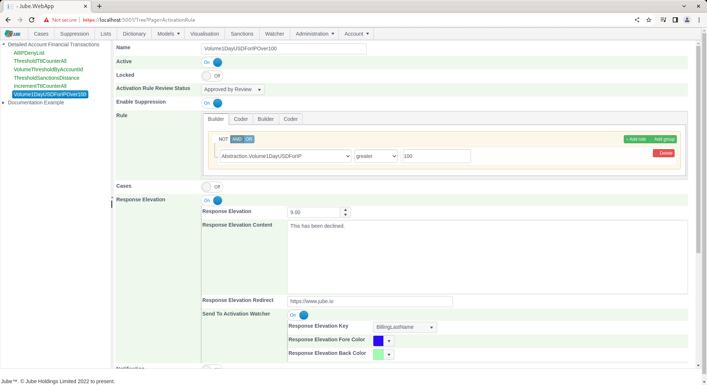
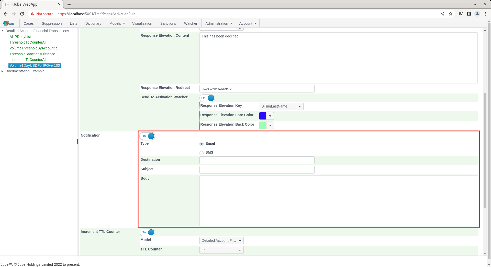
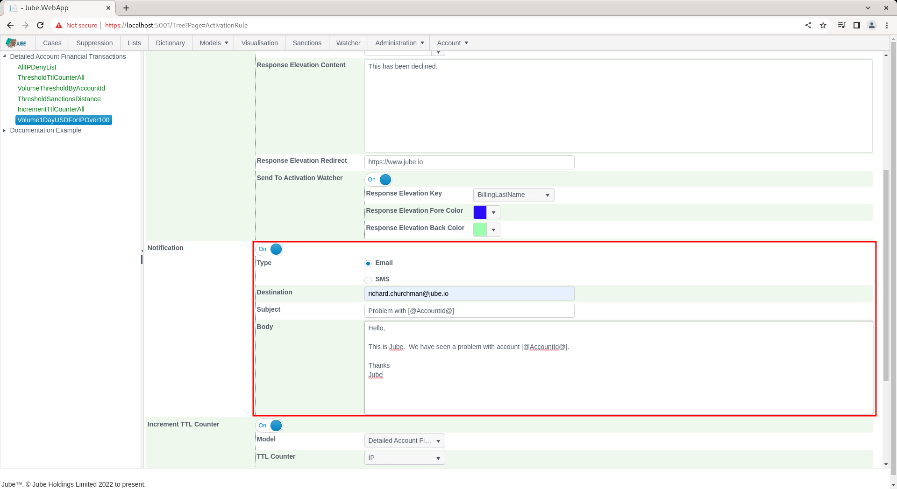
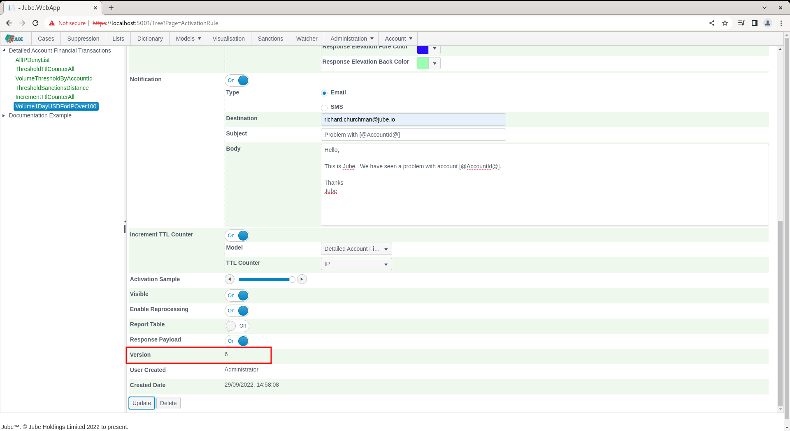

# Activation Rule Notifications
It is possible to send Email and SMS notifications as a consequence of an Activation Rule having matched,  with Notification configuration strings being available for tokenization (i.e. swapping values with that available in the processing for the purposes of providing context to the recipient).

It is important to note that the Engine must be configured to use SMTP gateway in the case of email by updating Environment Variables:

```text
SMTPHost=email.emailhost.com
SMTPPort=587
SMTPUser=UsernameExample
SMTPPassword=PasswordExample
SMTPFrom=richard.churchman@jube.io
```

| Value        | Description                                              |
|--------------|----------------------------------------------------------|
| SMTPHost     | The SMTP host name.                                      |
| SMTPPort     | The SMTP port name.                                      |
| SMTPUser     | The SMTP user name for authentication.                   |
| SMTPPassword | The SMTP password for authentication.                    |
| SMTPFrom     | The email address where the email will be received from. |

Likewise the Clickatell gateway in the case of SMS, using the value in the Environment Variable:

```text
ClickatellAPIKey=APIKeyFromClickatell
```

| Value            | Description                         |
|------------------|-------------------------------------|
| ClickatellAPIKey | The API Key provided by Clickatell. |

In all instances if the engine instance is to dispatch notification it must be enabled via an Environment Variable:

```text
EnableNotification=True
```

| Value              | Description                                                                                 |
|--------------------|---------------------------------------------------------------------------------------------|
| EnableNotification | Enables Notification dispatch from the engine either via AMQP or internal concurrent queue. |

To send a notification asynchronously on Activation Rule match, navigate to rule that was created beforehand,  titled Volume1DayUSDForIPOver100,  clicking on it for the purposes of editing:



Scroll down to the Notification switch:


Check the Notification check box to expand on Notification options:



All fields for a Notification support tokenization which will swap values enclosed in [@ @] brackets with a corresponding value.  For example, the AccountID is present in model definition,  hence will be available in the payload.  To instruct the AccountID to be swapped in during processing,  the value would be tokenized as [@AccountID@].

In this example a notification will be sent to richard.churchman@jube.io,  showing some elements of tokenization.

The process to send an SMS over an Email is similar,  except for radio buttons between SMS and email, and the subject being ignored in the case of SMS.

Complete the notification section of the Activation Rule:



Scroll down to update the Activation Rule with a new version:



Synchronise the model via Entity >> Synchronisation and repeat the HTTP POST to endpoint [https://localhost:5001/api/invoke/EntityAnalysisModel/90c425fd-101a-420b-91d1-cb7a24a969cc](https://localhost:5001/api/invoke/EntityAnalysisModel/90c425fd-101a-420b-91d1-cb7a24a969cc) for response.

There will be no noticeable difference to the response payload, however, an email will have been dispatched asynchronously.  

Receipt of the email can be observed on inspection of the email addresses Inbox, that the message has been received and correctly tokenized:


Only plain text emails are supported.

Exactly the same tokenization process would take place given an SMS selected,  although the destination would need be the telephone number as per the Clickatell API specifications.  The subject is ignored in SMS dispatch. To send SMS, simply change the Notification Type from Email to SMS and change the email from richard.churchman@jube.io to a mobile telephone number (noting in the Clickatell API this should be + and not 00 for the country code at the time of writing).


