🚀 Get to pre-production in weeks, not months, with private [training](https://www.jube.io/jube-training) direct from
Jube's developer — real sovereignty, zero vendor lock-in.

# Activation Rules Override

In the previous procedure the Response Elevation was set as the result of an Activation Rule matching. Response
Elevations are commonly used initiate the decline of a transaction in real time.

Consider the scenario where a customer has been declined in real time for foreign transactions, yet it transpires upon
investigation, that that the customer is on holiday. In such a circumstance, it would be desirable to suppress any
actions as the result of an Activation Rule match, for that account.

To help illustrate, repeat the HTTP POST to
endpoint [https://localhost:5001/api/invoke/EntityAnalysisModel/90c425fd-101a-420b-91d1-cb7a24a969cc](https://localhost:5001/api/invoke/EntityAnalysisModel/90c425fd-101a-420b-91d1-cb7a24a969cc)
for response as follows:

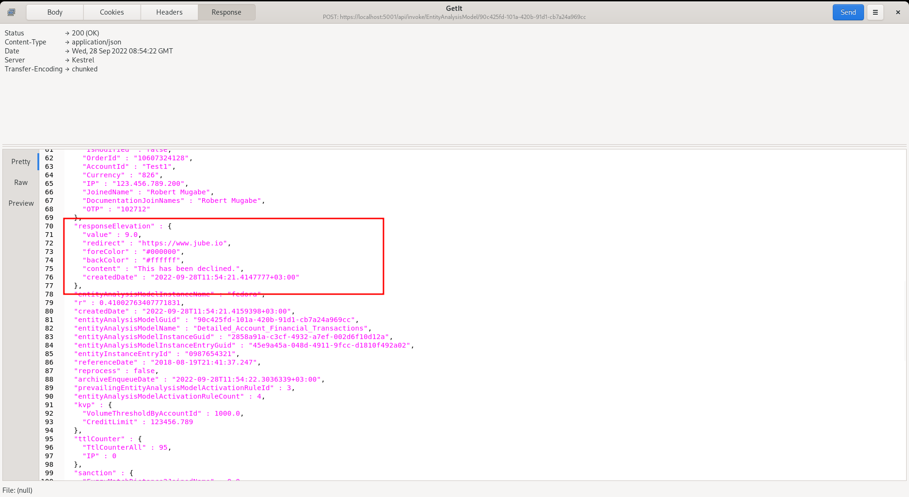

It can be seen that there is a Response Elevation being returned, which would be inferred as a transaction decline.

Note that the IP in the JSON transaction message is "123.456.789.200":

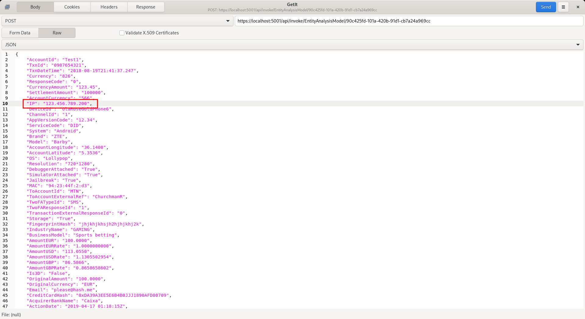

To enable the IP for Override matching, navigate to the IP in the Request XPath:

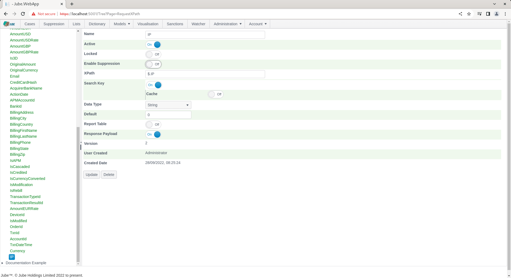

To allow IP to be used in Override, toggle the Enable Override switch:

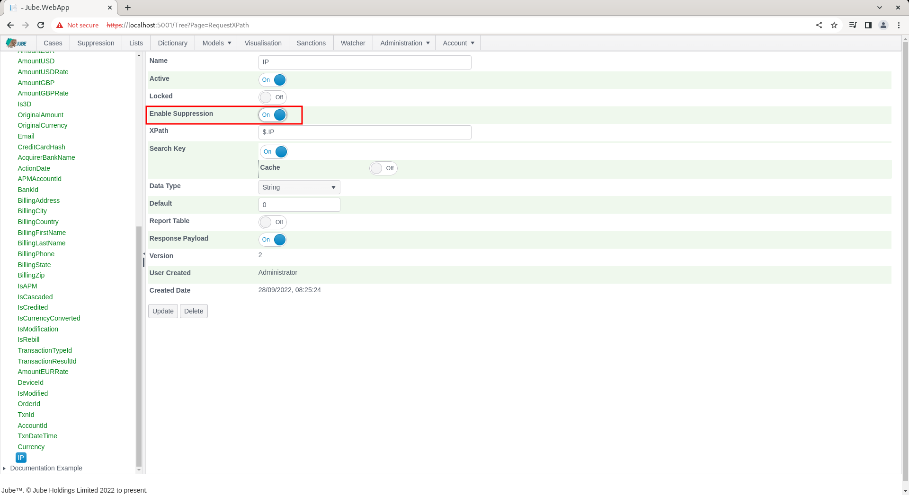

Update the Request XPath to create a new version including the Enable Override flag:

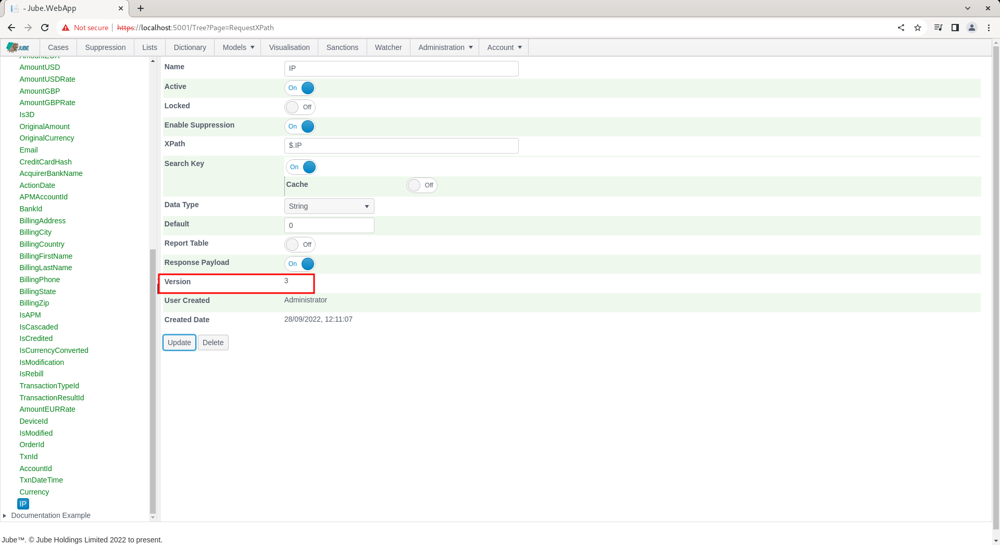

Synchronise the models to ensure that the override is recognised in the real-time processing. Override is available in
the top level menu:

To add an override at the model level, which will suppress on all rules, navigate to the Override page:

It can be seen in the Override Key drop down that the distinct list of all Request XPath elements designated for
suppression:

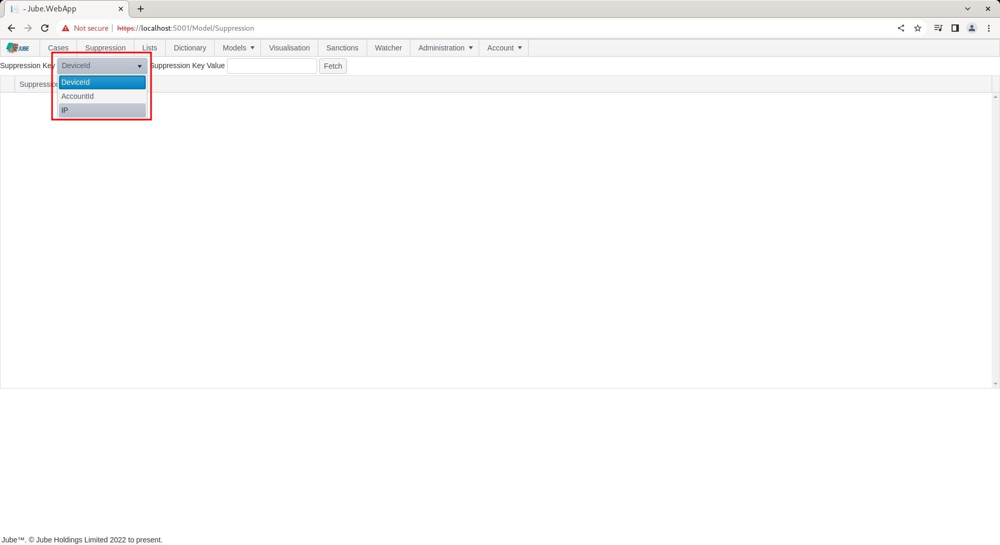

It follows that the override value must be for the IP for which suppression is required. To add an override for the IP,
simply type in the IP in the Override Key Value. The Override Key Value, and the Override Key itself, are each limited
to 256 characters:

Click the Fetch button to return suppression for the IP 123.456.789.200:

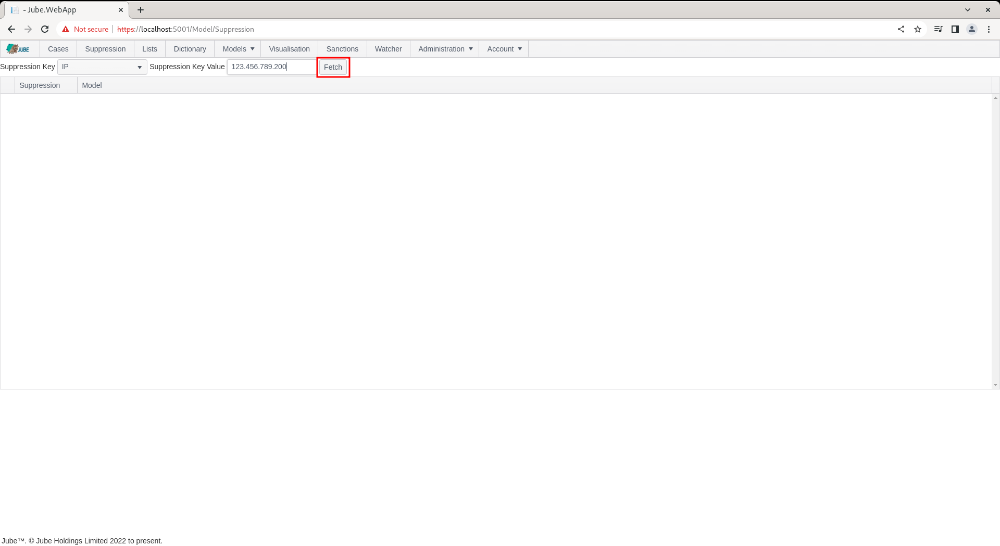

Upon clicking the Fetch button, all models will be returned for which IP is eligible, overlay with a switch to indicate
the override status for the IP 123.456.789.200:

To suppress for the IP value 123.456.789.200, simply toggle the switch next to the model name to indicate that all
Activation Rules belonging to the model should be suppressed:

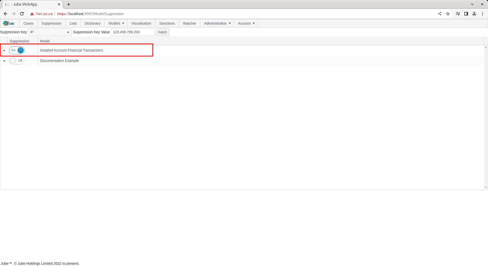

Next to the toggle switch, a Delete Expiry Date column is exposed, using a date and time picker.

The Delete Expiry Date picker is disabled unless suppression is currently switched on for the row, becoming immediately
available the moment the switch is toggled on, and immediately locked again, and cleared, the moment the switch is
toggled off. Setting a Delete Expiry Date has exactly the same effect as manually toggling the switch off once that date
and time is reached: it does not require an explicit synchronisation or any further manual intervention. Leaving Delete
Expiry Date blank, which is the default the moment an override is switched on, means the override never expires and must
be removed manually by toggling the switch off. The date and time entered must be in the future; an attempt to set a
value in the past is rejected immediately in the browser, reverting the picker to its previous value and displaying a
validation message on the page, without the invalid value ever being sent to the server. The same Delete Expiry Date
column, with the same behaviour, is available for suppression scoped to a specific Activation Rule, described further
below.

Every change made to an override record, whether removed by toggling the switch off or by a Delete Expiry Date being
reached, is recorded to an audit history, in the same manner as other versioned objects in Jube.

Overrides (as Lists and Dictionary) do not require an explicit synchronisation, rather they will be synchronised in the
engine as a matter of routine.

Repeat the HTTP POST to
endpoint [https://localhost:5001/api/invoke/EntityAnalysisModel/90c425fd-101a-420b-91d1-cb7a24a969cc](https://localhost:5001/api/invoke/EntityAnalysisModel/90c425fd-101a-420b-91d1-cb7a24a969cc)
for response as follows:

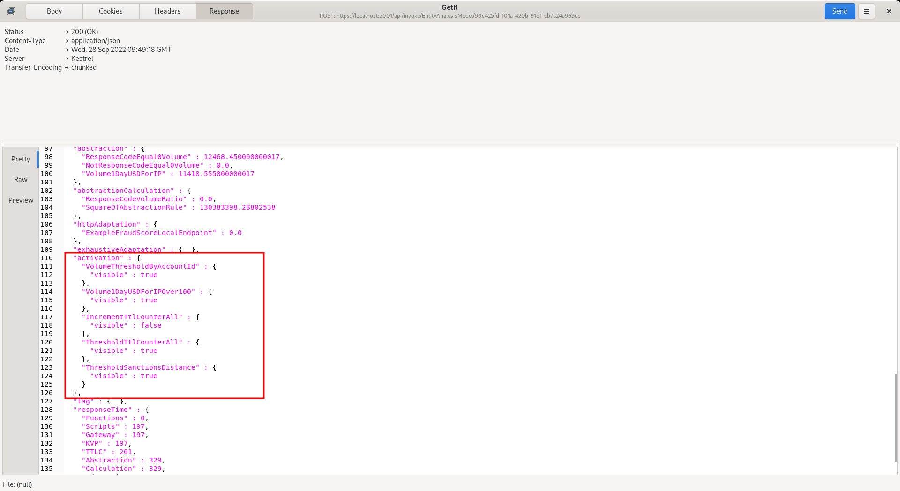

It can be seen that the Activation Rule has still matched - which is to be expected - but note that the following
actions are suppressed:

* Response Elevations.
* Notifications.
* Case Creation.
* Activation Watcher.

TTL Counter increments will not be suppressed.

In the response, locate the Response Elevation:

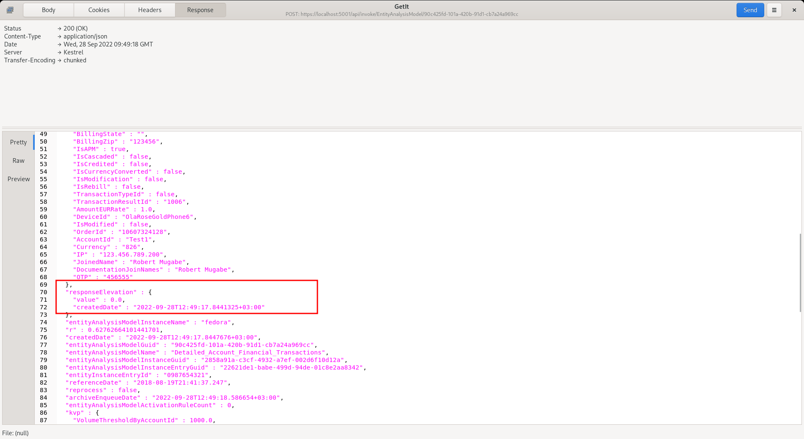

It can be seen that the Response Elevation is zero - as it has been suppressed - and will no longer drive a decline
(being a Response Elevation value other than zero).

To remove the override, simply toggle off the switch after having fetched the IP of 123.456.789.200 from the override
tab:

To validate removal of suppression, repeat the HTTP POST to
endpoint [https://localhost:5001/api/invoke/EntityAnalysisModel/90c425fd-101a-420b-91d1-cb7a24a969cc](https://localhost:5001/api/invoke/EntityAnalysisModel/90c425fd-101a-420b-91d1-cb7a24a969cc)
for response as follows:

It can be seen that the Response Elevation is now active - given that the override has now been removed.

It is also possible to specify just a specific activation rule for suppression.

To expose the Activation Rules rolling up to model, click on the arrow to the left hand side of the grid:

Click on the arrow to expand Activation Rules:

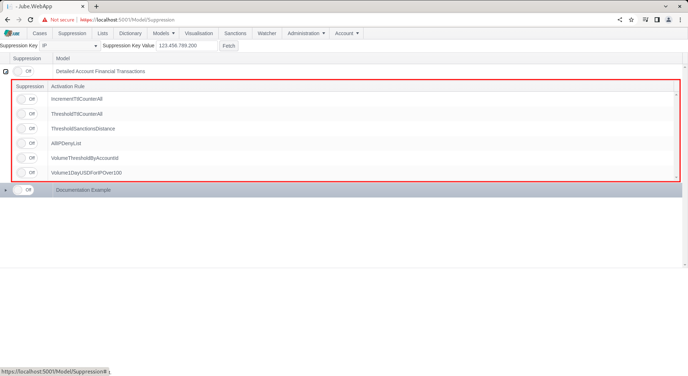

The override process works in the same manner as at the model level with a simple toggle switch to be immediately
synchronised, but suppression will be targeted to a rule name and not encompass the whole model processing of the
transaction or event.

As at the model level, a Delete Expiry Date can optionally be set once the switch is toggled on for the Activation Rule,
behaving identically: an automatic, unattended un-suppression at the date and time specified, requiring no further
synchronisation.

As with the Override Key and Override Key Value, the Activation Rule name is limited to 256 characters, and must
reference an Activation Rule that currently exists on the Model being overridden and that has been opted in to the
override surface, as described in Which Activation Rules may be overridden below. An Activation Rule that has been
deleted from the Model cannot be overridden:  deletion is final for the override surface, and an override naming a rule
that no longer exists has no effect.

## More than one Override Key on a Model

A Model may have several Request XPath elements with Enable Override switched on — for example a card fingerprint, a
user id and a project code. Each of those keys is checked independently against the payload, and the results are
combined, not replaced:

* A transaction is suppressed at the model level if **any** override key present in the payload carries an all
  activation rules override of kind Suppress for its value. It does not matter which key, nor in what order the keys are
  checked. A suppressed card is still suppressed when the user id on the same transaction has no override of its own.
* Where several keys each name specific Activation Rules, the resulting set of overridden rules is the **union** across
  every key. A card override naming Rule A and Rule B, together with a user override naming Rule B and Rule C, leaves
  Rules A, B and C overridden.

## Override Kind

Every override, whether held at the model level or against a named Activation Rule, carries an Override Kind:

* **Suppress** — the default, and the behaviour described throughout this page. The Activation Rule is still evaluated
  and still matches; it is the consequences of the match that are muted:  Response Elevations, Notifications, Case
  Creation and the Activation Watcher. TTL Counter increments are not suppressed.
* **Force** — the Activation Rule is treated as matched for this value without the rule being evaluated at all, so its
  consequences fire. This is the shape of a blacklist:  the value is known bad, and the rule's Response Elevation, Case
  and Notification are to be raised for it regardless of what the rule's own logic would have concluded. A Force
  override also bypasses the Activation Rule's Activation Sample, since an explicit operator override should not be
  sampled away.

The Override Kind is exposed as a drop down next to the toggle switch on the **Activation Rule** grid only, and like the
Delete Expiry Date picker it is enabled only while the override is switched on for that row. The model level grid shows
the Kind as read-only text and is fixed at Suppress:  an override held against every Activation Rule in a model may only
mute, never force, because forcing every rule in a model for a value is rarely intended and too easily set by accident.
To force, bind the override to the specific Activation Rule that carries the behaviour required.

Applying a Force override requires the separate **Apply Force Override** permission, which is granted to the
Administrator role only on upgrade and must be granted explicitly to any other role. Holding the ordinary suppression
permission allows an operator to mute a rule but not to make one fire; the two are deliberately separated, because
forcing an activation raises response elevations, creates cases and sends notifications, whereas suppression only
withholds them. The permission is enforced on create, on update and on any change of Override Kind.

Where the same Activation Rule is reached by more than one override — for example a Suppress against the card and a
Force against the user id, or a model level Suppress alongside a Force for one named rule — **Force takes precedence**.
A value that some other override has marked as known bad is not quietly muted by an unrelated suppression.

Global guards continue to apply to a forced Activation Rule:  the Response Elevation frequency limit, and the
reprocessing guard for a rule that does not have Enable Reprocessing set, each still mute the consequences. Force
governs whether the rule is treated as matched; it does not exempt the rule from those limits.

## Which Activation Rules may be overridden

The override surface is opt in at both ends, and neither end is implied by the other.

On the **Request XPath**, Enable Override determines whether that element is offered as an Override Key at all. It is a
model wide switch:  it says that this payload element is a thing operators may look values up by, and it governs the
search rather than any particular rule.

On the **Activation Rule**, three fields govern what may be done to that rule:

* **Enable Override** — the rule may be overridden at all. A rule without it is never suppressed and never forced,
  whatever overrides exist against the values on the payload, including a model level all activation rules override. It
  is off by default, so a rule is not drawn into the override surface simply by existing.
* **Enable Force** — the rule may additionally be **forced**, not merely suppressed. It is enabled only where Enable
  Override is on, and is off by default. A rule that may be muted is not thereby a rule that may be made to fire:  the
  second is the far larger claim, and is stated separately.
* **Override Key** — the single Request XPath whose values may override this rule. Left empty, any override enabled key
  may override it. Set, only overrides held against that key apply, and an override held against any other key is
  ignored for this rule.

The Override Key is deliberately one key and not a list. A rule that would need to answer to two different keys is two
rules, and saying so forces the rules to be labelled for what they actually do. If a policy appears to need an OR across
keys, that is the signal to split it, not to widen the binding.

All three are enforced by the engine at evaluation time as well as by the editor at write time, so an override that was
admissible when it was created stops applying the moment the rule's opt in is withdrawn. Withdrawing Enable Override on
a rule therefore disarms every override against it without any of them needing to be found and deleted, and the same is
true of Enable Force for forcing specifically:  turning it off leaves any Suppress overrides in place and stops the
Force ones.

The Activation Rule grid on the Override page lists only the rules that the selected Override Key may override, and
offers Force in the Kind drop down only for rules that have Enable Force set. Where a rule already carries a Force
override and Enable Force has since been withdrawn, the Kind continues to read Force so that what is stored is shown
honestly, but the engine no longer acts on it.

## Building a blacklist

A blacklist is a live Activation Rule plus Force overrides against its Override Key.

1. Create an Activation Rule carrying the behaviour a blacklisted value is to receive — its Response Elevation, its Case
   Workflow and its Notification. Give it a name that says so, for example Blacklist Card.
2. Give the rule an expression that matches nothing of its own accord. A rule whose expression returns false never
   activates for ordinary traffic, which is exactly what is wanted:  the rule is a carrier of consequences and not a
   detector.
3. Set Enable Override and Enable Force on the rule, and set its Override Key to the Request XPath the blacklist is
   keyed by.
4. Add a Force override for each blacklisted value on the Override page, against that rule.

Each value in the blacklist then activates the rule and receives its consequences, and nothing else does. The list is
edited by operators through the override surface, live and without synchronisation, while the behaviour of the list
stays where behaviour belongs, in a rule. Removing a value from the blacklist is removing its override, and emptying the
blacklist entirely leaves the rule dormant rather than leaving a rule behind that has to be remembered.

The rule remains an ordinary Activation Rule throughout. It appears in the Model, it can be edited, it is versioned, and
deleting it deletes the blacklist behaviour with it:  deletion is honoured by the override surface and not worked around
by it. A Model may carry several such rules keyed by different Request XPaths, and a rule that is both a real detector
and forceable for known bad values is equally valid — Force simply short circuits the evaluation for the bound values.

## Recording that an Activation was forced

A forced Activation is distinguishable after the event, because a forced Activation is not evidence of anything the
Model detected.

* The Activation element written into the Archive payload carries a **Forced** flag alongside the rule's name and
  visibility, so any Case, export or query reading the payload can tell an Activation the Model reached from one an
  operator asserted. No Archive column was added; the flag lives in the payload JSON where the Activation element
  already is.
* The Activation Rule carries a **Forced Activation Counter** separately from its Activation Counter, with the same
  separation carried into the counter history. The Activation Counter continues to count every Activation, forced or
  otherwise, so existing reporting is unchanged; the forced count says how much of that total was asserted rather than
  detected. A rule whose Activation Counter is entirely forced is doing no detecting at all, which is worth knowing
  about a rule that was meant to detect.

## The Override Key summary

The page opens on a summary of every Request XPath that has Enable Override switched on anywhere in the tenant, one row
per key, whether or not anything is currently held against it. Each row reports:

* **Values** — how many distinct values are currently overridden on that key.
* **Overrides** — how many live bindings there are in total, counting a model level binding and each named Activation
  Rule binding once each.
* **Forced** — how many of those bindings force their Activation Rule rather than suppress it, which is the number worth
  watching, since forcing raises response elevations and creates cases.
* **Activation Rules** — how many distinct Activation Rules are bound on that key.
* **All Rules** — how many bindings are the model level all activation rules kind rather than a named rule.
* **Models** — how many Models offer the key, a key being enabled per Request XPath and the same element commonly
  appearing on several Models.
* **Last Created** and **Next Expiry** — when the key was last used, and the soonest an override on it will lapse of its
  own accord.

Selecting a key drills into the list of values held against it, which is the same view that a Fetch with the Override
Key Value left blank produces. Filling in a value and pressing Fetch goes straight to the per value view for that one
value.

## Listing every value held against an Override Key

The Fetch button looks up one exact Override Key Value at a time. Leaving the Override Key Value blank and clicking
Fetch, or selecting a key from the summary above, instead lists **every** value currently held against the selected
Override Key across the tenant, with the Model it belongs to, the Override Kind, the user who created it and its Delete
Expiry Date. Values held only against named Activation Rules are listed alongside those held at the model level, since
the rule level is where most overrides now live, and a value is listed once per Model however many of its rules are
bound, reporting Force where any of those bindings forces. This is intended for monitoring what is overridden on a key
rather than testing values one by one. Selecting a row fills in the Override Key Value and returns to the per value
view.

The summary itself is available on the API as `GET /api/GetEntityAnalysisModelOverrideQuery/Keys`, which takes no
parameters and is scoped to the caller's tenant. The value listing is available as
`GET /api/GetEntityAnalysisModelOverrideQuery/Values?overrideKey=...`, which takes an optional `limit` clamped to
between 1 and 1000 and defaulting to 250.