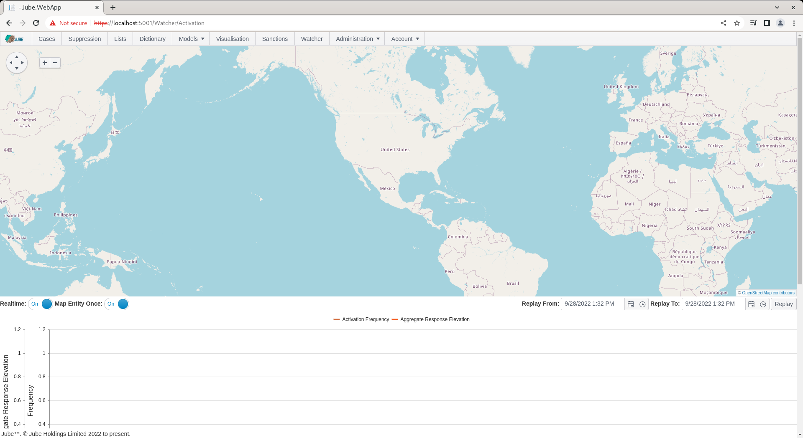
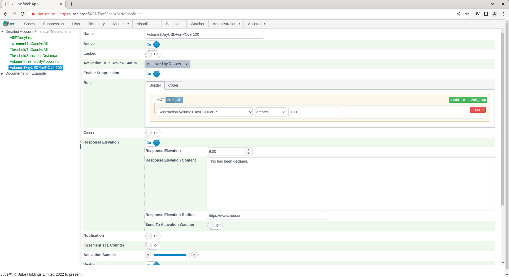
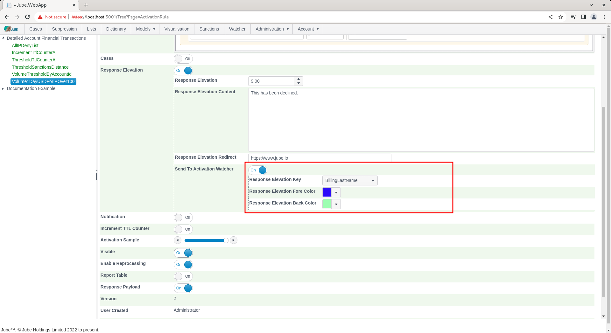
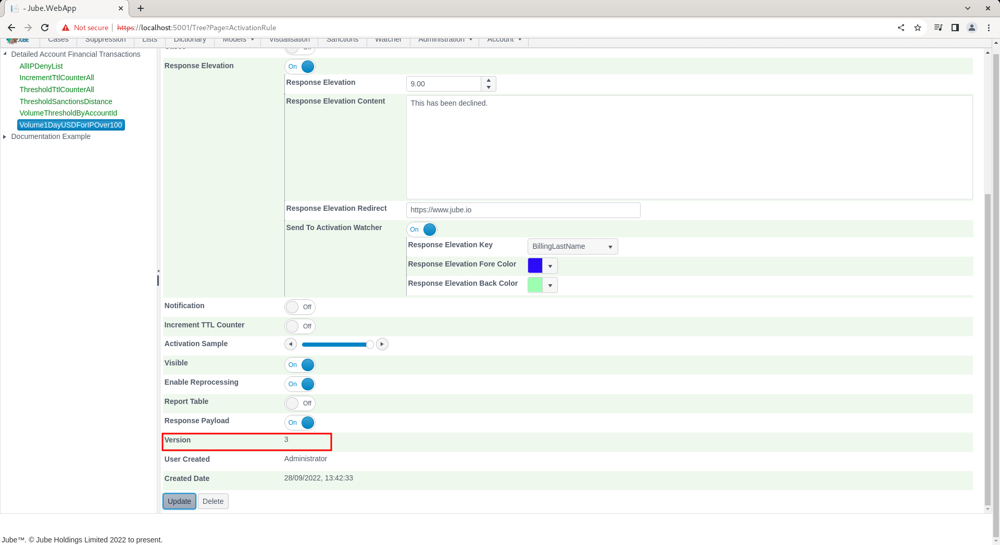
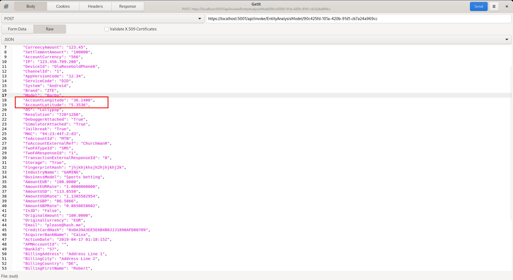
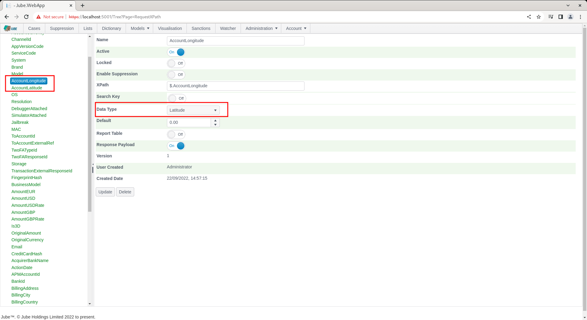
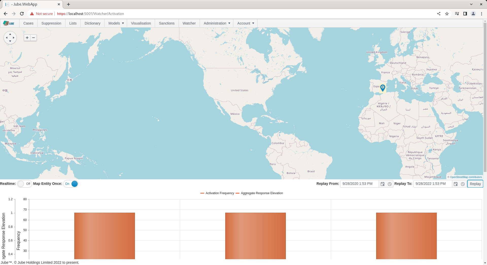

🚀Speed up implementation with hands-on, face-to-face [training](https://www.jube.io/jube-training) from the developer.

# Activation Watcher 
The purpose of the Activation Watcher is to provide a real time ticker of Response Elevations,  subject to the Activation Rule having been set to send messages to the Activation Watcher.

The Activation Watcher is available in a main menu item:

Navigate to the Watcher by clicking the menu item:

Ensure that the Real Time mapping check-box is checked to allow plotting on a real-time basis,  rather than only relying on solely on Replay:

The Map Entity Once switch exists to ensure that for the key (which would have been defined in the Activation Rule definition) that a flag may only be plotted the once on a map for that key,  so not to over-plot the map:

To configure an Activation Rule to dispatch real time messages to the Activation Watcher,  navigate to the Volume1DayUSDForIPOver100 for editing:

Scroll down to the Response Elevation section:

Check the Send to Activation Watcher Switch to expose further options:

The fore colour and back colour is the colouring that will be included in the Activation Watcher for the entry tick. The Activation Watcher has the ability to plot on a map,  along with the background colour specified.  The plotting of activation rule matches on the map relies on a Latitude and Longitude having been specified in the Request XPath or the Inline Script attributes, else it will plot [0,0] (just off Central Africa).

Update the model to Send To Activation Watcher alongside some tasteful colouring:

Scroll down and click update to create a new version of the Activation Rule:

Navigate to the Watcher. Synchronise the model via Entity >> Synchronisation and repeat the HTTP POST to endpoint [https://localhost:5001/api/invoke/EntityAnalysisModel/90c425fd-101a-420b-91d1-cb7a24a969cc](https://localhost:5001/api/invoke/EntityAnalysisModel/90c425fd-101a-420b-91d1-cb7a24a969cc) for response as follows:

There will be nothing of note in the JSON response payload.  Note that the pin has been plotted based on a latitude and longitude sent to the watcher.

In this example the Latitude and Longitude is passed in the JSON transaction message:

With the values being specified as being of Data Type Latitude and Longitude in the Request XPath definition,  respectively:

The Activation Watcher will only tick through alerts as they happen when that page is connected.

The Replay functionality of the Activation Watcher - but only if the engines have been configured to store Activation Watcher entries in the database - will query and replay these entries through the Activation Watcher as if they were being sent in real-time.

Activation Watcher replay, is for a given date range,  in ascending date order,  for a maximum of 10000 records, as if they were streaming in real-time.  It should not be used to drive workflow,  rather be considered a sample.

Set the date range to a day apart:

Before clicking the Replay button,  it is recommended to turn off real time ticking,  as this will eliminate confusion between real time data and replay data:

To replay,  simply click the Replay button, lending a wide date range in this example:

Keep in mind that the map is set to plot an Entity the once,  only the grid and the chart will show real activation frequencies:

There are several mechanisms that stop the Activation Watcher being flooded with data and causing the system to become unresponsive.  It follows that the Activation Watcher should be viewed to be a sample of activity for a period of time,  rather than a system of record or alert.