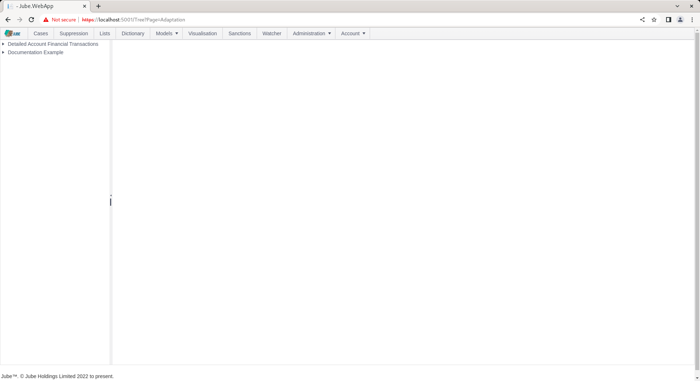
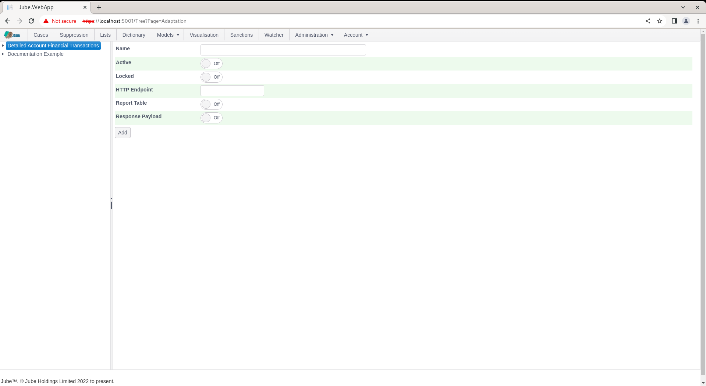
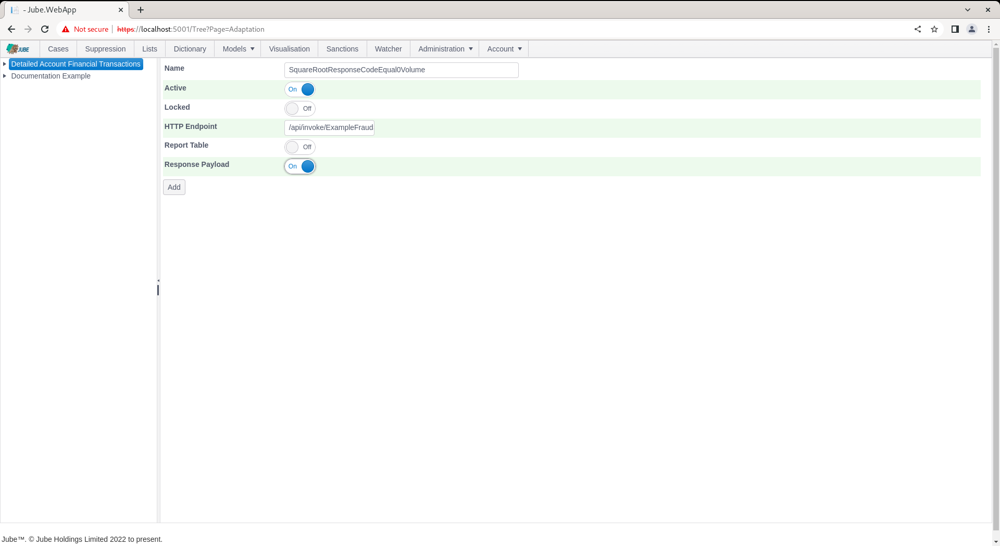
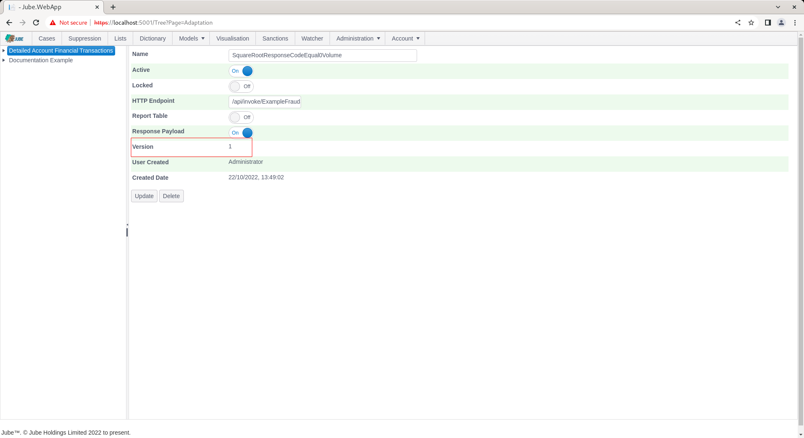
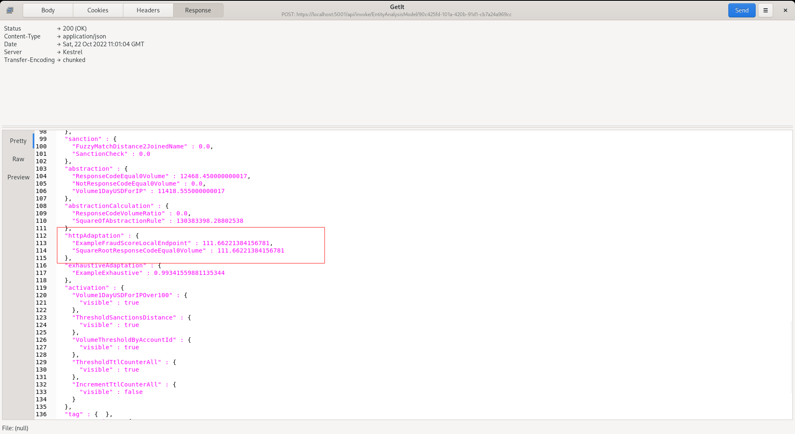

🚀Speed up implementation with hands-on, face-to-face [training](https://www.jube.io/training) from the developer.

# HTTP Adaptation
HTTP Adaptation refers to the dispatch a JSON document in a POST body to a remote HTTP endpoint for the receipt of a single quantitative score in the JSON response body.  

The request payload is of top level structure only:

``` json
{
"ResponseCodeEqual0Volume":1,
"NotResponseCodeEqual0Volume":2,
"Volume1DayUSDForIP":3
}
```

And the response payload need be:

``` json
{
[0]
}
```

Abstraction Rule values, TTL Counter Values and Abstraction Calculation Values are eligible for consolidation into the top level JSON payload in the following order of precedence:

* Abstraction Rules.
* TTL Counters.
* Abstraction Calculations.

The intention of HTTP Adaptation is to recall R models via Plumber,  Python models via Flask or make use of any HTTP service that respects the payload specification set out above.

To create a HTTP Adaptation,  navigate Models >> Machine Learning >> HTTP Adaptation:



Click on a model in the tree to create a new HTTP Adaptation:



The HTTP Adaptation accepts a single parameter as follows:

| Value         | Description                                                                                                                                                                                                                        | Example                                    |
|---------------|------------------------------------------------------------------------------------------------------------------------------------------------------------------------------------------------------------------------------------|--------------------------------------------|
| HTTP Endpoint | Using the prefix specified in the HttpAdaptationUrl Environment Variable in concatenation with remainder of the URL for the HTTP Endpoint to POST to.  Assume no "/" terminating the HttpAdaptationUrl Environment Variable value. | /api/invoke/ExampleFraudScoreLocalEndpoint |

In this example an endpoint is available for the purpose of echoing back the Square Root of the ResponseCodeEqual0Volume Abstraction Rule Value at https://localhost:5001/api/invoke/ExampleFraudScoreLocalEndpoint.  Complete the page as follows:



Scroll down and click Add to create a version of the HTTP Adaptation:



Synchronise the model via Entity >> Synchronisation and repeat the HTTP POST to endpoint [https://localhost:5001/api/invoke/EntityAnalysisModel/90c425fd-101a-420b-91d1-cb7a24a969cc](https://localhost:5001/api/invoke/EntityAnalysisModel/90c425fd-101a-420b-91d1-cb7a24a969cc) for response as follows.



Notice that the score has been returned for use in Activation Rules in the Adaptation entity.

