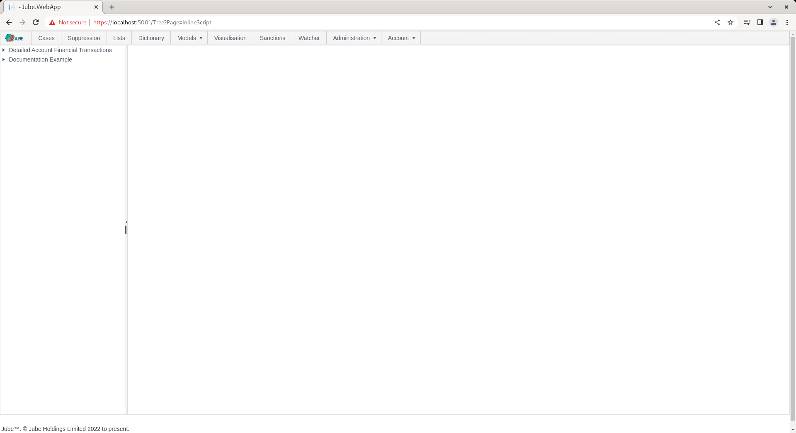
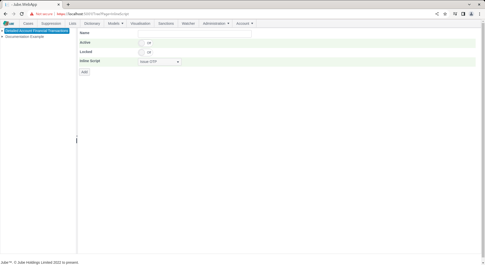
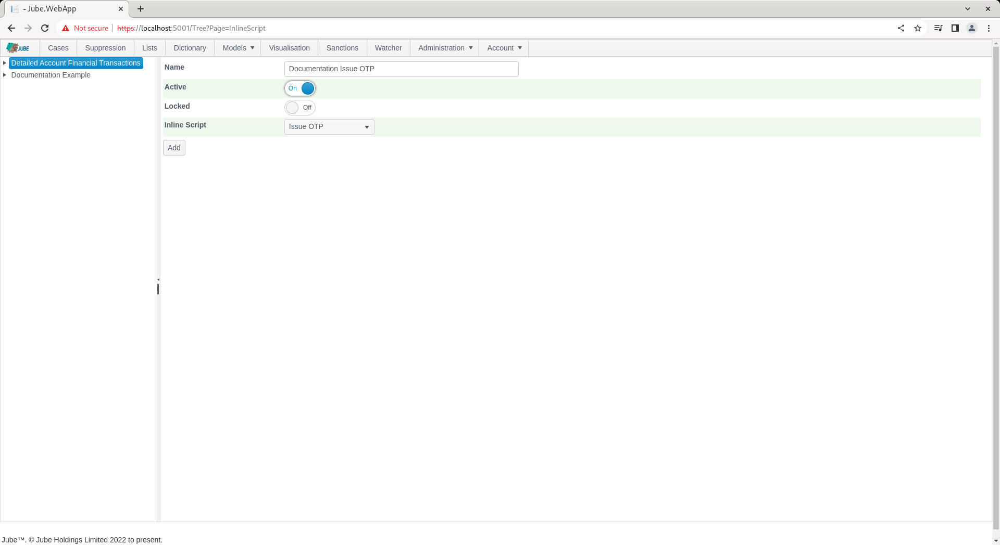
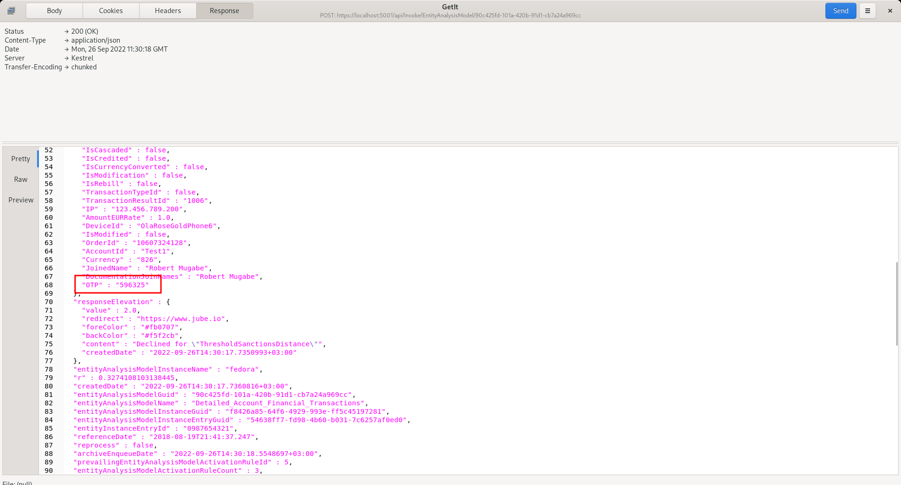

🚀Speed up implementation with hands-on, face-to-face [training](https://www.jube.io/training) from the developer.

# Inline Scripts
The models inside Jube are extensible via the use of Inline Scripts.  

Inline Scripts once registered in the database are available for all models, however they must be registered in a model for the payload to be populated in the same manner as Request XPath (i.e. it is available in the rules in the Payload collection).  

The system wide Inline Script (which can be added only through direct entry to the database table EntityAnalysisInlineScript as follows) is as per the following specification,  and is here intended to dispatch a one time password to a mobile device.  There is a default Inline Script which produces a random three digit string of six characters in length, whereby the following configuration exist in the EntityAnalysisInlineScript table:

``` sql
select * from EntityAnalysisInlineScript
```


The database contains code as follows:

```vb

Imports log4net
Imports System
Imports System.Collections.Generic
Imports Microsoft.VisualBasic

Public Class IssueOTP
Inherits System.Attribute

	<ReportTable>
	Public Property OTP As String

	Private _log as ILog

	Public Sub New(Log As ILog)
		_log = Log
	End Sub

	Public Sub Execute(Data As Dictionary(Of String,Object), Log As ILog)
		Data.Add("OTP", RandomDigits(6))
	End Sub
	
	Private Function RandomDigits(ByVal length As Integer) As String
	    Dim random = New Random()
	    Dim s As String = String.Empty

	    For i As Integer = 0 To length - 1
		s = String.Concat(s, random.[Next](10).ToString())
	    Next

	    Return s
	End Function	
End Class
```
An InlineScript is a complete .Net class written in VB.net (although C# will be supported in the future), and starts out with all of the Imports statements,  being the references,  at the top of the class:

```vb
Imports log4net
Imports System
Imports System.Collections.Generic
Imports Microsoft.VisualBasic
```

After the Imports statements,  the class can be declared and named:

```vb
Public Class Example
 Inherits System.Attribute ''Don't forget this
 ''Properties and Attributes Go Here
 ''Methods Go Here
End Class
```

The class at a minimum must contain two methods conforming to the following signatures:

```vb
Public Sub New(Log As ILog)
  ''You can do anything here that can be accomplished in .Net.
End Sub

Public Sub Execute(Data As BsonDocument, Log As ILog)
  ''You can do anything here that can be accomplished in .Net.
End Sub
```
The class behaves exactly as any .Net class would,  the New() sub routine is the invoked only the once and upon the instantiation of the class.  The New method can be used to instantiate objects that will be available for the lifetime of the object.  Henceforth,  if there are any tasks which are expensive, they should be done just the once at the point the class is loaded.  The New() sub routine takes a reference to the Log4Net logging such that logs can be created from the InlineScript for visibility.

The Execute() sub routine is called on each and every transaction or event, taking the an Object Dictionary and the Log4Net logging as its parameters.  The Data Dictionary is a reference, hence any appends to the document will be available in subsequent processing, the same process calling the class upstream.

To return values from the Execute() sub routine,  append key value pairs to the Data Dictionary:

```vb
	Public Sub Execute(Data As Dictionary(Of String,Object), Log As ILog)
		Data.Add("Key","Value") 
	End Sub
```

If the data is being added to the Data Dictionary,  or payload, it should be exposed to the User Interface also such that rules can be created to target the value.  Meta data for payload is exposed as a public property in the class with certain attribute decoration to emulate configuration available in Request XPath:

```vb
<ReportTable>
<ResponsePayload>
<SearchKey(CacheKey:=False, CacheKeyIntervalType:="s", CacheKeyIntervalValue:=10, FetchLimit:=100, CacheKeyIntervalTTLType:="d", CacheKeyIntervalTTLValue:=1)>   
Public Property Key As String
```

As a property is typed (e.g. Public Property Hello as String) the data type will be taken from the property type, supporting the following types only:

* String.
* Integer.
* Double.
* Date.
* Boolean.

Note that attribute decoration is available to achieve similar functionality as Request XPath manual definitions:

* ResponsePayload.
* ReportTable.
* SearchKey.

The existence of the ResponsePayload or ReportTable attribute is straight boolean,  the existence of which will be taken to be true (inserting records into the ArchiveKey table), the absence is false.  The SearchKey has more parameters available in the attribute:

| Value                  | Description                                                                        | Example |
|------------------------|------------------------------------------------------------------------------------|---------|
| CacheKey               | A flag indicating that the Cache Key is to be sent to the Search Key Cache Server. | True    |
| CacheKeyIntervalType   | The interval of reprocessing for the Search Key Cache Server.                      | d       |
| CacheKeyIntervalValue  | The interval value for the Search Key Cache Server.                                | 1       |

When an Inline Script is invoked, the payload data is passed,  with the Inline Script being expected to be adding data to that payload, the updating of properties has no practical effect in model invocation.

In the event that the Inline Script fails to compile,  a log entry will be written out with the compile errors at the INFO level.  It is advisable to compile the class as part of a separate project before promoting in the database.

To promote an InlineScript to Jube, it is a question of inserting the class to a table in the database entitled InlineScript:

```sql
insert into InlineScript
  (InlineScript,
    Dependencies,
    ClassName,
    MethodName)
Values(
    @TheInlineScriptAsAbove, --This would be the full text of the Inline Script.
    @TheClassName, --There may be many class specifications,  hence specify the class where the methods and properties are available.  In this case IssueOTP.
    @AnyDLLsRequired, --Any third party DLL's required are declared here,  separated with ;. The DLL must be copied to the same directory as the Jube Engine executable. None here.
    @MethodName --The namne of the public invocation method,  in this case Execute
);
```

The Inline Script page exists to facilitate the registration of Inline Scripts for a model. The page is available by navigating through the menu as Models >> References >> Inline Scripts:



Add a new Inline Script by clicking an Entity Model entry in the tree towards the left hand side:



The parameters available to Inline Script allocation in the model are:

| Value                       | Description                                                               | Example    |
|-----------------------------|---------------------------------------------------------------------------|------------|
| Inline Script               | The Inline Script to be invoked on each request being made to the model.  | Issue OTP  |

Complete the page as above parameter and as follows:



Click Add to create the first version of this Inline Script allocation in the model:


Synchronise the model via Entity >> Synchronisation and repeat the HTTP POST to endpoint [https://localhost:5001/api/invoke/EntityAnalysisModel/90c425fd-101a-420b-91d1-cb7a24a969cc](https://localhost:5001/api/invoke/EntityAnalysisModel/90c425fd-101a-420b-91d1-cb7a24a969cc) for response as follows:



Notice a field added as "OTP" in the response, which was also exposed by the Inline Script as being a property such that it is available in the rule builder and coder. Keep in mind that an Inline Script can expose many properties and add many elements,  hence the name of the inline script itself has limited relevance.

Although the inline script set out above is basic, simply appending a value to the payload as if it had been passed originally in the request JSON,  Inline Scripts can be used for far more complex integration and data processing.