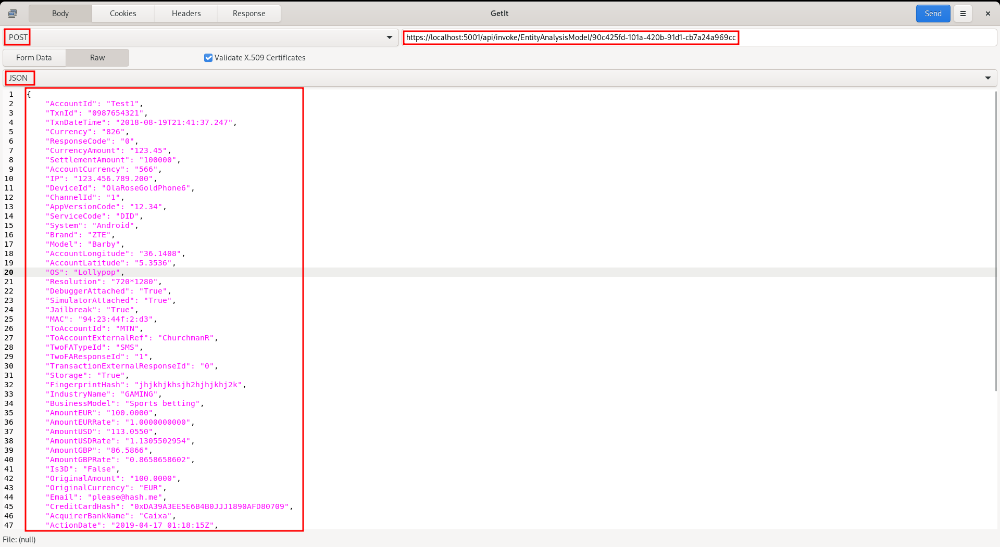
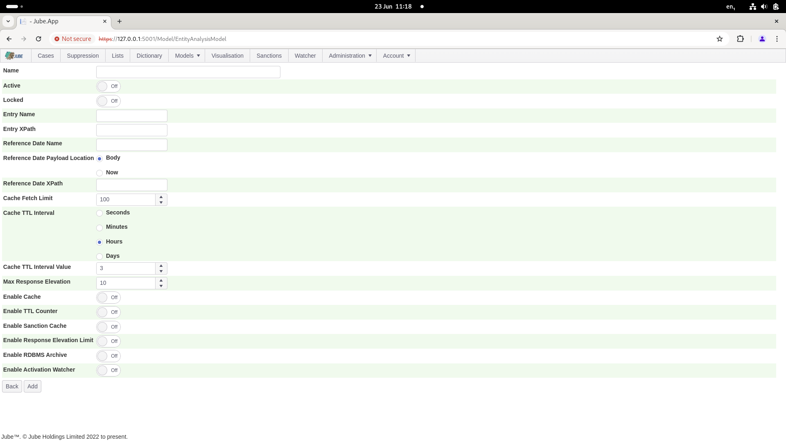
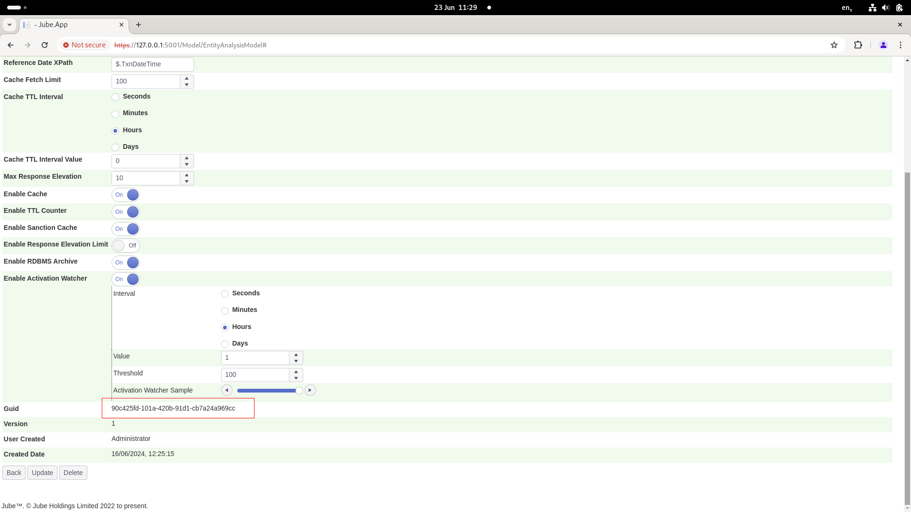
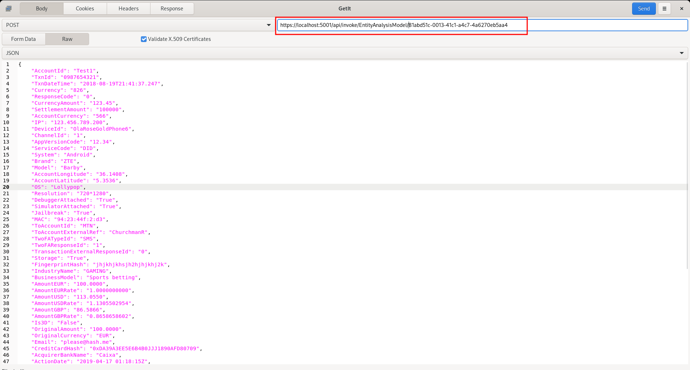

# Models
Jube does not have a fixed model specification nor integration API,  instead, Models are configured via the user interface assuming the availability of JSON on integration.

The default and example models are built around the following JSON object:

```json
{
    "AccountId": "Test1",
    "TxnId": "0987654321",
    "TxnDateTime": "2018-08-19T21:41:37.247",
    "Currency": "826",
    "ResponseCode": "0",
    "CurrencyAmount": "123.45",
    "SettlementAmount": "100000",
    "AccountCurrency": "566",
    "IP": "123.456.789.200",
    "DeviceId": "OlaRoseGoldPhone6",
    "ChannelId": "1",
    "AppVersionCode": "12.34",
    "ServiceCode": "DID",
    "System": "Android",
    "Brand": "ZTE",
    "Model": "Barby",
    "AccountLongitude": "36.1408",
    "AccountLatitude": "5.3536",
    "OS": "Lollypop",
    "Resolution": "720*1280",
    "DebuggerAttached": "True",
    "SimulatorAttached": "True",
    "Jailbreak": "True",
    "MAC": "94:23:44f:2:d3",
    "ToAccountId": "MTN",
    "ToAccountExternalRef": "ChurchmanR",
    "TwoFATypeId": "SMS",
    "TwoFAResponseId": "1",
    "TransactionExternalResponseId": "0",
    "Storage": "True",
    "FingerprintHash": "jhjkhjkhsjh2hjhjkhj2k",
    "IndustryName": "GAMING",
    "BusinessModel": "Sports betting",
    "AmountEUR": "100.0000",
    "AmountEURRate": "1.0000000000",
    "AmountUSD": "113.0550",
    "AmountUSDRate": "1.1305502954",
    "AmountGBP": "86.5866",
    "AmountGBPRate": "0.8658658602",
    "Is3D": "False",
    "OriginalAmount": "100.0000",
    "OriginalCurrency": "EUR",
    "Email": "please@hash.me",
    "CreditCardHash": "0xDA39A3EE5E6B4B0JJJ1890AFD80709",
    "AcquirerBankName": "Caixa",
    "ActionDate": "2019-04-17 01:18:15Z",
    "APMAccountId": "",
    "BankId": "57",
    "BillingAddress": "Address Line 1",
    "BillingCity": "Address Line 2",
    "BillingCountry": "DE",
    "BillingFirstName": "Robert",
    "BillingLastName": "Mugabe",
    "BillingPhone": "1234567890",
    "BillingState": "",
    "BillingZip": "123456",
    "IsAPM": "True",
    "IsCascaded": "False",
    "IsCredited": "False",
    "IsCurrencyConverted": "False",
    "IsModification": "False",
    "IsModified": "False",
    "IsRebill": "False",
    "OrderId": "10607324128",
    "TransactionTypeId": "1000",
    "TransactionResultId": "1006"
}
```

The example JSON is used extensively throughout this documentation,  however naming elements aside,  it is a highly generic format. Jube can handle any correctly formed JSON,  seeking to be directed to the data elements via JSONPath. JSONPath is a query language for JSON and has the effect of allowing for the support of any existing interfaces that set forth the POST body as JSON.

In this guide a rudimentary HTTP request tool called GetIt (https://getit.bartkessels.net/) is used.  Many other HTTP testing tools are available, such as Postman or tools within most IDE's, such as Jetbrains.  For completeness,  the above example JSON would represent a POST body for HTTP invocation:



Invocation is explained in more depth elsewhere in the documentation, and it is suffice to draw attention to the above to the HTTP verb as being of type POST,  the JSON comprising the POST body,  and the url slug api/Invoke/EntityAnalysisModel/<Guid> (whereby the Guid is the model identifier).  It follows that a Model is an endpoint in practice.

Start by navigating to Models >> Models:


The documentation will proceed on the basis of reconstructing the default or example model, installed by Migration also.

The Entity Models screen is where a model is first defined and allocated a GUID (Globally Unique Identifier) for recall.

Start by clicking on the New button to expose the basic parameters:


The parameters required for the creation of a new Model will be displayed:



The table as follows gives an introduction to each parameter:

| Value                                      | Description                                                                                                                                                                                                                                                                                                                                                                                                                                                     | Example                              |
|--------------------------------------------|-----------------------------------------------------------------------------------------------------------------------------------------------------------------------------------------------------------------------------------------------------------------------------------------------------------------------------------------------------------------------------------------------------------------------------------------------------------------|--------------------------------------|
| GUID                                       | When an Entity Model is created it is allocated a GUID (Globally Unique Identifier) which will be the key to the model upon it being recalled via the HTTP Endpoint.  For example,  the GUID is used in recalling the model via this endpoint as: [https://localhost:5001/api/invoke/EntityAnalysisModel/90c425fd-101a-420b-91d1-cb7a24a969ccc](https://localhost:5001/api/invoke/EntityAnalysisModel/90c425fd-101a-420b-91d1-cb7a24a969ccc)                                                                                                                    | 90c425fd-101a-420b-91d1-cb7a24a969cc |
| Entry Name                                 | The name of the field,  as extracted from the HTTP POST Body,  that represents the entry identifier or key.  An example of an Entry might be an Transaction identifier in the processing of financial transactions.                                                                                                                                                                                                                                             | TxnId                                |
| Entry XPath                                | The JSONPath specifying the location of the Entity in the HTTP Post Body.                                                                                                                                                                                                                                                                                                                                                                                       | $.TxnId                              |
| Reference Date Name                        | The name of the field,  as extracted from the HTTP POST Body or using the current time,  that represents the Reference Date.  An example of a Reference Date might be the date time as of Now taken from the API endpoints system time.                                                                                                                                                                                                                         | TxnDateTime                          |
| Reference Date XPath                       | Subject to Now not having been specified for the Payload Location, the XPath or JSONPath specifying the location of the Reference Date in the HTTP Post Body.                                                                                                                                                                                                                                                                                                   | $.TxnDateTime                        |
| Cache Fetch Limit                          | A limit applied on the retrieval of data from the cache set in order to avoid the real-time transaction processing being flooded by a very active entities (i.e. Accounts with an implausibly high number of transactions,  such as test accounts).  When retrieval is made from the Cache it is done so by selecting all records where there is a match on a search key,  hence there is the potential for denial of service events without such a constraint. | 100                                  |
| Maximum Response Elevation                 | The maximum Response Elevation allowed in response payload model.  In the event a Response Elevation is specified to exceed this value,  it is clipped to this maximum.                                                                                                                                                                                                                                                                                         | 10                                   |
| Enable Cache                               | A flag that indicates if entry data is to be stored in the Cache for the purposes of backing Abstraction Rules.  In ultra high throughput environments it is sometimes more manageable to store TTL Counters instead.                                                                                                                                                                                                                                           | True                                 |
| Enable Cache TTL Counters                  | A flag that indicates if the TTL counter entries are to be stored in the Cache for the purposes of backing TTL Counters.                                                                                                                                                                                                                                                                                                                                        | True                                 |
| Enable Sanctions Cache                     | A flag indicating if the requests to the computationally expensive Levenshtein Distance algorithm for the Sanctions checking should first refer to a time limited cache.                                                                                                                                                                                                                                                                                        | True                                 |
| Enable Response Elevation Limit            | A flag indicating if there should exist a limit on the number of Response Elevations that can be set in a within a defined period as follows                                                                                                                                                                                                                                                                                                                    | True                                 |
| Enable Response Elevation Limit: Interval  | Given Enable Response Elevation Limit, the time interval type in which the number of Response Elevations will be counted in (e.g. Hour).                                                                                                                                                                                                                                                                                                                        | Hour                                 |
| Enable Response Elevation Limit: Value     | Given Enable Response Elevation Limit, the time value to be used in conjunction in which the interval that the number of Response Elevation will be counting in (e.g. 1)                                                                                                                                                                                                                                                                                        | 1                                    |
| Enable Response Elevation Limit: Threshold | Given Enable Response Elevation Limit the maximum number of Response Elevations that can be set within the time period, else returning 0 if in excess                                                                                                                                                                                                                                                                                                           | 1000                                 |
| Enable RDBMS Archive                       | A flag to indicate if model data should be stored in the Archive table of Postgres.                                                                                                                                                                                                                                                                                                                                                                             | True                                 |
| Enable Activation Watcher                  | A flag indicating that activations should not be sent to the Activation Watcher. In the event that the number exceeds a time bound threshold (in a similar manner to Enable Response Elevation Limit).                                                                                                                                                                                                                                                          | True                                 |
| Enable Activation Watcher: Value           | Given Enable Activation Watcher the time interval type that the number of Response Elevations will be counted in (e.g. Hour).                                                                                                                                                                                                                                                                                                                                   | 1                                    |
| Enable Activation Watcher: Threshold       | Given Enable Activation Watcher the time value to be used in conjunction with the interval that the number of Response Elevation will be counting in (e.g. 1)                                                                                                                                                                                                                                                                                                   | 1000                                 |
| Enable Activation Watcher: Sample          | The Activation Watcher is intended to provide for a streaming overview of the proportions of risk. Given Enable Activation Watcher a random sample determining the selection to the Activation Watcher.                                                                                                                                                                                                                                                         | 100%                                 |

The incorrect configuration of Response Elevation and Limits is one of the more common reasons why Response Elevations may be zero,  even though they are set to a value in an Activation Rule.

Placing each one of the example values into their respective fields in the Model page as follows:


Click the Add button to commit the new Model specification:


Confirmation that the Entity Model has been created will return in the form of a GUID having being created:



The GUID will be 81abd51c-0013-41c1-a4c7-4a6270eb5aa4.  It follows that the HTTP endpoint will be https://localhost:5001/api/invoke/EntityAnalysisModel/81abd51c-0013-41c1-a4c7-4a6270eb5aa4.  

In the case of AMQP integration,  a header key value pair of EntityAnalysisModelGuid = 81abd51c-0013-41c1-a4c7-4a6270eb5aa4 will be used. 

For the newly created Guid (keeping in mind that in most documented example the default guid of 90c425fd-101a-420b-91d1-cb7a24a969cc will be used), perform a POST of the example JSON to https://localhost:5001/api/invoke/EntityAnalysisModel/81abd51c-0013-41c1-a4c7-4a6270eb5aa4:



Without synchronisation, the endpoint would return HTTP status Not Found (404).

Navigate to Models >> Synchronisation:


The synchronisation page shows the instances running and their status,  be that when last heartbeat or last model synchronisation took place.

Click "Synchronise Now":


The nodes running the engine will turn an orange colour indicating that the synchronisation is pending:


Turning green upon the Synchronisation having been completed (refreshing every 30 seconds, unless otherwise instructed by clicking the Refresh button):


Upon synchronisation, proceed to POST the JSON to the endpoint [https://localhost:5001/api/invoke/EntityAnalysisModel/81abd51c-0013-41c1-a4c7-4a6270eb5aa4](https://localhost:5001/api/invoke/EntityAnalysisModel/81abd51c-0013-41c1-a4c7-4a6270eb5aa4) and observe response:


It can be observed that the HTTP response status is of 200,  which means that there was no error in processing:


In the event that there is an error in processing it will be communicated by HTTP status code:

* Bad Request (400) in the event that a head check fails for the JSON, the JSON does not parse, is of invalid length or is subject other constraints.
* Not Ready (204) in the event the engine is not ready to respond to requests from the model,  which may happen when an instance is starting.
* Not Found (404) in the event a bad Guid has been provided or the Guid cannot be matched to a synchronised model.
* Internal Error (500) in the event of other unspecified processing error available to the logs.