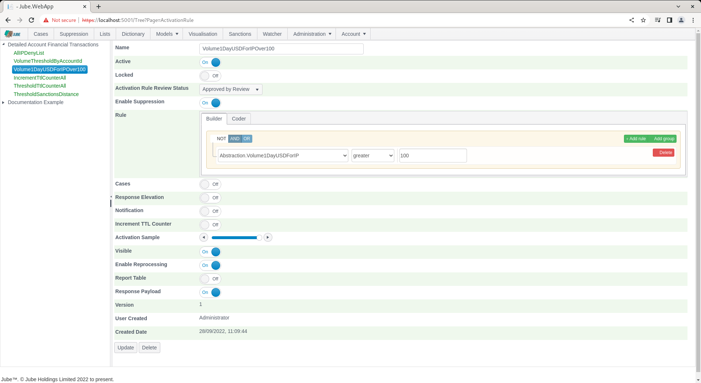
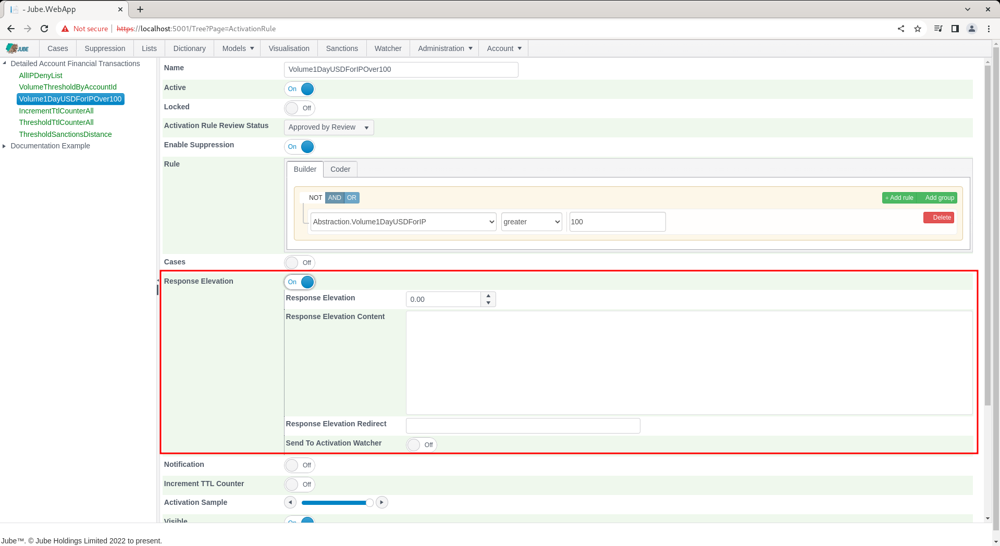

🚀Speed up implementation with hands-on, face-to-face [training](https://www.jube.io/training) from the developer.

# Activation Rules with Response Elevation
Response elevation - commonly inferred as a decline code - is a consequence of the activation rule match.  The Response Elevation has several other properties which can direct action, with the values being returned in the response payload also.

Navigate to the Activation Rule that was created beforehand,  titled Volume1DayUSDForIPOver100,  clicking on it for the purposes of editing:

Scroll down the page to the section Response Elevation:

Check the Response Elevation box to reveal the options available:

Complete the Response Elevation Field as follows to return9 , thus infer a decline with escalation severity 9:

Scroll down and click update:

Synchronise the model via Entity >> Synchronisation and repeat the HTTP POST to endpoint [https://localhost:5001/api/invoke/EntityAnalysisModel/90c425fd-101a-420b-91d1-cb7a24a969cc](https://localhost:5001/api/invoke/EntityAnalysisModel/90c425fd-101a-420b-91d1-cb7a24a969cc) for response as follows:

It can be seen from the HTTP response payload that the Response Elevation has been returned as 9, alongside the URL and example messages configured. It is worth noting that if more than one Activation Rule seeks to allocate a Response Elevation,  it can only be to a value greater than the one already existing (hence the name Response Elevation).