🚀Speed up implementation with hands-on, face-to-face [training](https://www.jube.io/jube-training) from the developer.

# Introduction

Preservation is functionality to allow for the Export and Import of definitions and various lookup data to facilitate
the migration of configuration environments. Entity Analysis Model Configuration Data, and all data rolling up to Entity
Analysis Models, is exported in all cases, and includes:

* Entity Analysis Models definition data.
* Request XPath definition data.
* Inline Function definition data.
* Inline Script definition data., but not including the Inline Script itself.
* Gateway Rule definition data.
* Sanction matching definition data, but not including the Sanctions data itself.
* Tag definition data.
* Time To Live Counter definition data.
* Abstraction Rule definition data.
* Abstraction Calculation data.
* HTTP Adaptation definition data, but not the models which are available on a remote basis.
* Activation Rule definition data.
* Case Workflow definition data:
    * Case Workflow Status definition data.
    * Case Workflow XPath definition data.
    * Case Workflow Form definition data.
    * Case Workflow Action definition data.
    * Case Workflow Display definition data.
    * Case Workflow Macro definition data.
    * Case Workflow Filter definition data.

In the case of certain data rolling up to Entity Analysis Models, the data can be both selectively exported and imported
in the case of:

* Exhaustive models, including training data, which has the potential to be very large.
* Lists and List Values, which has the potential to contain sensitive or production data.
* Dictionaries and Dictionary Values, which has the potential to contain sensitive or production data.
* Suppressions, which has the potential to contain sensitive or production data.

Visualisation Registry (reports configuration) data, and all data rolling up to Visualisation Registries, can be
selectively
exported, but is adjacent configuration not otherwise subordinate to Entity Analysis Model definition data.

# Production Data

Production data is not exported and the Preservation functionality is not intended as a replacement for database or
cache backup procedures. Production data includes, but is not limited to:

* Archive transaction data.
* Case data, such as:
    * Case Notes.
    * Case Event data.
    * Case Execution Log data.
    * Case Search and Case Filter Session data.
    * Case Form data.
    * Case Audit data.
    * Case File Uploads.
* Search Key Cache calculation data, such as:
    * Search Key Cache Instance Data.
    * Distinct Values processed in Search Key Cache Instance for each key.
    * Abstraction Values that are stored also in created for each key value, and also stored in cache.
* System Performance and Monitoring data:
    * HTTP Processing Counters.
    * Asynchronous Queue Balances.
    * Entity Analysis Model Asynchronous Queue Balances.
    * Entity Analysis Model Processing.
* Roles.
* Users.
* Role Permissions.
* Tenant Registry.
* Tenant Registry User Allocations.
* Sanctions.
* Engine Instance data.
* Model Synchronisation data.
* Reprocessing instance data.
* Inline Script code data.
* Any and all data in the Redis cache.
* Migrations Version History data.

# Navigating to Preservation

Preservation assumes that the "Allow Preservation Import and Export" permission is granted to the Role.

Navigate to Preservation via Administration >>> Preservation:

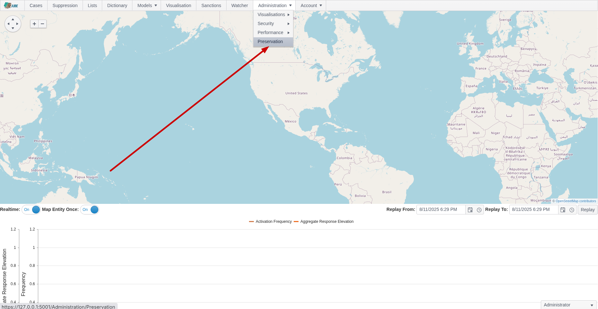

The Preservation screen comprises the following:

| Field                  | Example                            | Description                                                                                                                               |
|------------------------|------------------------------------|-------------------------------------------------------------------------------------------------------------------------------------------|
| Encryption Password    | SuperSecretPasswordToProtectExport | Subject to the encryption scheme described below a password, rather encryption key, to protect the contents of the .jemp file downloaded. |
| Include Exhaustive     | True                               | A flag to indicate that the Exhaustive models and training data should be included in either the Import or the Export.                    |
| Include Suppressions   | True                               | A flag to indicate that the Suppression data should be included in either the Import or the Export.                                       |
| Include Lists          | True                               | A flag to indicate that the Lists and List Values data should be included in either the Import or the Export.                             |
| Include Dictionaries   | True                               | A flag to indicate that the Dictionaries and Dictionary Values data should be included in either the Import or the Export.                |
| Include Visualisations | True                               | A flag to indicate that the Visualisation data should be included in either the Import or the Export.                                     |

The values set out in the above table are passed to actions as follows. There are three actions available:

| Field    | Example                                                                                                                                                                      |
|----------|------------------------------------------------------------------------------------------------------------------------------------------------------------------------------|
| Download | The downloading of a compressed encrypted serialisation of an export model containing all included data.  See encryption scheme below.                                       |
| Peek     | The rendering of a human readable serialisation of an export model containing all included data.  See purpose and limitations below                                          |
| Import   | A file upload control that accepts a compressed encrypted serialisation of an export model containing all included data.  See encryption scheme below and consistency notes. |

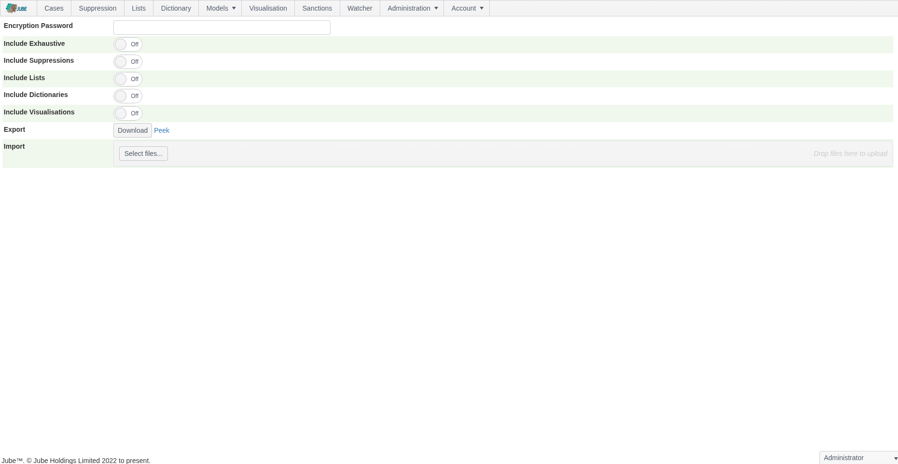

# Export Download

Configure the parameters as described above:

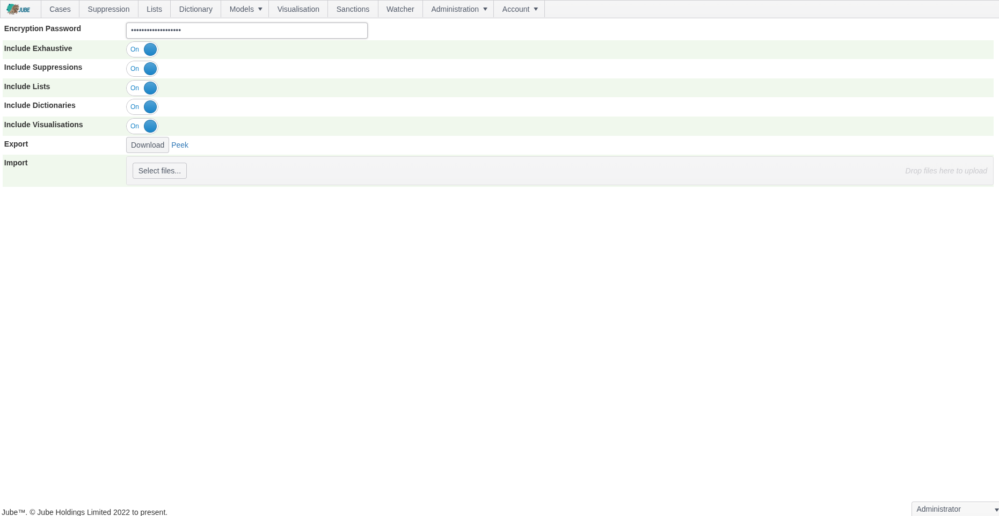

Identify the Download button next to Export:

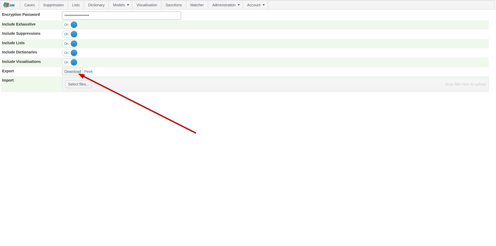

Click the Download button to populate the export model containing all included data, compress and encrypt to encryption
scheme as below. The bytes will be available in a file for download:

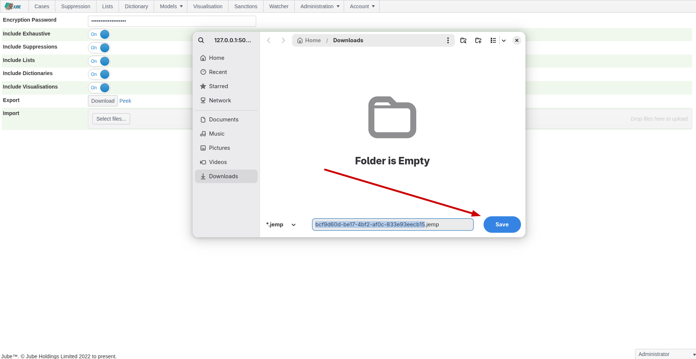

The file name is a GUID allocated in the auditing of the export process, as described below. The file extension is
.jemp, which stands for Jube Encrypted Message Pack, as encryption scheme below.

The file is not human-readable, except to the extent no password or salt is provided, and even then, given
weak encryption and binary serialisation, the file would still require decryption - albeit with empty pad keys - and
deserialization using strongly
typed export types only available programmatically.

Given binary serialisation and compression .jemp files are very small, with the default configuration of Jube taking a
mere
16kb:

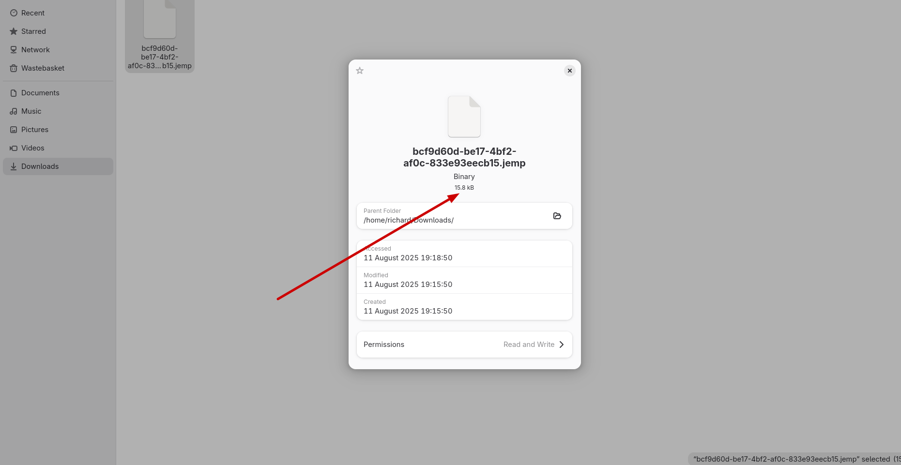

By contrast that same data in YAML when peeked would be 140kb.

The small size and its encryption allows for the simple exchange of files via email, irrespective of content filtering.

# Peek

Peek is functionality to export a human-readable serialisation of the export model containing all included data without
any encryption or compression. The serialisation format is YAML, as it was judged to be the most human-readable and
initiative to compare versions with file difference tooling.

A human-readable peek of the export model containing all included data cannot be imported nor recovered.

Peek exists for a very specific and narrow purpose, to allow for an export model containing all included data to be
compared
to one another at a point in time, which is useful for identifying changes without necessitating inspection of the audit
tables of Jube.

While it is technically feasible to deserialize YAML, it is not supported given the risks of injection attacks. For the
avoidance of doubt, only .jemp files can be imported, and the YAML must in no way be relied on as a means to
preserve definitions.

To obtain a YAML, upon configuring the parameters as would be required for Export, identify the Peek hyperlink:

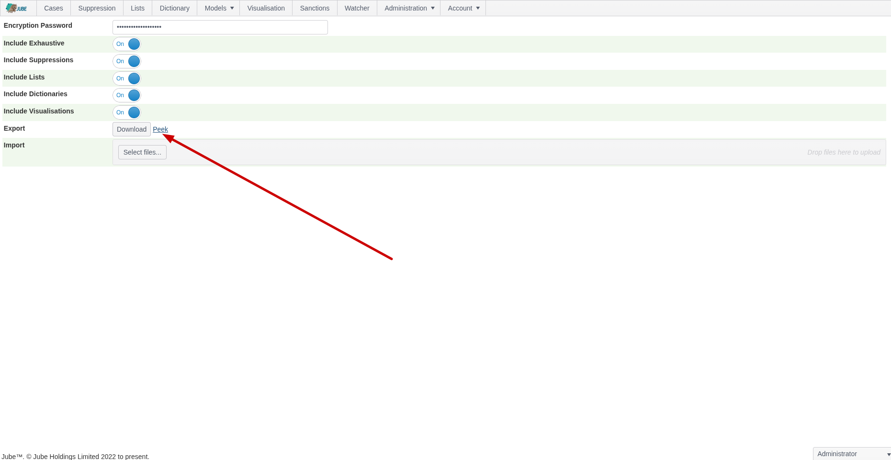

Click the Peek Hyperlink which will open the YAML data in a new tab:

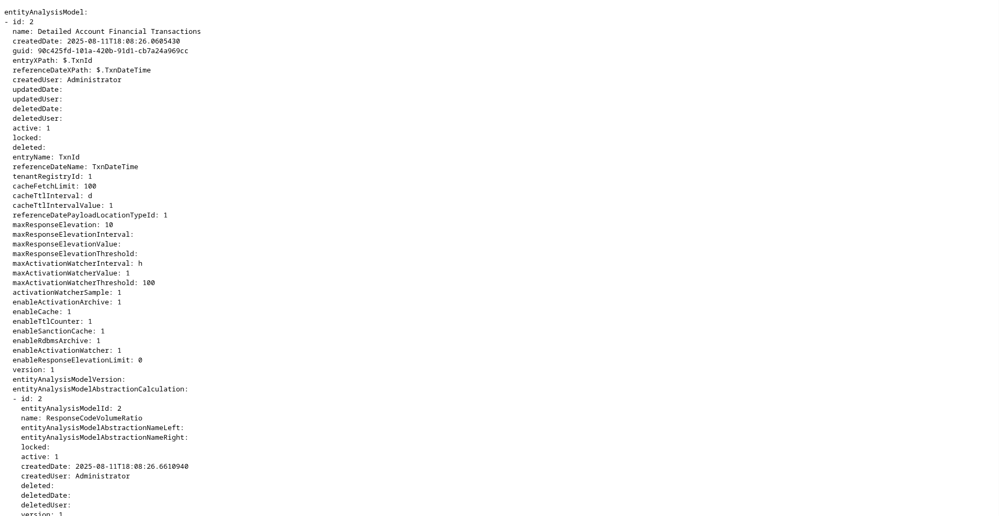

# Import Upload

Only .jemp files are eligible for upload, decryption, deserialisation and import.

To import a .jemp file, start by identifying the Select Files button in the file upload widget:

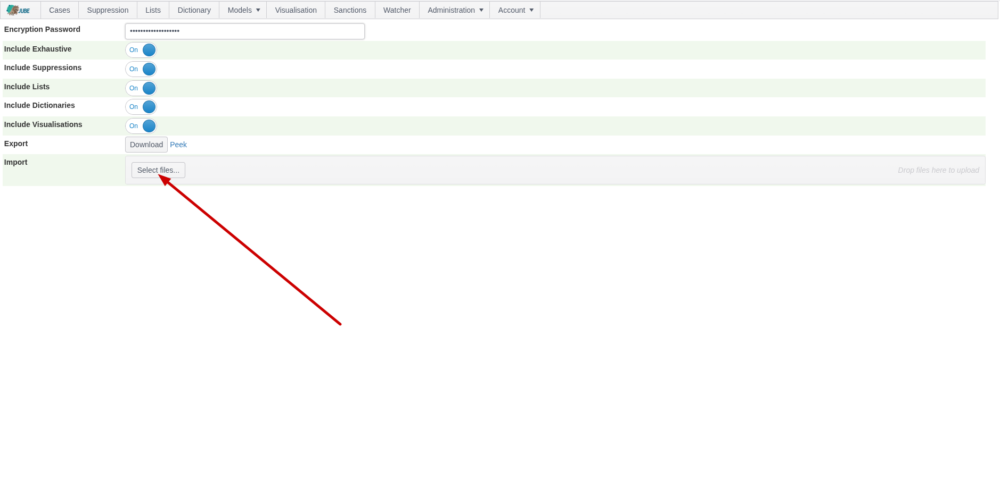

Click Select Files to expand the file search of the local file system:

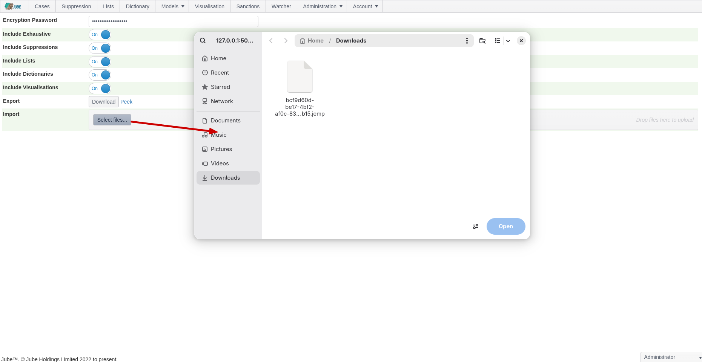

Select the .jemp file to be uploaded:

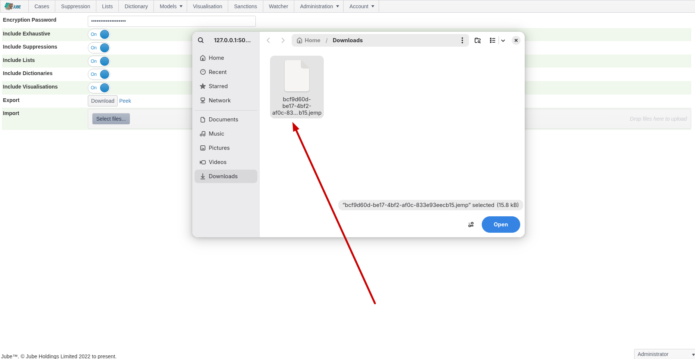

Click open to stage the file:

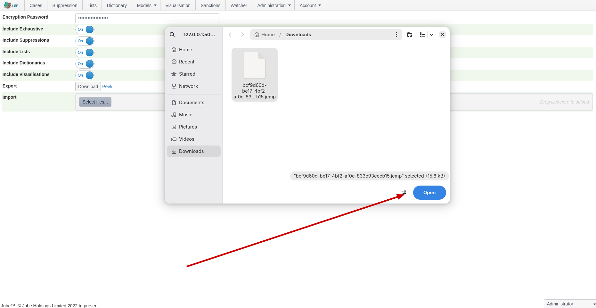

Once the file is staged, note the Upload button:

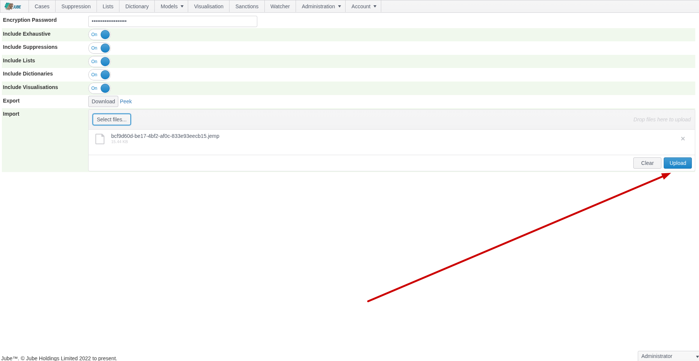

Click the Upload button to upload file, decrypt, decompress, deserialize and import the file containing the exported
model including all
exported data:

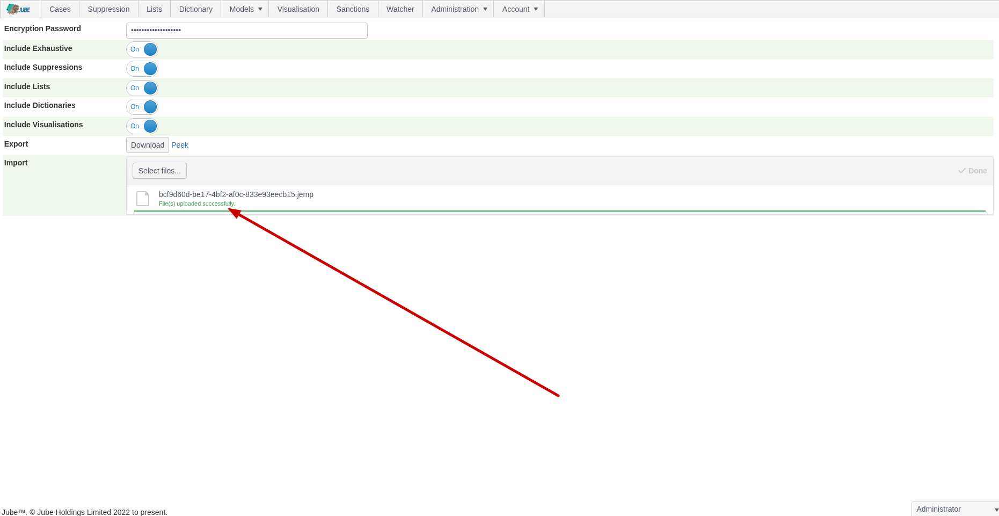

Assuming that the decryption is valid to scheme, the bytes are decompressed, deserialized and iterated to import all
data. Assuming all preconditions a success message is displayed. In the event of failure, an error will be displayed
instead.

# Consistency

Encryption goes a long way to ensure the integrity of the exported data for import, reference the encryption scheme as
below.
Furthermore,
assuming decompression and deserialisation are also valid, the
file import happens inside a database transaction, and so has consistency guarantees. In the event of import failure, it
can be
assured that data is not left in a partial state and that the existing data is not corrupted (i.e. all, or nothing at
all is imported).

An import identifier will have been created, outside a transaction and before any attempt at decryption, decompression of
deserialisation.

The import process follows the following steps, assuming deserialisation has taken place:

* A database transaction is opened.
* For each entity (i.e. table) and for tenant that the user is switched into, not the tenant of origination, all data is
  deleted logically (i.e.
  subject to audit). The import identifier is used to identify the import event that brought about the logical delete,
  such that it can be rolled back conceptually.
* The export model will be wholly iterated and data inserted.
* Assuming no errors the database transaction is committed. The import record is updated to confirm success.
* On error the database transaction is rolled back. The import record is updated to signal failure, and the error
  messages stored alongside it. Very little information is communicated for the reason of an import failure to the end
  user, although it is comprehensively stored in audit.

A transaction cannot be commited unless all inserts have occured without error. Given that data is only updated in a
transaction, it is not possible to have a partial import, nor lose existing data as deletes happen in the same
transaction, and any exception, anywhere, brings about a transaction rollback.

# Compression Scheme

Serialisation happens using the MessagePack Library, which is a high performance binary serializer:

https://github.com/MessagePack-CSharp/MessagePack-CSharp

The compression is provided for by the MessagePack Library and the compression scheme is Lz4BlockArray.

# Encryption Scheme

Serialisation of the export model containing all data is performed by MessagePack, and the result is a byte
array that would otherwise be unencrypted. The serialisation is not rendered in an unencrypted state to prohibit
injection (although the absence of a password or salt has the effect of the file being unencrypted, even though the
bytes are encrypted, they would be null pad bytes, and easily reverse engineered).

The encryption is AES256 and relies on a salt (set in the environment variables) and an encryption key (passed during
import
and export as a password) combination.

The salt is optional, and allows for more secure encryption, preventing the decryption of the file in foreign
environments where the salt is not common or known. For example, if a salt is set, files cannot be imported into
foreign environment unless the same salt is shared, and configured in the environment variable. The salt is optional,
and the absence means to say the salt becomes empty null pad bytes. To set the salt, update the following environment
variable:

```shell
export PreservationSalt="SuperSecretPasswordToChangeForSalting"
```

The encryption key is the password provided during import and export. Like the salt, the password is
optional, and the absence becomes empty null pad bytes and has the practical effect of the file becoming unencrypted, as
it
would easily be reversible given knowledge of this encryption scheme.

Before encryption, the unencrypted bytes are hashed using HMAC, with a 32 byte hash being produced. Upon encryption, the
HMAC is prepended to the encrypted bytes, henceforth the first 32 bytes of the final export are an unencrypted HMAC
hash, with the bytes thereafter, to end, being encrypted.

For the uploaded bytes, discounting the first 32 bytes HMAC hash for the original unencrypted bytes, the remaining bytes
are decrypted and the HMAC hash of the decrypted bytes is verified against the HMAC hash prepended.
Only upon the original unencrypted bytes HMAC hash and decrypted bytes HMAC hash matching will decryption be considered
successful, after which decompression and deserialisation is attempted.

Such is the strength of the encryption scheme, subject to, at a minimum, a password encryption key, there is no
means to recover a file should the encryption key or salt become lost. It is however possible to recover unencrypted
bytes from the export auditing, but only on the same instance of Jube that created it, but, not unliked the reasoning
held of for YAML, the importing of unencrypted serialisation is unsupported.

# Auditing

There are several audit tables available for the Preservation functionality.

The Export table details all instances of an export, and includes unencrypted and encrypted bytes of the export model:

```sql
select *
from "Export"
```

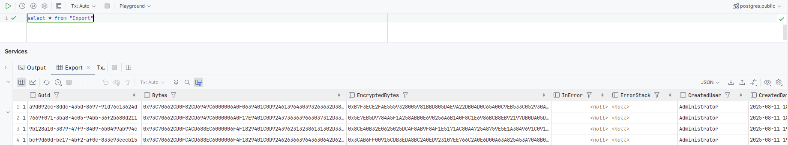

The Import table details all imports of .jemp files, or rather bytes:

```sql
select *
from "Import"
```

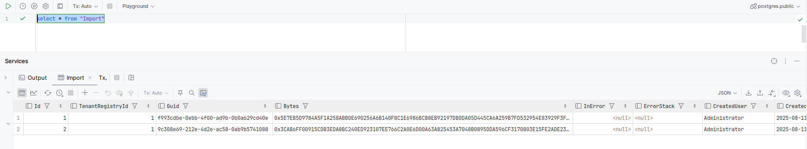

The ExportPeek table details all rendering of human-readable YAML responses:

```sql
select *
from "ExportPeek"
```

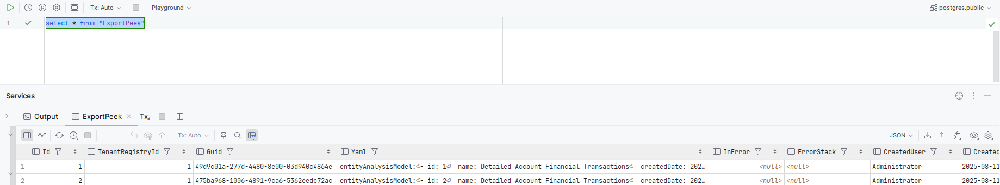