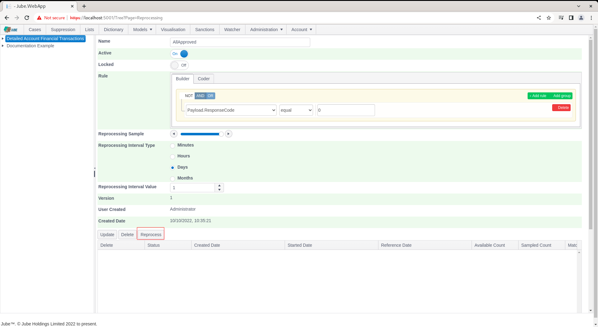
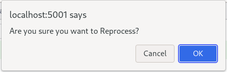
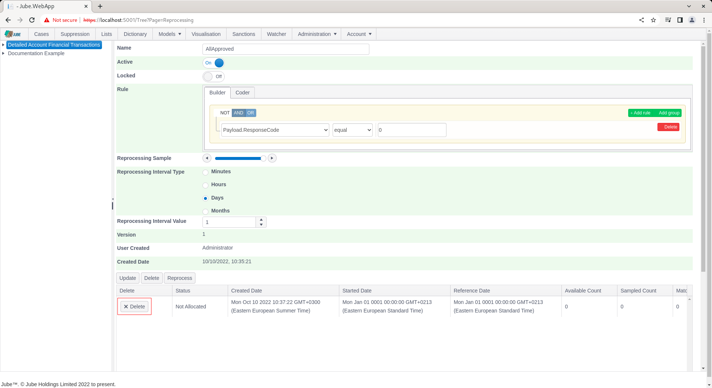
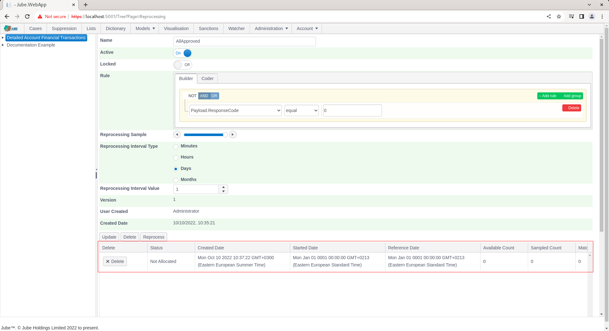
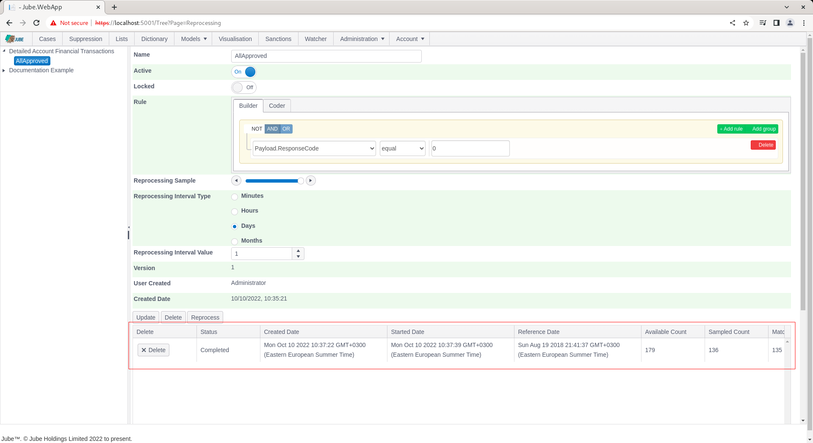

🚀 Get to pre-production in weeks, not months, with private [training](https://www.jube.io/jube-training) direct from
Jube's developer — real sovereignty, zero vendor lock-in.

# Reprocessing Instance

To create a reprocessing request, ensure that the Reprocessing Filter created beforehand is available:

Scroll down and locate the Reprocess button:

By clicking the Reprocess button, an entry will be made in the database requesting the engine perform reprocessing as
per the filter specification.

Only one reprocessing request may exist at any given point in time, and a new request cannot be created until any
unprocessed requests move to a completed state.

Click the Reprocess button:

An entry will be created showing the reprocessing job request:

It is possible to Delete - which will also stop - a reprocessing request by clicking the Delete button:

The reprocessing job has the following processing steps:

| Name          | Description                                                                                                                                                    |
|---------------|----------------------------------------------------------------------------------------------------------------------------------------------------------------|
| Not Allocated | The request has not been picked up by the reprocessing engine.                                                                                                 |
| Allocated     | The request has been picked up by the reprocessing engine.                                                                                                     |
| Initial Count | The initial count has been completed,  to establish created date range and universe of records.                                                                |
| Processing    | The request has begun processing data.                                                                                                                         |
| Completed     | The request has completed.                                                                                                                                     |
| Failed        | The request could not run: the filter rule does not parse or compile, or its interval is not valid. Nothing was reprocessed, and a new request can be created. |

The reprocessing instance table is available and updated as reprocessing takes place:

| Name            | Description                                                                                                   |
|-----------------|---------------------------------------------------------------------------------------------------------------|
| Status          | The current status of the reprocessing job.                                                                   |
| Created Date    | The date and time the reprocessing request was created.                                                       |
| Reference Date  | The current date and time being processed in that moment.  This is the reference date specified in the model. |
| Available Count | The total number of records in the universe as brought back during the initial counts.                        |
| Sampled Count   | The total number of records that have been sampled for the purposes of reprocessing.                          |
| Matched Count   | The total number of records that have been matched (after being sampled) for the purposes of reprocessing.    |
| Processed Count | The total number of records reprocessed so far.                                                               |
| Completed Date  | The date and time that the job completed.                                                                     |
| Error Count     | The number of records in error observed during reprocessing.                                                  |

Refreshing the grid by navigating again to the Reprocessing Filter (Models >> Reprocessing, clicking on the Reprocessing
Filter and scrolling down to the instances gird):

It can be seen that the reprocessing job has completed (which will allow new reprocessing jobs to be created for this
reprocessing filter by simply clicking the Reprocess button).

## How reprocessing reads and updates the archive

- **The window.** The newest reference date in the model's archive is found, and the filter's interval is counted back
  from it. Every archived record from that start up to and including the newest reference date is read.
- **Records archived during the run.** Only records archived before the request started are read. Transactions that
  arrive while reprocessing runs are not picked up, so the run has a fixed end.
- **The order.** Records are read oldest first, by reference date and then by entry, a page at a time
  (`ReprocessingBulkLimit` records per page). Each page continues exactly after the last record of the one before, so
  every record in the window is read once, however many records share a reference date, and a later page is read as
  quickly as an early one.
- **The sample.** The filter's sample is a percentage: 100 considers every record, 50 about half, 0 none.
- **What happens to a match.** A sampled record that the filter rule matches is run through the model again. The new
  results of a page's matches are then written to the archive together, in one transaction: each record is updated in
  place, its previous version is kept in the archive's version history, its version is increased, and it is stamped with
  the reprocessing request. Only archive keys whose value changed are rewritten (with a version kept); keys the new
  result no longer produces are removed, for that record only, and keys that did not change are left as they are.
- **The cache.** Reprocessing does not change the cache. A transaction's cached payload, its search key journals and the
  latest transaction for each search key value belong to the transaction as it arrived, and a re-run changes none of
  them, so none are rewritten; neither are the latest reference date, TTL counters or the archive write-ahead log. The
  only trace is the cache's own record of which journals were read.
- **Errors.** A record whose filter rule or re-run fails is counted in Error Count, not in Matched Count, and the run
  carries on. If a page's archive write fails, or a matched record's archive row has been deleted in the meantime, those
  records are counted as errors too.
- **Stopping.** Deleting the request stops it within one record once the progress is next written (every 10 seconds); a
  deleted request stays deleted and is not marked completed.

### Performance

The load test `Jube.Tests/Load/ReprocessingLoadTests.cs` (category `Load`) seeds the archive of a synchronised copy of
the example model, reprocesses it with a rule that matches about 5% of records, and checks that every record is read
once, that exactly the matches are updated once, that memory stays bounded and that late pages are read as quickly as
early ones. It seeds 1,000,000 records by default (`JubeReprocessingLoadRows`) and expects at least 2,000 records a
second (`JubeReprocessingLoadMinRowsPerSecond`).

On a development machine, 1,000,000 records were read and 48,677 matches re-run and updated in 1 minute 25 seconds
(about 11,800 records a second, 570 re-runs a second), in 200 pages of 5,000, with pages read in about 45 ms from first
to last and the heap growing by 74 MB. Writing each match's archive record in its own transaction took more than twice
as long (3 minutes 40 seconds); writing a page's matches together removed most of that cost.
