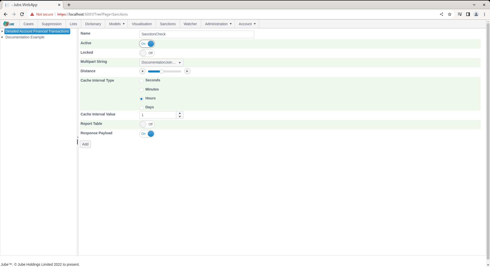
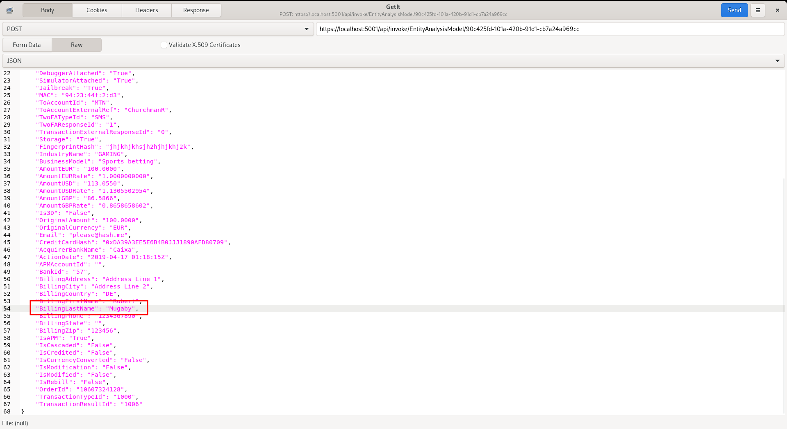
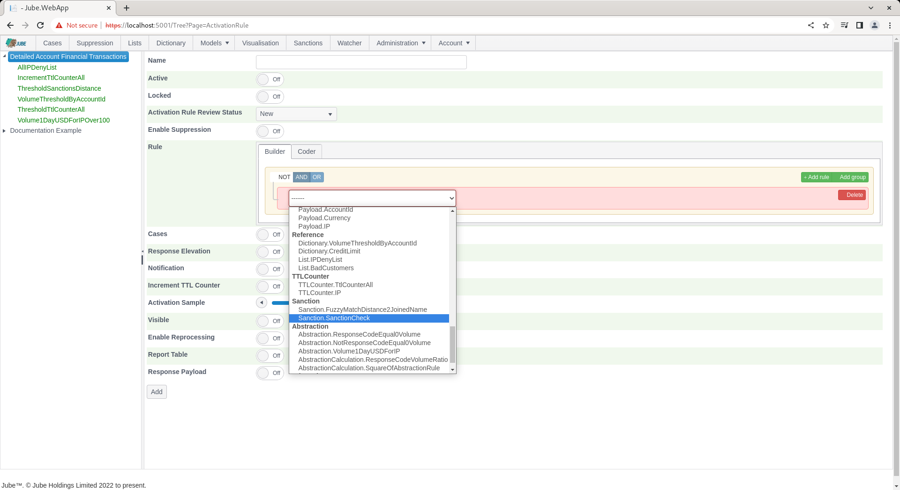

# Sanction Model Invocation
Sanctions matching can also be achieved by model invocation,  taking the Multipart string from the data payload.

To perform Sanctions checking in model invocation,  start by creating the specification,  navigating to Models >> References >> Sanctions:

Click on the model in the top left hand corner to begin the process of adding a Sanctions matching reference:

The parameters available to the Sanctions checking matching in model invocation are as follows:

| Value                | Description                                                                                                                                                                                                                            | Example           |
|----------------------|----------------------------------------------------------------------------------------------------------------------------------------------------------------------------------------------------------------------------------------|-------------------|
| Multipart String     | The multi part string containing the full name separated by a space character (and only a space).                                                                                                                                      | Billing Full Name |
| Distance             | The maximum Levenshtein Distance for the stepping of the fuzzy logic matching.                                                                                                                                                         | 2                 |
| Cache Interval Type  | As sanctions screening is computationally expensive and the underlying data is fairly slow moving, it is possible to cache a multipart string. The value interval type for the purposes of maintaining the cached distance mean score. | d                 |
| Case Interval Value  | As above parameter,  the value detailing the length of time the cached scores should be available for the multi part string.                                                                                                           | 1                 |

Recall that an Inline Function - by the name of DocumentationJoinNames was created as an Inline Function - concatenated the values from BillingFirstName and BillingLastName, separating with a space, thus becoming a Multipart string for the purpose of the Sanctions algorithm.

Complete the Sanction check matching entry as below, targeting the DocumentationJoinNames data element:

Click Add to create a version of the sanction:

Synchronise the model via Entity >> Synchronisation and repeat the HTTP POST to endpoint [https://localhost:5001/api/invoke/EntityAnalysisModel/90c425fd-101a-420b-91d1-cb7a24a969cc](https://localhost:5001/api/invoke/EntityAnalysisModel/90c425fd-101a-420b-91d1-cb7a24a969cc) for response as follows:

An element under sanctions will only be available if there is a match on the sanctions with the distance specified in the configuration entry.  In the example above, the return of 0 means absolute match,  otherwise, a distance value is the mean distance of all of the matches returned (keeping in mind that several matches might be returned from several lists). Model invocation cannot make use of individual match records, and it will be the mean distance of all matches that is available for evaluation. Keep in mind also that the maximum allowable distance specified to be returned is 2,  so if distance is any greater than 2 characters of change,  it will not be included in the match at all (being judged to be unmatched).

For completeness and to show the mean distance concept, change the billing last name in the transaction JSON to "Mugaby":

Repeat the HTTP POST to endpoint [https://localhost:5001/api/invoke/EntityAnalysisModel/90c425fd-101a-420b-91d1-cb7a24a969cc](https://localhost:5001/api/invoke/EntityAnalysisModel/90c425fd-101a-420b-91d1-cb7a24a969cc) for response as follows:

It can be seen in the response that the average distance has been returned as 1.

The average distance is available to Abstraction Rules,  Activation Rules and Abstraction Calculations for evaluation,  as follows for an empty Activation Rule:

