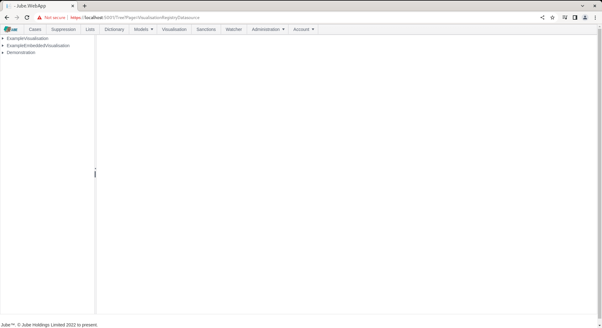
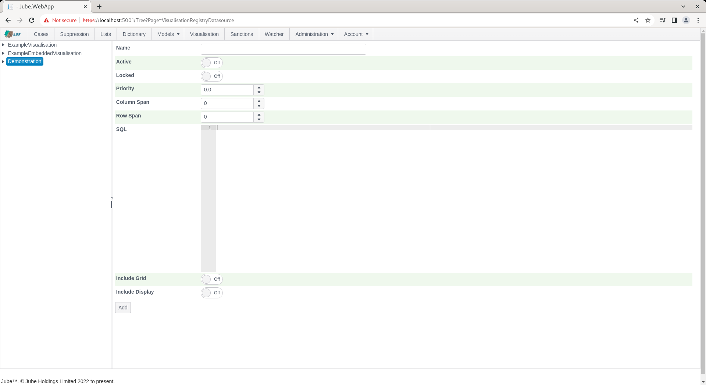
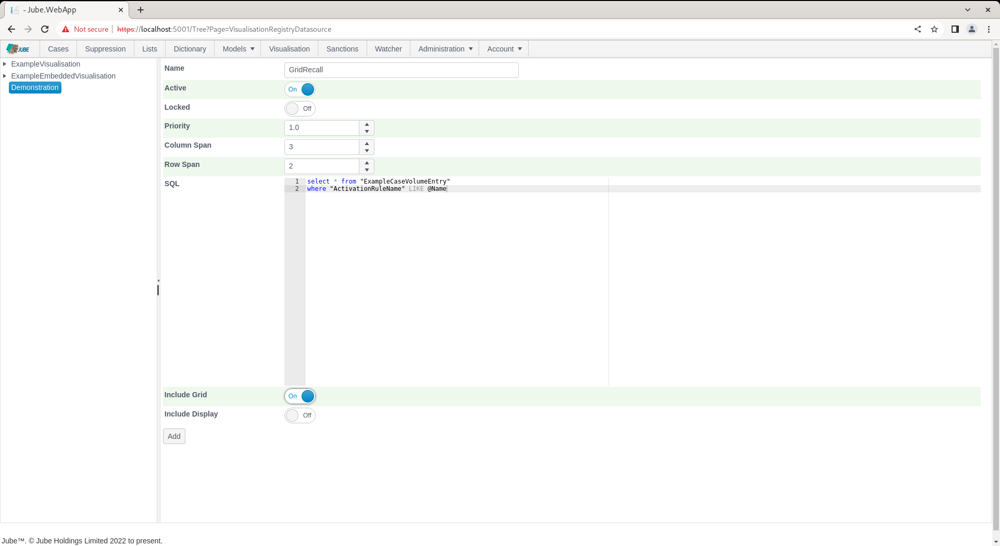
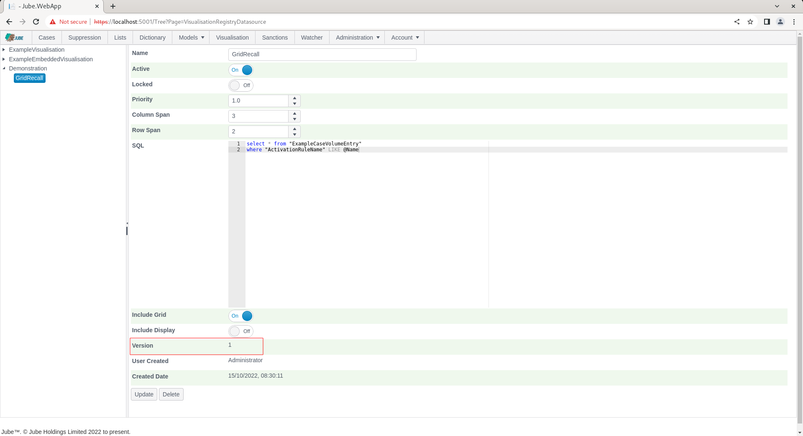
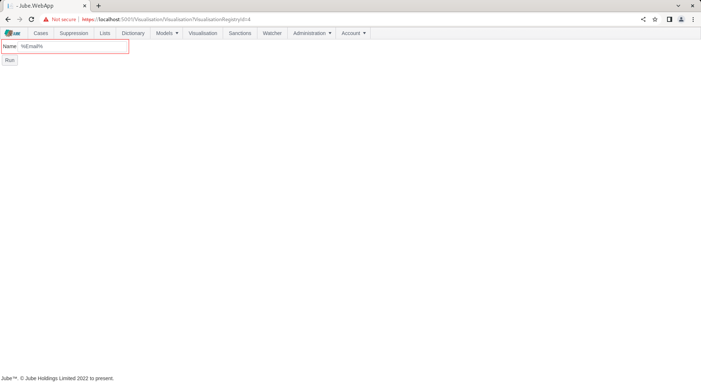
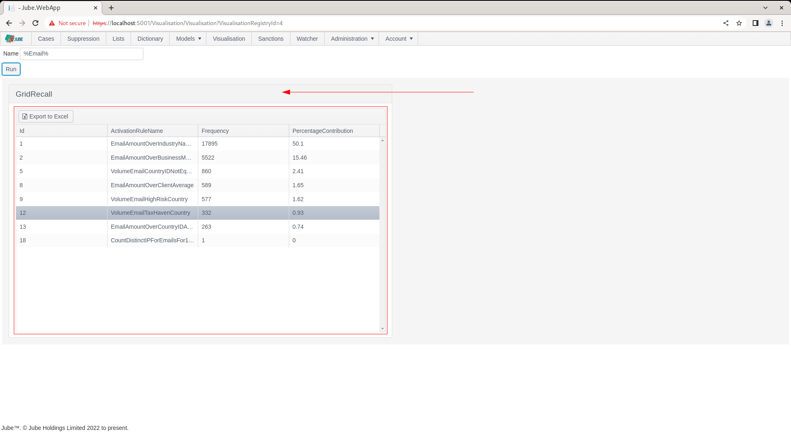

🚀Speed up implementation with hands-on, face-to-face [training](https://www.jube.io/jube-training) from the developer.

# Embed SQL and Generate Grid in Datasource
Datasource's are the tiles inside the Visualisation which are in their core SQL statements executed against the database and returned for presentation as either a grid or some form of chart, map or tokenized HTML iteration.

As introduced beforehand, the following SQL is to be executed:

```sql
select * from "ExampleCaseVolumeEntry"
where "ActivationRuleName" LIKE @Name
```

The tokenization will be performed on the basis of the Visualisation Registry Parameter created, and will be matched on the basis of the name.

To create a datasource, start by navigating to Administration >> Visualisations >> Visualisations Datasources:



To create a new Datasource for the Visualisation Registry Wrapper,  click on the node for the Visualisation Registry,  in this case Demonstration:



The Visualisation Registry Datasource accepts the following parameters:

| Value                         | Description                                                                                                                                                                                                                                          | Example                                                                     |
|-------------------------------|------------------------------------------------------------------------------------------------------------------------------------------------------------------------------------------------------------------------------------------------------|-----------------------------------------------------------------------------|
| Priority                      | The order of presentation of the datasource tile.                                                                                                                                                                                                    | Priority                                                                    |
| Column Span                   | Given the number of columns specified in the Visualisation Registry,  the number of those columns that should be taken up by this datasource tile.                                                                                                   | 3                                                                           |
| Row Span                      | Given rows are unbounded,  with the height of the rows specified in the Visualization Registry, the number of rows that the tile should overlay.                                                                                                     | 3                                                                           |
| SQL                           | The SQL to be executed against the database with parameters added with teh symbol.                                                                                                                                                                   | select * from "ExampleCaseVolumeEntry"where "ActivationRuleName" LIKE @Name |
| Include Grid                  | A value to signal that a grid is to be displayed containing the full dataset returned by the SQL.                                                                                                                                                    | True                                                                        |
| Include Display               | A value to signal that a Kendo or HTML visualisation should be invoked using the columns returned by the SQL.                                                                                                                                        | True                                                                        |
| Include Display: Display Type | A value indicating how to render the Display Text.  Chart Javascript refers to Kendo Chart configuration, Map Javascript refers to Kendo Map configuration and HTML refers to HTML to be tokenized and returned for each record returned by the SQL. | Chart Javascript                                                            |
| Include Display: Display Text | Either JSON like Javascript to be parsed as an object for the initialisation of a Kendo Chart or a Kendo Map, or, HTML to be tokenized for each record returned by the SQL.                                                                          | As below for clarity.                                                       |

```javascript
({
    legend: {
        position: "bottom"
    },
    series: [{
        type: "pie",
        field: "Frequency",
        categoryField: "ActivationRuleName"
    }],
    seriesColors: ["#03a9f4", "#ff9800", "#fad84a", "#4caf50"],
    tooltip: {
        visible: true,
        template: "${ category } - ${ value }%"
    }
})
```
For SQL invocation and grid display only,  complete the page as follows:



Click Add to create a version of the Visualisation Registry Datasource:



On the creation the SQL is tested to ensure it is valid and the return columns parsed to establish the datatype.  In the event that an error is returned including the response from the database to direct correction of the SQL, for example:


Given the use of parameter queries and the validation of SQL on creation of a datasource, the prospect of errors during execution are minimised (although execution performance is available with each datasource execution being logged).

Navigate to the Visualisation Registry through the Visualisation Directory to recall:



Noting the default parameter value for Name, as Email, click on Run to execute the datasource, whereby SQL will be tokenized for with the parameter value provided:



Notice the SQL response presented as a grid taking up 100% of the height and width in the tile. If a display were specified too, the grid would appear at the bottom half of the tile, instead taking up 50% of the height, but still 100% of the width. The functionality to have both grids and charts in the same container is to allow for reuse of the SQL and present a charts raw data alongside the chart.