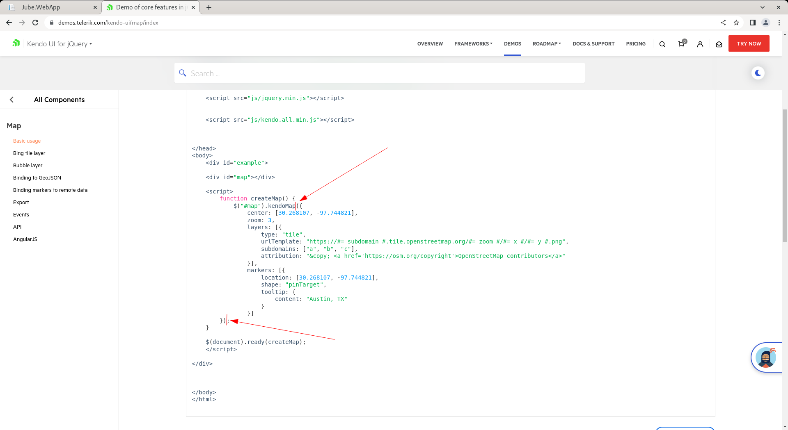
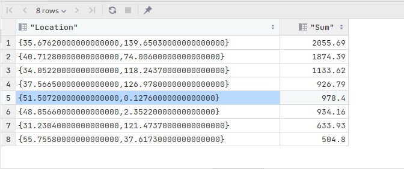
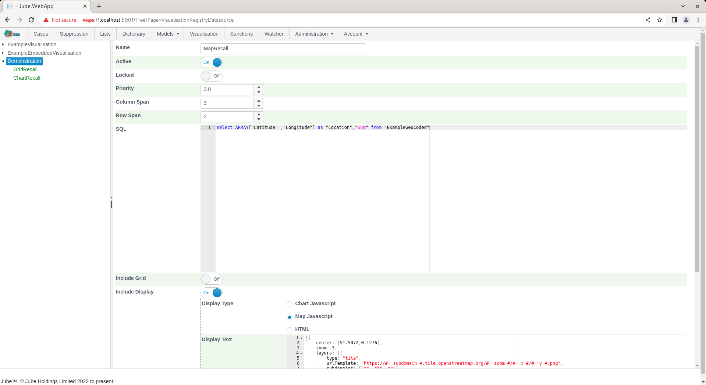
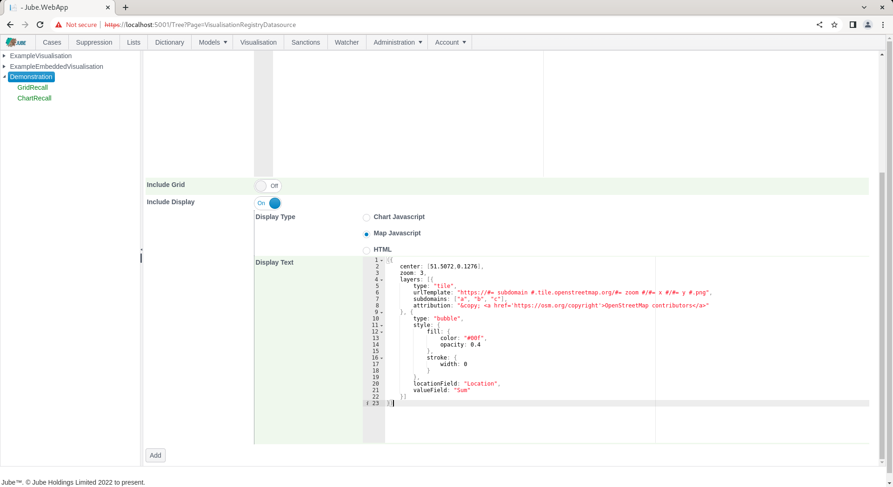
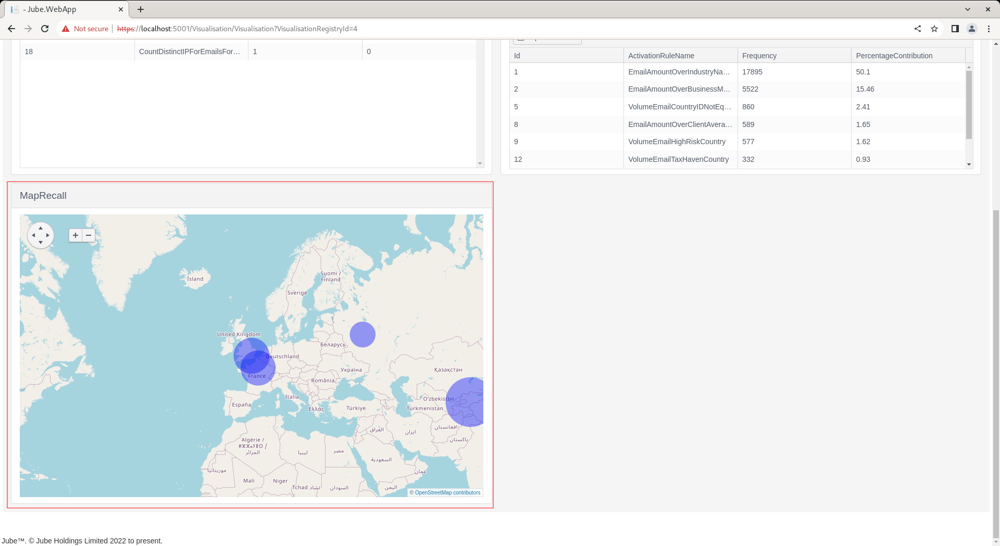

🚀Speed up implementation with hands-on, face-to-face [training](https://www.jube.io/jube-training) from the developer.

# Generate Map in Visualisation Datasource
Similar to charts Visualisations are achieved via embedding configuration Javascript for the Kendo Charting toolset. The Kendo Map toolset provides a rich set of mapping functions that can be used to alternatively present data that would otherwise be in grid form.

A demonstration of the Kendo mapping tools can be seen as follows:

[https://demos.telerik.com/kendo-ui/map/index](https://demos.telerik.com/kendo-ui/map/index)

A datasource can accept the initialisation parameters for a Kendo Chart:



Extracted as follows:

``` javascript
({
    center: [30.268107, -97.744821],
    zoom: 3,
    layers: [{
        type: "tile",
        urlTemplate: "https://#= subdomain #.tile.openstreetmap.org/#= zoom #/#= x #/#= y #.png",
        subdomains: ["a", "b", "c"],
        attribution: "&copy; <a href='https://osm.org/copyright'>OpenStreetMap contributors</a>"
    }],
    markers: [{
        location: [30.268107, -97.744821],
        shape: "pinTarget",
        tooltip: {
            content: "Austin, TX"
        }
    }]
})
```

For the purpose of chart initialisation, series are the columns returned by the SQL statement (which are parsed out on creation of the datasource and do not otherwise require manual definition beyond the SQL select block), however, the latitude and longitude values must be returned using the Array type, which has special construct in SQL:

``` sql
select ARRAY["Latitude" ,"Longitude"] as "Location","Sum" from "ExampleGeoCoded"
```

Executing the above SQL directly presents the following dataset:



The array return value will be used to drop a bubble or pin. In the case of bubble, the Sum expresses magnitude.

Taking the following example of Kendo Map initialisation:

``` javascript
({
    center: [51.5072,0.1276],
    zoom: 3,
    layers: [{
        type: "tile",
        urlTemplate: "https://#= subdomain #.tile.openstreetmap.org/#= zoom #/#= x #/#= y #.png",
        subdomains: ["a", "b", "c"],
        attribution: "&copy; <a href='https://osm.org/copyright'>OpenStreetMap contributors</a>"
    }, {
        type: "bubble",
        style: {
            fill: {
                color: "#00f",
                opacity: 0.4
            },
            stroke: {
                width: 0
            }
        },
        locationField: "Location",
        valueField: "Sum"
    }]
})
```

Note the locationField and valueField has been updated for binding to the datasource:

``` javascript
    locationField: "Location",
    valueField: "Sum"
```

Any datasource object will be added during the recall process and should be removed from the initialisation.

Navigate Administration >> Visualisation >> Visualisation Datasources,  then click on the Visualisation Registry Entry to create a new datasource:


Using the above SQL and map initialisation as above, create a new entry:





Click Add to create a version of the Visualisation Registry Datasource, which will parse the SQL and create the series definitions in the background:


Navigate to the Visualisation Registry through the Visualisation Directory to recall. Noting the default parameter value for Name, as Email, click on Run to execute the datasource, whereby SQL will be tokenized for with the parameter value provided.  Scroll down to make visible the third tile:



It can be seen that the map has been plotted as initialisation with bubbles being dropped based on the location,  and the bubbles magnitude being the Sum value. In the event that magnitude, thus bubble, is not required,  then the pin target can simply be used in the chart initialization.