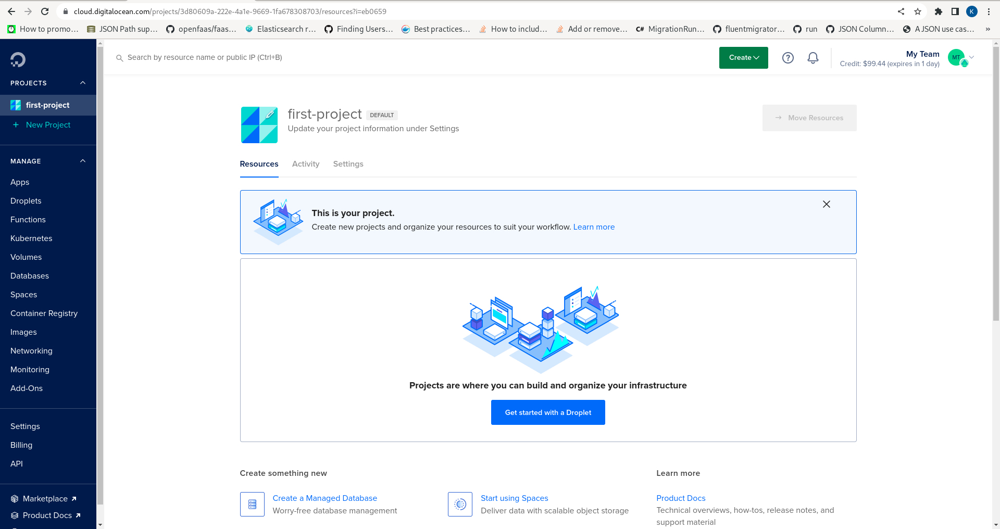

🚀Speed up implementation with hands-on, face-to-face [training](https://www.jube.io/training) from the developer.

# Prerequisites

The README file in the head of the project provides for a Quickstart that assumes some ability to provision servers,
databases and operating system dependencies:

```shell
git clone https://github.com/jube-home/aml-transaction-monitoring
cd jube/Jube.App
export ConnectionString="Host=<host>;Port=<port>;Database=<defaultdb>;Username=<username>;Password=<password>;Pooling=true;Minimum Pool Size=0;Maximum Pool Size=100;SSL Mode=Require;Trust Server Certificate=true;"
export RedisConnectionString="<host>:<port>,password=<password>"
export ASPNETCORE_URLS="https://localhost:5001"
export JWTKey="IMPORTANT:_ChangeThisKey_~%pvif3KRo!3Mk|1oMC50TvAPi%{mUt<9"B&|>DP|GZy"YYWeVrNUqLQE}mz{L_UsingThisKeyIsDangerous"
dotnet run
```

This section of the documentation makes no assumption about technical ability and provides a step by step approach to
getting started with Jube on [DigitalOcean](https://m.do.co/c/8be72e86abb2)
servers.  [DigitalOcean](https://m.do.co/c/8be72e86abb2) is an enterprise hosting provide much like AWS, Azure or Google
Cloud Platform. Digital [DigitalOcean](https://m.do.co/c/8be72e86abb2) has a much simpler and focussed offer,
specifically very well priced high performance Virtual Machines running commodity Linux and Managed PostgreSQL, and when
taken together greatly simplify the infrastructure and reduce cost.  [DigitalOcean](https://m.do.co/c/8be72e86abb2) also
offer a free $200 credit on being referred from Jube documentation, which is more than enough to complete testing and
proof of concept.

This documentation is intended to be introductory, and while Redis is introduced, it is introdduced for completeness,
it is highly elective for the purpose of this section of the documentation (insofar as it serves as a cloud
introduction).

Jube has the following prerequisites:

* .Net 9 Runtime.
* Postgres database version 13 onwards (tested on 15.4 but no significant database development to cause a breaking
  change).
* Optional: Redis version 6 or above (it probably works fine on earlier versions, as the command used are basic. RESP
  wire compatible implies that it is possible to use KeyDB, DragonflyDB, Garnet or any RESP compliant wire protocol
  database). In DigitalOcean Managed Redis is not without some integration complexity given TLS, and is presented here
  for completeness. Managed Redis at DigitalOcean is subject to being comfortable with some advanced administrative
  concepts described as
  follows: https://www.digitalocean.com/community/tutorials/how-to-connect-to-managed-redis-over-tls-with-stunnel-and-redis-cli

Create an account on [DigitalOcean](https://m.do.co/c/8be72e86abb2). Once the account is created and navigate to the
page as follows:

For security, there is no means to pass configuration values via anything other than Environment Variables, and the
contents of those Environment Variables are never - ever - stored by Jube (which is something the CodeQL security
scanner tests for).

There are sensitive cryptographic values that need to be included at startup. At a minimum the JWTKey value is required:

```shell
export JWTKey="IMPORTANT:_ChangeThisKey_~%pvif3KRo!3Mk|1oMC50TvAPi%{mUt<9"B&|>DP|GZy"YYWeVrNUqLQE}mz{L_UsingThisKeyIsDangerous"
```

The JWTKey value is used to encrypt access tokens providing for API authentication, and therefore user interface
authentication.

While outside of the scope of this installation documentation, other sensitive variables, while optional, are strongly
suggested:

```shell
export PasswordHashingKey="IMPORTANT:_ChangeThisKey_~%pvif3KRo!3Mk|1oMC50TvAPi%{mUt<9"B&|>DP|GZy"YYWeVrNUqLQE}mz{L_UsingThisKeyIsDangerous"
```

It is imperative that the keys be changed from their defaults and kept safe in appropriate storage. Jube will not start
if the keys above are used.



Creating a new project if necessary:


The installation assumes three servers as follows:

* General Purpose Droplet (Virtual Machine) 8GB RAM / 2vCPU.
* Managed PostgreSQL Database 4GB RAM / 2vCPU.
* Optional: Managed Redis Database 4GB RAM / 2vCPU.

Putting aside high availability and storage, this configuration will be more than adequate for the purpose of testing
and proof of concept.