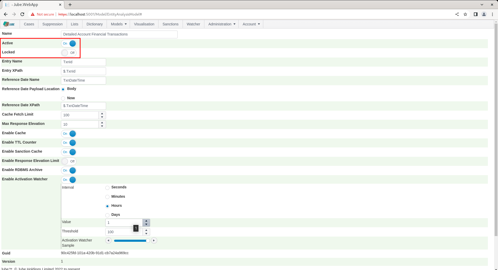
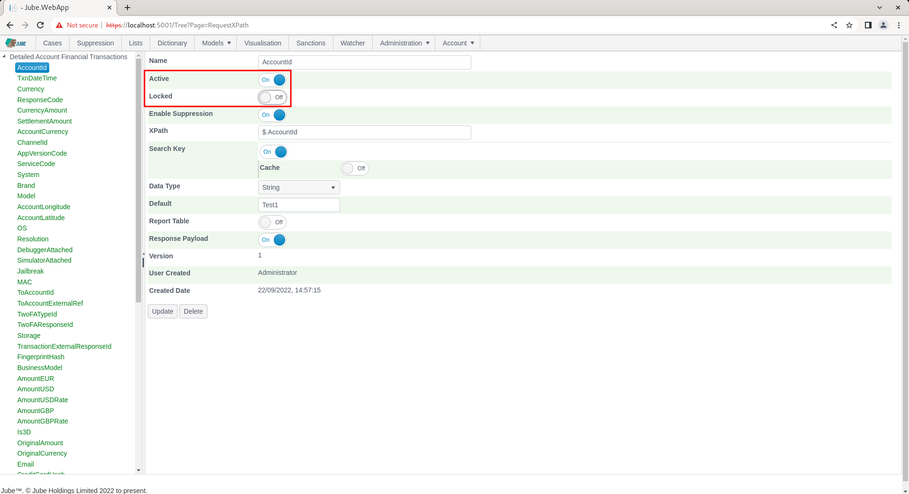
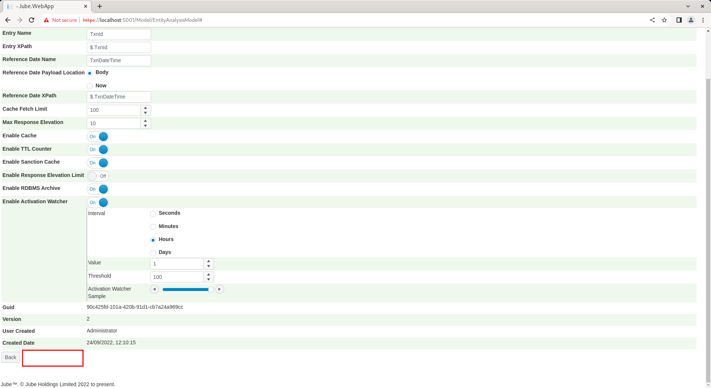
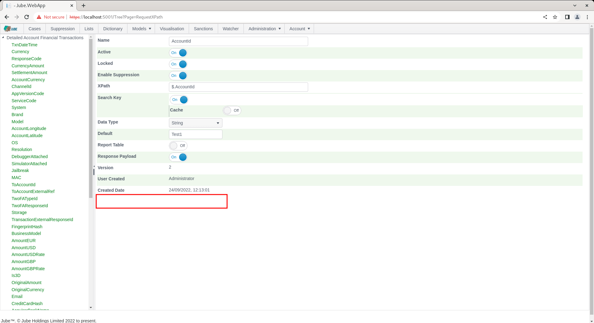

🚀Speed up implementation with hands-on, face-to-face [training](https://www.jube.io/jube-training) from the developer.

# Locked and Active

For every parent object and child object there exists an Active and Locked switch. In the case of a parent object:

In the case of a child object:

Both the Active and the Locked flags form part of the model object record and are updated in the same manner as the rest of its properties.

The Active flag provides a means to deactivate an object without having to delete it. In most cases deactivating a child object has a very similar behaviour to deleting it,  insofar as the entry will be unavailable for processing.

The Locked flag may be toggled in just one direction,  locking a record. If a record is locked it means that all subsequent editing of that record is barred, and the records is presented as read only.

Locking records is useful to avoid the inadvertent update or deletion of important objects. An example of objects that once created should not be deleted are Abstraction Rules which are in use a Machine Learning Adaptation (either HTTP or Exhaustive), given alteration would render the results of the Adaptation inaccurate.

Another example is ensuring that the Request XPath configuration,  once created,  remains unchanged such is the importance of these values in maintaining real time interfaces.

On lock,  the effect is that the buttons for updating the record are hidden,  however, this has no effect should the values be deleted by API (this may change in the future).  

In the case of a parent object:

In the case of a child object:

Notice both the absence of Update or Delete buttons.