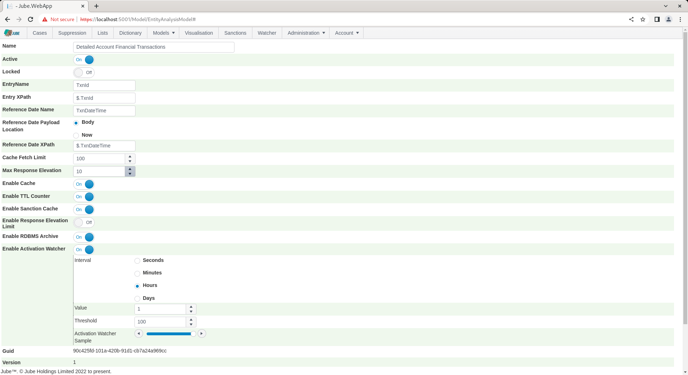
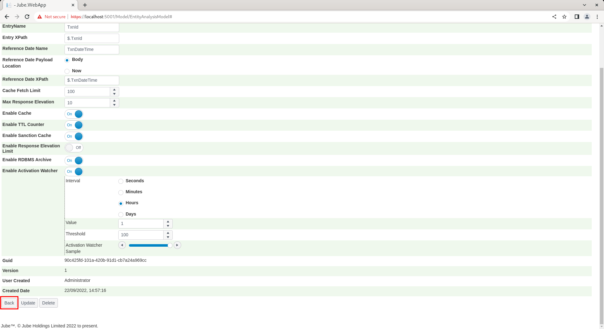
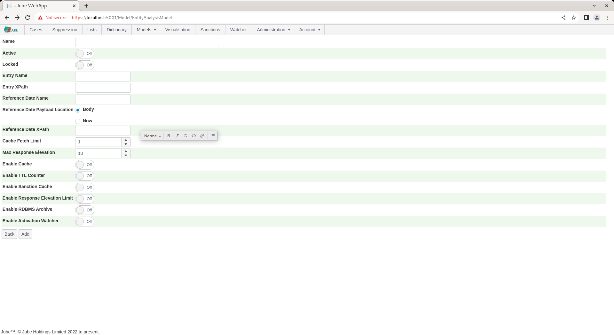
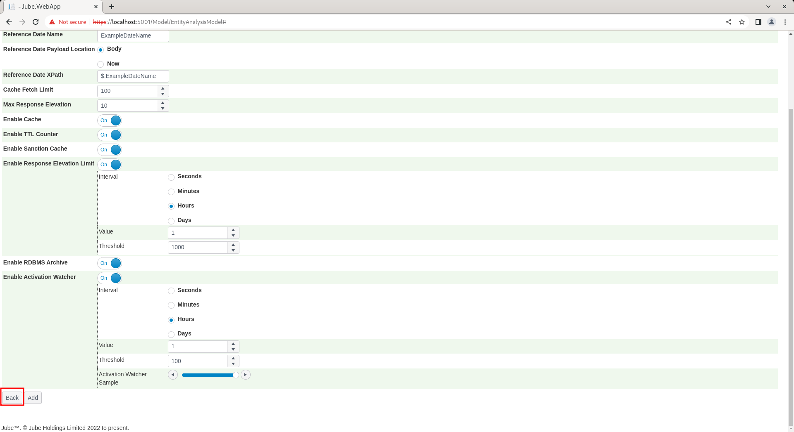
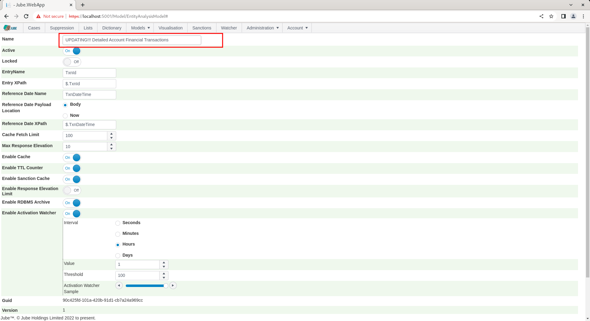

🚀Speed up implementation with hands-on, face-to-face [training](https://www.jube.io/jube-training) from the developer.

# Parent Objects

To Create,  Update and Delete a parent object, in this example a Model,  a similar user interface exists to list, expand upon then edit entries.  

For example navigate to Models >> Model: 


Models will be presented as a list of names:


To select into a Model,  click on the link by name:


On clicking the link by name, the entry will be expanded upon:



Scrolling down the page and clicking on the back button will restore the view back to the list of models, as start of this procedure:



To Add a record to an object, a button titled New is implemented below the list of available models:


Clicking on this button will expand an empty model record:



Upon completing the form with valid values for this object (each of these is documented elsewhere), to commit the record,  click the Add button after scrolling down to the base of the page:


If Add has been clicked,  the version,  created date and a guid (in some instances) will be returned by way of confirmation:


Alternatively,  clicking the Back button will roll back the change and return to the list:



To update an entry, select into the entry from the list of names as if to view:


The fields are available for modification with the current values presented:



Upon completing the form with valid values for this object to commit the record,  click the Update button after scrolling down to the base of the page. If Update has been clicked,  the version and created date will be returned by way of confirmation, but any Guid will remain static:


The Back button should be used to return to the model list,  which will expose the newly created entry:


To delete an entry instead of clicking the Update button, click the Delete button instead:


A message for confirmation will be sought:


Clicking ok will enact the delete,  thereafter returning to the model list,  having the same effect as clicking back, albeit without the entry just deleted available:


Each parent object entry will have a Name field, which is a text string.  A description field appears on a more irregular basis and is a character string.

Upon update a copy of the record before the update is stored in a Version table in the database for the purpose of audit, thereafter the record is updating in place,  incrementing the version number.

For example,  on inspection of the versioning for Case Workflow Status Definitions:
```sql
select *
from "EntityAnalysisModelVersion"
Order By "Id" desc
```

It can be seen that a full copy of the record was taken before it was updated.  Parent records are versioned in this manner such is the extent to which complex relationships exist, where Id must be immutable. It should be noted that there is a record for each update maintained in the database for the purposes of audit.