🚀 Get to pre-production in weeks, not months, with private [training](https://www.jube.io/jube-training) direct from
Jube's developer — real sovereignty, zero vendor lock-in.

# Rule and Code Builder

Several pages in the platform rely on the construction of code and in most cases this is facilitated by a point and
click construction tool. In most cases the code constricted is of vb.net fragment dialect, unless it is used for
reporting, case management or Exhaustive training, in which case it is an SQL query fragment:

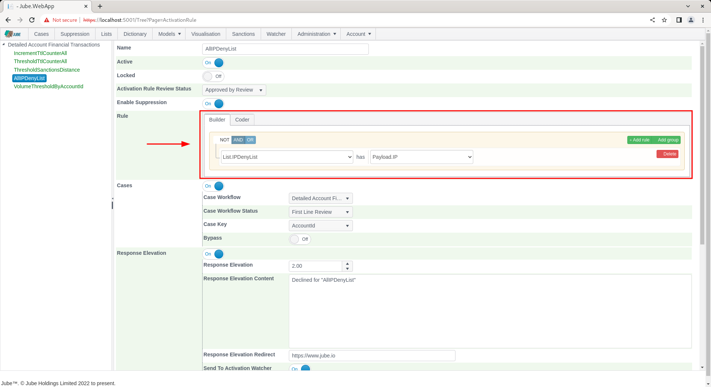

In the following example the Rule and Code Constructor is embedded in the Activation Rules page and has a comprehensive
range of data available:

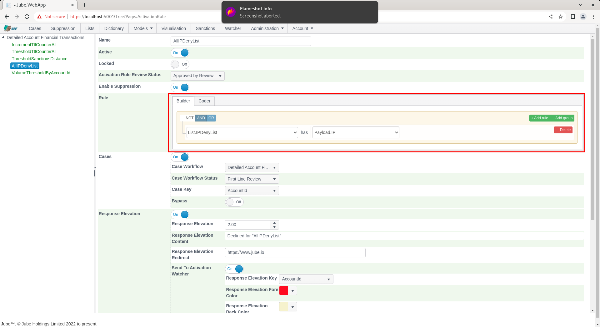

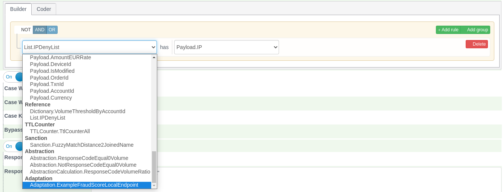

There are oftentimes two modes to create rules, being Builder (which is point and click) and Coder (which is the
handcrafting of the vb.net). Clicking on the Coder tab will allow for the VB.Net code fragment to be handcrafted:

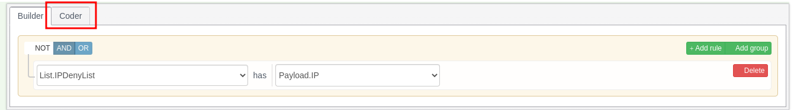

The Builder and Coder is available for the creation of VB.Net fragments in:

* Gateway Rules.
* Activation Rules.
* Abstraction Rules.
* Reprocessing Rules.

Inline Functions can be used in all of these rules, including Reprocessing Rules, and appear in the Builder's field list
alongside the Payload fields.

For reasons of creating SQL fragments and not VB.Net fragments. Only the Builder is available in:

* Case Workflow Filters.
* Cases Search.
* Exhaustive Adaptation Class Definition.

An example of only the builder being available is as follows for Models >> Cases Workflows >> Cases Workflow Filter:

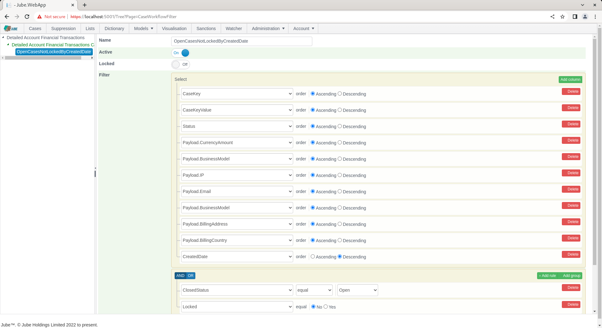

Only the Coder is available for the creation of VB.Net fragments in:

* Inline Functions.
* Abstraction Calculations.

An example of only the coder being available is as follows for Models >> References >> Inline Functions:

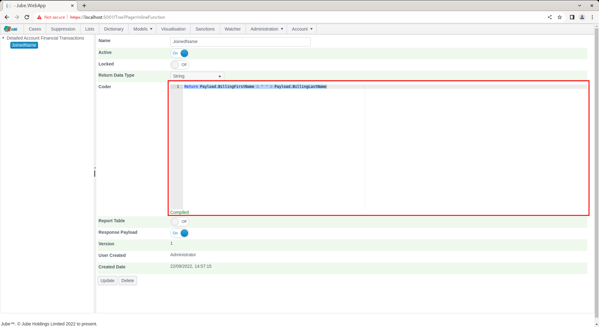

The default Coder value will be taken from the Builder, being the VB.Net fragment equivalent:

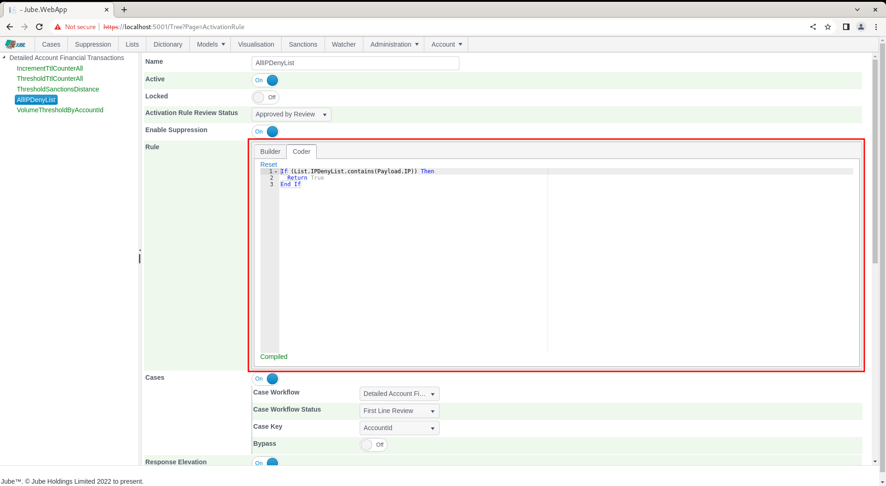

As typing, the freehand code will be continually parsed for integrity:

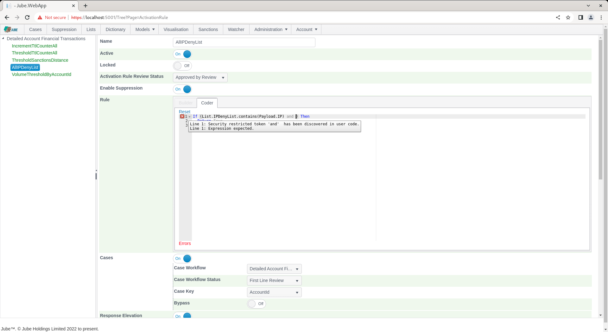

With errors being displayed in the tool tip along the coder guttering. Parsing will happen on the conclusion of each
typing burst, until such time as the rule compiles:

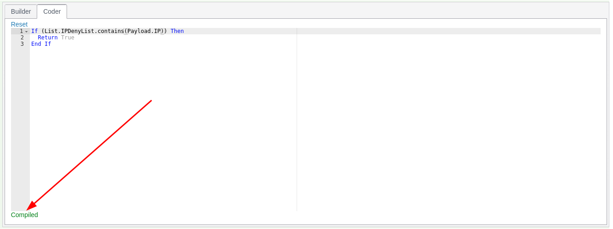

To facilitate the development of Coder rules, completions are populated on each keypress, returning model
configurations:

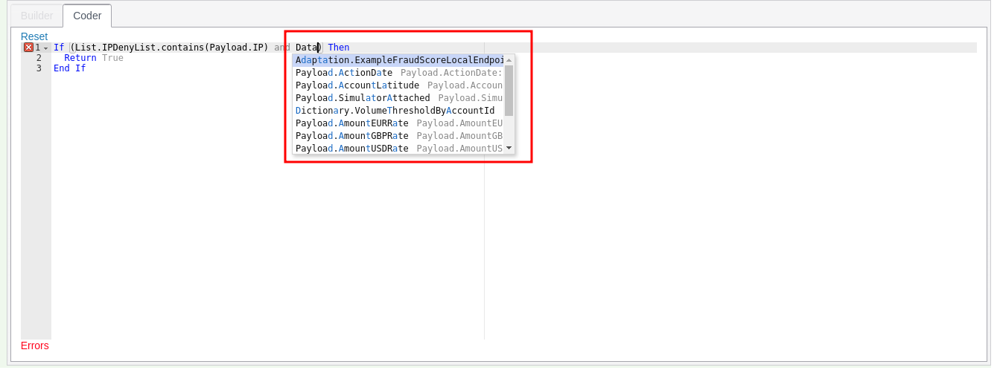

Only what the engine would actually run is offered: an item that has been made inactive (a Request XPath, Inline Script,
Inline Function, Dictionary, List, TTL Counter, Sanction, Abstraction Rule, Abstraction Calculation, HTTP Adaptation,
Exhaustive instance or Tag whose Active switch is off) does not appear in the completions, the field lists of the rule
builders, or the fields offered for reporting, and appears again as soon as it is made active. The Active switch of the
model itself does not hide its fields, so that rules can be built for a model that is still a draft.

If the Coder diverges from what was originally created in the Builder, then the Builder tab will be disabled:

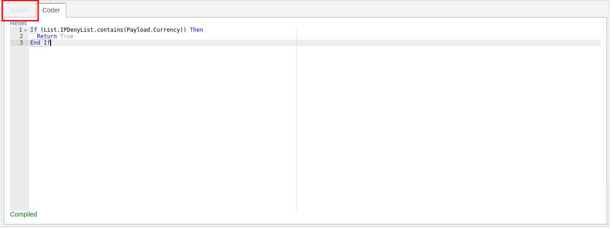

Clicking the Reset link will restore the Builder contents to its Coder representation:

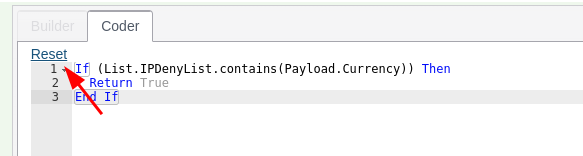

Upon clicking Reset, the Coder will be overwritten to the parsed contents of the Builder, and the tab will become
enabled once again:

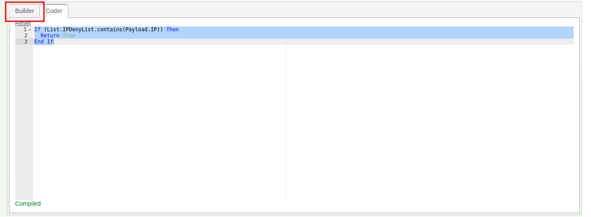

## Fields available to each rule

The fields offered depend on the kind of rule, because the invocation pipeline works them out in stages and a rule can
only use what has been worked out before it runs:

| Rule                            | Fields it may use                                                                                               |
|---------------------------------|-----------------------------------------------------------------------------------------------------------------|
| Gateway Rule, Reprocessing Rule | Payload fields, inline functions, dictionary values and lists.                                                  |
| Abstraction Rule                | As a Gateway Rule, but only payload fields that are cached.                                                     |
| Activation Rule                 | Everything: also TTL counters, abstractions, sanctions, calculations, adaptations and earlier activation rules. |

The fields offered and the fields the rule compiler accepts differ in one respect: an Abstraction Rule is offered TTL
counters and sanctions, and an Abstraction Calculation is offered abstraction calculations, but neither will compile
with them. A rule using one is refused when it is saved, in the Builder as in the Coder.

## Checking a rule when it is saved

A rule is checked again when it is saved. A rule whose text does not parse or compile is refused, with the line and
position of each error, and nothing is saved. The check follows the engine: it checks the Builder or Coder text,
whichever is selected, and only restricts a Builder Abstraction Rule to cached payload fields, so it never refuses a
rule the engine would accept. Reprocessing Rules are checked as Gateway Rules.

## Builder operators

Each condition in the Builder is a field, an operator and the operator's values. The operator drop-down only lists the
operators that suit the field's type, under headings: **Basic** first, then the groups below, each in alphabetical
order. The same operators are offered in every rule builder: Gateway, Abstraction, Activation and Reprocessing Rules,
and the backtest filters.

### Basic

The builder's usual comparisons. Rules saved before the other groups were added keep exactly the rule text they always
produced.

| Operator         | Allowed for                   | Values   | Rule text produced                                     |
|------------------|-------------------------------|----------|--------------------------------------------------------|
| equal            | Text, numbers, dates, Boolean | value    | `field = value`                                        |
| not equal        | Text, numbers, dates, Boolean | value    | `field <> value`                                       |
| in               | Text, numbers                 | values   | `field.MatchIn(a, b, …).ToBoolean()`                   |
| not in           | Text, numbers                 | values   | `field.MatchNotIn(a, b, …).ToBoolean()`                |
| less             | Numbers, dates                | value    | `field < value`                                        |
| less or equal    | Numbers, dates                | value    | `field <= value`                                       |
| greater          | Numbers, dates                | value    | `field > value`                                        |
| greater or equal | Numbers, dates                | value    | `field >= value`                                       |
| between          | Numbers, dates                | from, to | `field.MatchInRange(from, to).ToBoolean()` (inclusive) |
| not between      | Numbers, dates                | from, to | `field.MatchInRange(from, to).ToBoolean() = False`     |
| begins with      | Text                          | value    | `field.StartsWith(value)`                              |
| not begins with  | Text                          | value    | `field.StartsWith(value) = False`                      |
| contains         | Text                          | value    | `field.Contains(value)`                                |
| not contains     | Text                          | value    | `field.MatchContainsNone(value).ToBoolean()`           |
| ends with        | Text                          | value    | `field.EndsWith(value)`                                |
| not ends with    | Text                          | value    | `field.EndsWith(value) = False`                        |
| is empty         | Text                          | none     | `field.MatchIsNullOrEmpty().ToBoolean()`               |
| is not empty     | Text                          | none     | `field.MatchIsNotNullOrEmpty().ToBoolean()`            |
| is null          | Text                          | none     | `field.MatchIsNull().ToBoolean()`                      |
| is not null      | Text                          | none     | `field.IsNotNull()`                                    |

### Lists

A model list has one operator, **has**, which tests whether the list contains the value of a text field chosen from a
list, for example `List.HighRisk.contains(Payload.Country)`.

### Compare to another field

Equal, not equal, greater, greater or equal, less and less or equal can also compare a field with another field of the
same type, chosen from a list, for example `Payload.BillingCountry <> Payload.IpCountry`. Equal and not equal work for
text, numbers and dates; the others for numbers and dates.

### Every pipeline test

Every test in the [Rule Pipeline Reference](../../RuleTaxonomy/RulePipelineReference.html) that can be called on a plain
text, whole number, number, date or Boolean value is an operator, written as its `Match` step followed by
`.ToBoolean()`, for example `Payload.Iban.MatchIsValidIban().ToBoolean()` or
`Payload.Amount.MatchIsJustBelowAnyThreshold(10, 1000, 10000).ToBoolean()`. The list is read from the extension library
when Jube starts, so a new pipeline test becomes an operator with no other change. Its label is the step's name in words
(`MatchIsJustBelowAnyThreshold` is **Is just below any threshold**; `RatioOfAbove` is **Ratio of: above**).

A test that a Basic operator already covers is not offered twice. The pipeline's `Between` is offered as **Between
exclusive**, because unlike **between** it excludes its ends, and `IsEmpty` as **Is empty string**.

| Group                                      | For     | Examples                                                                                                                              |
|--------------------------------------------|---------|---------------------------------------------------------------------------------------------------------------------------------------|
| Text: comparison                           | Text    | Equals, ignoring case; In, ignoring case                                                                                              |
| Text: contains and patterns                | Text    | Contains any, Contains all, Contains ignoring case, Matches (a regular expression), Is JSON with the path                             |
| Text: model lists                          | Text    | In list, Not in list, Starts with any in list, Ends with any in list, Contains any in list, Contains none in list                     |
| Text: shape and length                     | Text    | Is numeric, Is alpha, Is all same character, Length in range, Has sequential digits, Shannon entropy above                            |
| Text: validation                           | Text    | Is valid IBAN, BIC, card number (Luhn), card expiry, email; ABA, country and currency codes, CUSIP, ISIN, LEI, SEDOL, UUID, JSON, XML |
| Text: email                                | Text    | Email domain equal, Email domain in, Email domain in list, Email alias normalised equal                                               |
| Text: network                              | Text    | Is valid IP, Is a private, public, loopback or reserved IP address, Is an IP address in the CIDR range                                |
| Text: fuzzy similarity                     | Text    | Soundex, Jaro-Winkler, Levenshtein, Damerau, Dice, token set and token sort, somehow like; each with its threshold                    |
| Number: comparison and value               | Numbers | Is zero, positive, negative, whole number, even, odd, prime; Is multiple of; Has value                                                |
| Number: thresholds and limits              | Numbers | Is just below or above a threshold or any of several, Is round amount, Headroom to, Shortfall below, Excess over                      |
| Number: change and growth                  | Numbers | Increased or decreased by more than a percentage, Deviates from by percent, Relative change, Growth factor, Slope                     |
| Number: ratios and shares                  | Numbers | Ratio of, Inverse ratio, Log ratio, Percent of, Share of sum, Complement, Imbalance with                                              |
| Number: statistics                         | Numbers | Z score, Modified z score, Coefficient of variation, Min–max normalise, Mean, sum, spread, Herfindahl and entropy with others         |
| Number: geography                          | Numbers | Distance, Within or outside a radius (km or miles), Implied speed                                                                     |
| Date: comparison and windows               | Dates   | Before, After, Same day as, Within minutes, hours or days of, More than days after                                                    |
| Date: calendar                             | Dates   | Is weekday, Is weekend, Is start of month, Is end of month, Day of week in                                                            |
| Date: time of day and business hours (UTC) | Dates   | Is morning, Is afternoon, Within or outside (weekday) business hours, in UTC                                                          |
| Date: time zones                           | Dates   | The same weekday, weekend and business hours tests in a named time zone                                                               |
| Date: relative to when the rule runs       | Dates   | Is past, Is future, Is today, Older than days, Younger than days                                                                      |
| Boolean                                    | Boolean | Is true, Is false                                                                                                                     |

The groups for time of day, time zones, the clock and fuzzy matching are labelled plainly because their answer depends
on the time zone, on when the rule runs, or on a threshold rather than an exact match. Their answer for a transaction
can change when it is reprocessed or backtested later.

A few validation checks have no pipeline test and are written as the plain extension call, for example
`Payload.Isin.IsValidIsin()`: ABA routing number, country code, currency code, CUSIP, domain name, ISIN, JSON, LEI,
SEDOL, UUID and XML validity, Is JSON with the path, Is an IP address in the CIDR range, and the private, public,
loopback and reserved IP address checks.

Every operator is written with `.ToBoolean()` because Visual Basic will not combine a plain comparison written before a
pipeline with `AND` or `OR` (`Payload.Amount > 1 AND Payload.Amount.MatchInRange(1, 5)` does not compile, while the
reverse order does). `.ToBoolean()` makes every operator an ordinary Boolean, so conditions combine in any order and
under NOT.

### Values

Once an operator is chosen, the Builder shows one box per value it takes, with the value's name as its placeholder: a
text box, or a list to choose from for a model list or another field. Where a value takes several items, such as the
values of **in** or the thresholds of **Is just below any threshold**, separate them with commas, for example `GB, FR`.

A value that is a number, a whole number or a date may also name a field of that type, and the rule then compares
against the field, for example `TTLCounter.PerAccount` as the first value of **Ratio of: above** is written
`Payload.Amount.MatchRatioOfAbove(TTLCounter.PerAccount, 2)`. Text values are always taken literally.

Text is written as a VB.NET string: it is wrapped in double quotes and a double quote inside it is doubled, so
`say "hi"` becomes `"say ""hi"""`. A date is written as ISO text, such as
`2026-01-31T00:00:00Z` (a date without a time zone is read as UTC), and becomes
`"2026-01-31T00:00:00Z".ToIsoDateTime()` in the rule text, because Visual Basic date literals are not allowed in rules.

### How the Builder becomes rule text

The Builder writes the Coder text from the same templates the server uses, so the rule text is the same wherever the
rule was built:

- The conditions of a group are joined with ` AND ` or ` OR `, as chosen for the group.
- A nested group is written in parentheses, `( … )`.
- A group with NOT selected is written as `NOT ( … )`.
- The whole expression is wrapped as `If (expression) Then`, `Return True`, `End If`.

For example, a group with NOT selected, holding **Payload.Amount greater 1** and an OR group of **Payload.Country equal
GB** and **Payload.Country equal FR**, becomes:

```
If (NOT ( Payload.Amount > 1 AND ( Payload.Country = "GB" OR Payload.Country = "FR" )  )) Then
  Return True
End If
```
