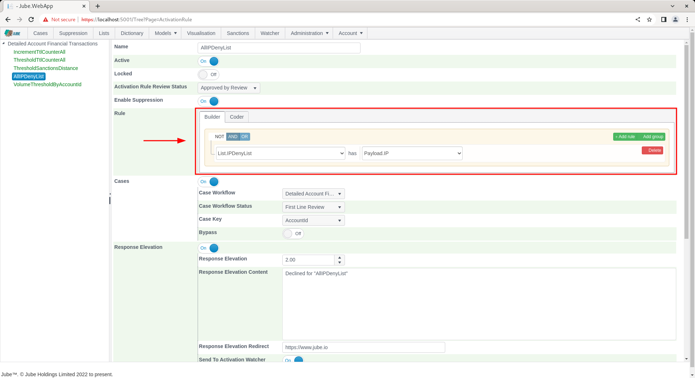
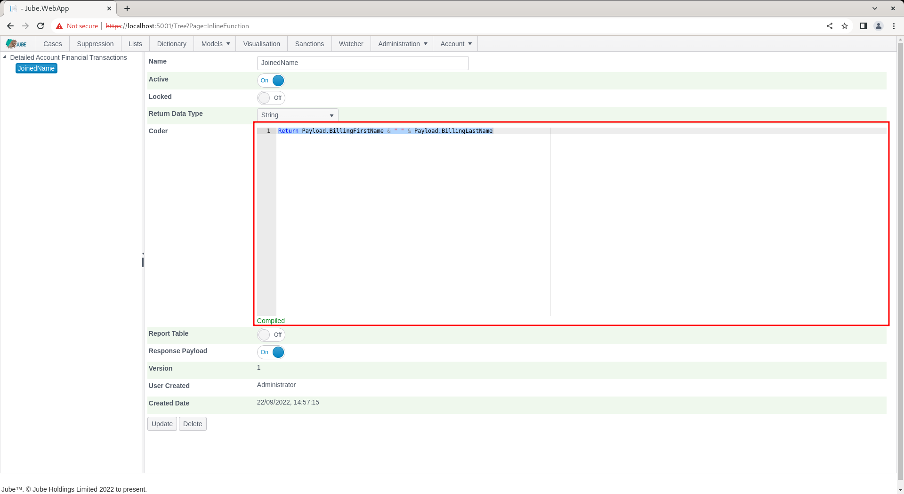
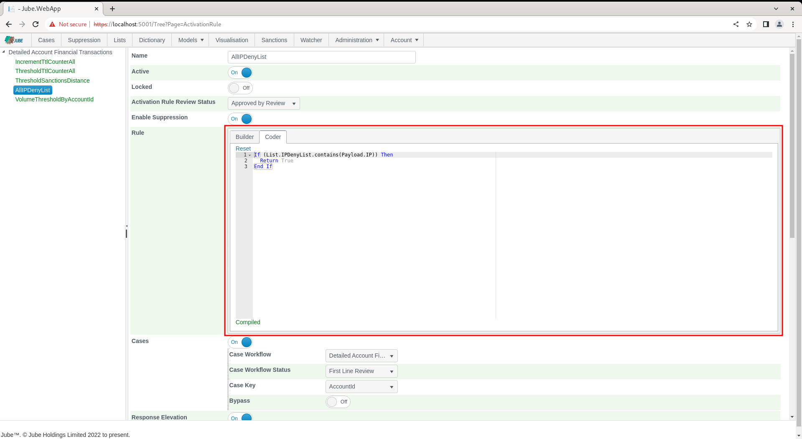
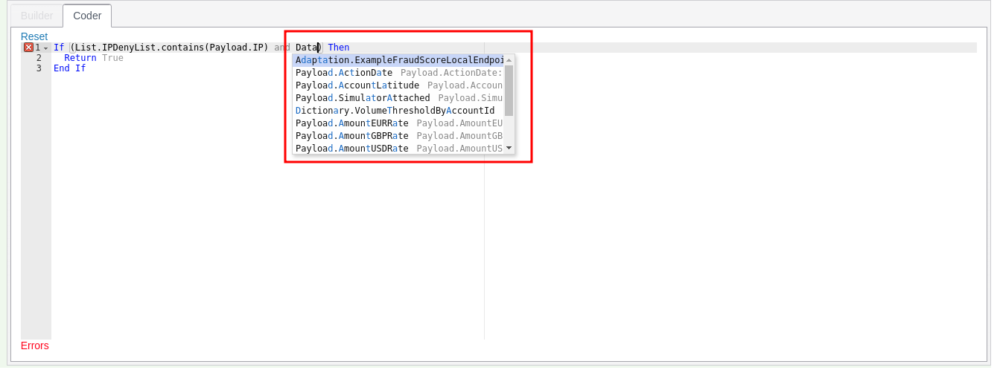
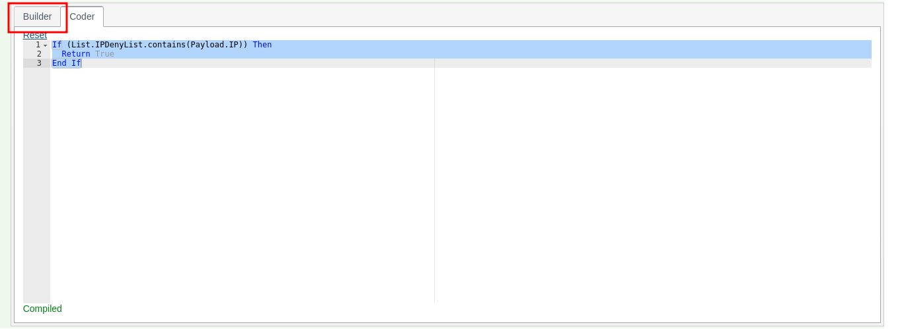

🚀Speed up implementation with hands-on, face-to-face [training](https://www.jube.io/training) from the developer.

# Rule and Code Builder

Several pages in the platform rely on the construction of code and in most cases this is facilitated by a point and click construction tool.  In most cases the code constricted is of vb.net fragment dialect,  unless it is used for reporting, case management or Exhaustive training, in which case it is an SQL query fragment:

In the following example the Rule and Code Constructor is embedded in the Activation Rules page and has a comprehensive range of data available:

There are oftentimes two modes to create rules, being Builder (which is point and click) and Coder (which is the handcrafting of the vb.net).  Clicking on the Coder tab will allow for the VB.Net code fragment to be handcrafted:

The Builder and Coder is available for the creation of VB.Net fragments in:

* Gateway Rules.
* Activation Rules.
* Inline Functions.
* Abstraction Rules.

For reasons of creating SQL fragments and not VB.Net fragments. Only the Builder is available in:

* Case Workflow Filters.
* Cases Search.
* Exhaustive Adaptation Class Definition.

An example of only the builder being available is as follows for Models >> Cases Workflows >> Cases Workflow Filter:

Only the Coder is available for the creation of VB.Net fragments in:

* Inline Functions.
* Abstraction Calculations.

An example of only the coder being available is as follows for Models >> References >> Inline Functions:

The default Coder value will be taken from the Builder,  being the VB.Net fragment equivalent:

As typing, the freehand code will be continually parsed for integrity:

With errors being displayed in the tool tip along the coder guttering.  Parsing will happen on the conclusion of each typing burst, until such time as the rule compiles:

To facilitate the development of Coder rules, completions are populated on each keypress,  returning model configurations:

If the Coder diverges from what was originally created in the Builder, then the Builder tab will be disabled:

Clicking the Reset link will restore the Builder contents to its Coder representation:

Upon clicking Reset,  the Coder will be overwritten to the parsed contents of the Builder, and the tab will become enabled once again:

